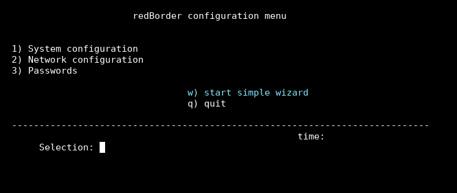
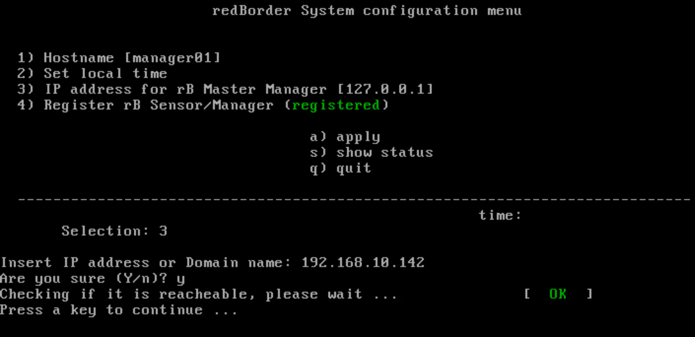
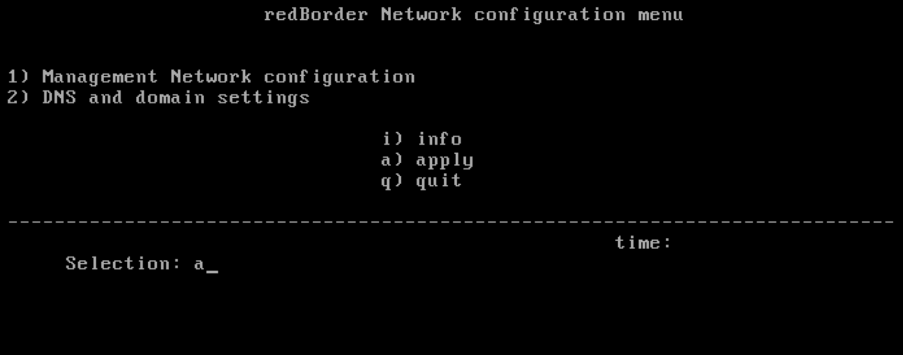

# What is RedBorder?

**Redborder** is the latest open, active, and scalable platform for Cybersecurity and Real-time Network Traffic Analysis (NTA). It is based on Big Data technology for enterprises and service providers.

Its ability to ingest, analyze, and report large amounts of data has been developed and tested in high-demand environments, as well as Network Traffic Analysis, Cybersecurity, or analysis and reporting of connections through wireless networks in different locations.

The platform unifies the different data sources provided by applications and probes. Additionally, it includes a set of common features: customizable panels and reports, correlation, analysis engines, user management, and layered storage.

Applications are within the platform and can be installed as plugins. These focus on digesting new types of data.

Probes are located outside the platform but are managed from it, and their function is to create new types of data and inspection capabilities.

Depending on the applications integrated into the platform, the user will see different options in the menu bar. The applications available in this new version of Redborder are as follows:

- Business Intelligence
- Malware
- Traffic
- Intrusion
- Monitor
- Vault
- Mobility
- Reports

## Basic scenario for Redborder installation

A typical basic scenario proposed by the solution consists of a set of sensors arranged at different sensitive points of the organization's network that will connect to a Manager or manager cluster for management and monitoring.

These points are formed by network links, called segments, through which sensitive traffic will flow and which the sensor will analyze more or less transparently, depending on the configured operating mode (IPS/IDS or Flow).

For the planning of sensor installation, some fundamental aspects should be taken into account:

- **Bypass segments** (specific network interfaces paired, usually with bypass support) will be placed in the middle of the traffic to be analyzed.
- **Management interfaces** (in bonding form) for remote access both from normal equipment and from the Manager.
- **IPMI access interfaces for remote hardware management** (SOL or Serial Over LAN connection, iKVM, and IPMI commands such as start, restart, and shutdown).

For the **Manager**, specific hardware is not necessary; **the only condition is the existence of one or more network interfaces.**

!!! note "Note"

    In case a **cluster** has been created, two network interfaces are necessary: one for the management network (Management IP Address) and another for the synchronization network (Sync IP address).

In this way, it allows the creation of a bonding for management and connection with the sensors and another bonding (optional) for their communications towards other networks. Both systems support the 802.1q standard for virtual LAN (optional when configuring).

!!! danger "Warning"

    It is **important** to first configure the Manager (or manager cluster) before configuring the sensors.

    The Manager must be operational and in a network accessible to the sensors. Some of the sensor configuration processes depend on access to the Manager.

Basic scenario for Manager installation

## User Interface Structure of the Installation Menu

### Menu, submenu, and command line

User Interface Structure of the Installation Menu

#### *Menu*

On the left side of the screen, you will find a list of available options. To select any of them, simply enter the number or letter corresponding to the option you want to choose on the line labeled Selection.

#### *Submenu*

If different actions can be performed on the selected option, a submenu will appear on the right margin of the screen.

#### *Command Line / Option Selector*

At the top margin, and separated graphically from the menu and submenu, we find the area where selections should be indicated on the line labeled `Selection` and enter the commands or data requested to execute the relevant actions. In this area, we will display the system date and time (defaulted to UTC).

### Option Selection

#### *Default Options*

In some cases, the system will display a series of default options. If it is in response to a question, the default defined option will be displayed in uppercase.

Selection of default options

#### *Options available in the RedBorder installation wizard menu*

- Default option selection: press **Enter**.
- Other options: enter the letter or command that corresponds.
- Exit: when you want to exit a screen to return to the initial menu, select the quit option by entering the letter **q**.
- Apply changes: to save the modifications made and apply the changes, select the **apply** option by entering the letter **a**.

Options available in the Redborder installation wizard menu

!!! warning "Important"

    **It is necessary to "apply" to activate the changes**

    If you see this message, you must select the **a** option. Otherwise, the system will not save or apply the modifications made.
