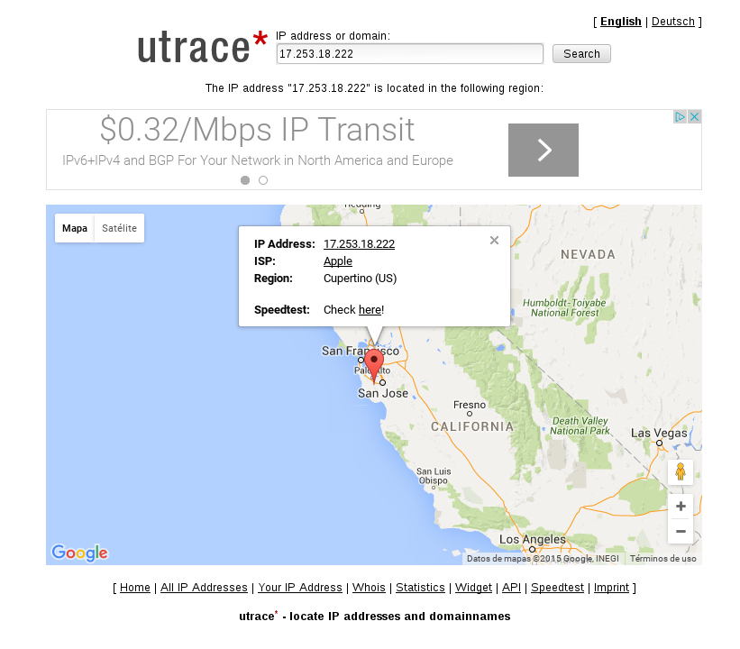

# Reputación y monitoreo de IPs

El origen de los atributos y el destino del tráfico (LAN IP/WAN IP) permite realizar diferentes acciones para facilitar un análisis más completo del origen y destino del tráfico que pasa a través de nuestra red. Para ello, debemos situarnos en la tabla de datos y colocar el ratón sobre uno de los valores que allí se encuentran, a la derecha del mismo aparecerá un ícono triangular apuntando hacia abajo, al hacer click se expandirá el menú ya conocido, este además contiene las opciones que veremos a continuación.

## Crear objeto

Esto permite poner un nombre y/o descripción que ayuda a indentificar un artículo de manera más rápida y fácil. Por ejemplo, si conocemos la máquina asociada con una dirección IP particular, esta opción le permite cambiarle el nombre para facilitar su reconocimiento.

Renombrando una IP, crear un objeto de red

## Fuentes externas

También encontramos la opción de consultar fuentes externas para ayudarnos a identificar la ubicación y la reputación de las IP consultadas.

- Whois.sc

Reputación de IP, Whois.sc

## Búsqueda de fuente básica

Es posible obtener un resumen completo de la información asociada con las IP consultadas. Al seleccionar esta opción, aparecerá una ventana emergente con dos pestañas:

- *Whois*: muestra el resultado de la consulta del Manager a whois, y de donde se obtiene. También muestra, entre otra información, quién posee esa IP, reputación, etc.
- *DNS*: el Manager realiza una resolución inversa que nos permite conocer el DNS asociado con la IP consultada.

Reputación de IP, búsqueda de fuente básica
