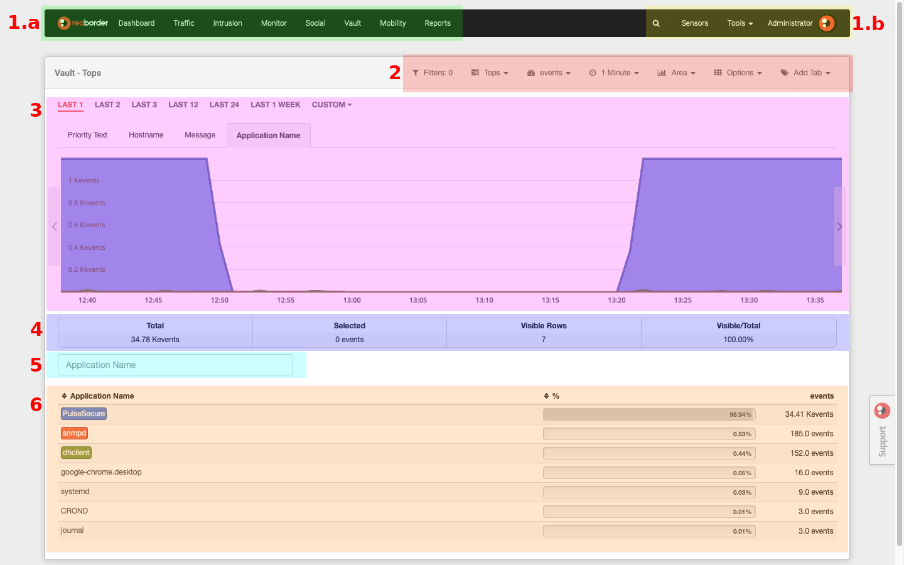
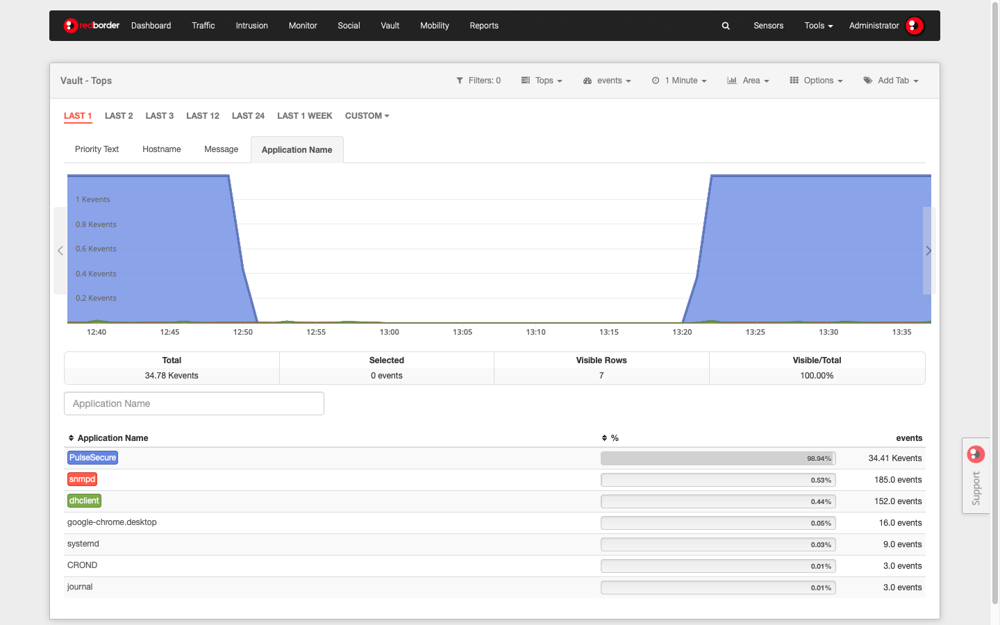
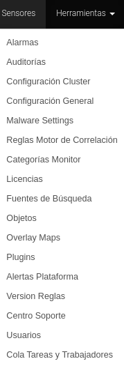
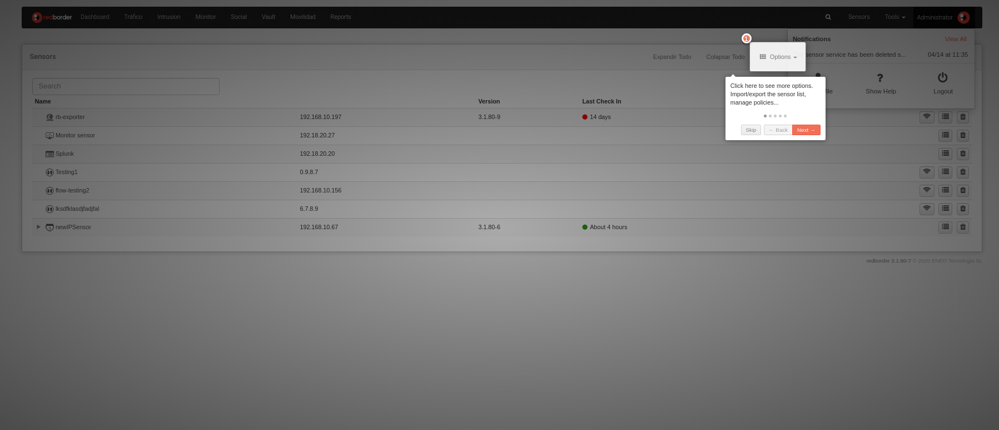

# Plataforma web de RedBorder

Una vez se ha finalizado el proceso de instalación del Manager, el usuario puede acceder a la plataforma web de Redborder insertando en la barra de direcciones de su navegador la IP de gestión asignada al Manager.

    https://direccion-IP-manager

Pantalla de acceso a la plataforma

!!! info "Ten en cuenta..."

    Es posible iniciar sesión en la plataforma usando la cuenta definida por defecto: **admin**.

!!! warning "Importante"

    La web de gestión no funcionará si se intenta acceder a ella mediante web no cifrada (http).

Nada más acceder a Redborder, lo primero que visualiza es un dashboard en el que encontrará diferentes métricas y datos sobre el estado de sensores, dominios, etc, o la ubicación de los sensores, si está configurada.

Esta pantalla de inicio es completamente personalizable. El usuario podrá crear tantos dashboards por perfil como crea necesarios. (1)
{ .annotate }

1. En el caso de la versión Community, el número de dashboards personalizables se limita a uno por perfil de usuario.

Administración de la pantalla de inicio del Manager: dashboard

## Estructura de la interfaz de la plataforma Redborder

RedBorder posee una estructura que se repite en todas las interfaces de Redborder. Conocer estos elementos le ayudará a navegar por la web de un modo cómodo y sencillo. (1)
{ .annotate }

1. La imagen corresponde a una instalación de Redborder con las Apps de Tráfico, Intrusión, Vault y Movilidad activas. La estructura será la misma para cualquier instalación de Redborder, a excepción de las aplicaciones disponibles en la barra de menú superior y de si están activas o no.

Veamos estas partes:

1. **Barra de menú**: en ella encontrará el acceso directo a todas las secciones de la plataforma Redborder. Se encuentra subdividida en dos áreas diferenciadas según operatividad:
  
    1. *Área de analítica (margen superior izquierdo)*: aquí encontrará todos los datos recolectados por los sensores mostrados en diferentes métricas e informes.
    - *Área de configuración (margen superior derecho)*: opciones de configuración y gestión de las Apps y de Redborder.

- **Submenú**: muestra las opciones disponibles según la sección que nos encontremos consultando.

- **Área principal**: este es el área de contenido. En esta zona se muestran los datos en diferentes métricas y gráficos completamente personalizables

- **Resumen**: bajo el gráfico encontrará un resumen con la información mostrada en la métrica, proveyendo valores totales.

- **Motor de búsqueda**: permite buscar rápidamente cualquier característica en la tabla de datos con el atributo que está siendo consultado. Únicamente tiene que introducir la IP, el sensor, el cliente, etc. que quiera consultar. Además, las búsquedas pueden convertirse en filtros, tal y como veremos más tarde.

- **Tabla de datos**: proporciona detalles de la información mostrada en la métrica. Además se pueden realizar diferentes acciones por filas. Estas acciones dependen de la App que estemos consultando.

### Opciones incluidas en la barra de menú

Vamos a realizar una descripción rápida de las opciones que se pueden encontrar en la barra de menú, tanto en el área de análisis como de configuración. En epígrafes posteriores se analizarán las funcionalidades y la configuración de dichas opciones.

#### Área de analítica

*Dashboard*: Proporciona un resumen de los eventos recibidos por un sensor, mostrandolos en diferentes métricas. Esta es la pantalla mostrada por defecto cuando se accede en la plataforma Redborder.

Dashboard

*Eventos*: A continuación, el usuario podrá ver eventos cuya información proviene de los sensores registrados en su sección correspondiente. Más adelante, se explicará en detalle qué función tiene cada uno y cómo se registran estos sensores. En la captura de pantalla adjunta: Vault

Eventos

#### Área de configuración

*Motor de búsqueda*: facilita localizar elementos/valores de la plataforma de acuerdo con la búsqueda introducida por el usuario.

*Sensores*: muestra la lista de sensores añadidos y el árbol de organización. También contiene las políticas globales y locales para cada dominio.

Lista de sensores

*Herramientas*: Provee una lista de opciones de configuración que están disponibles para el perfil de administrador.

Opciones disponibles en Herramientas

*Usuario*: esta sección muestra una lista de notificaciones, así como las diferentes opciones disponibles para la gestión de usuarios, información contextual de la plataforma y el botón de desconexión segura: Logout.

Opciones disponibles en Administrador

*Show Help*: Activando esta opción activará un pop-up proveyendo ayuda durante la navegación de la administración del manager. Está identificado con un símbolo de interrogación.

