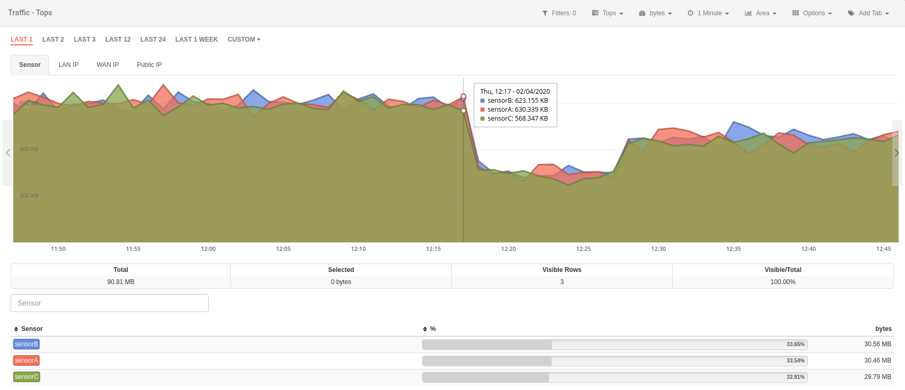
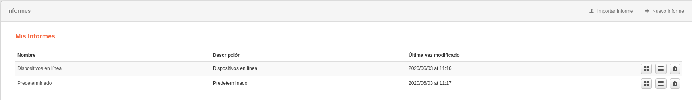

# Módulos

En la **Sección de Eventos** el usuario puede **mostrar, analizar y gestionar** los eventos recolectados por los sensores.

Redborder ofrece la máxima visibilidad de red gracias a las muchas opciones de representación y visualización de datos que nuestras Apps proveen.

La plataforma tiene un módulo para cada funcionalidad. Cada una utiliza diferentes tecnologías y tiene una interfaz independiente. Todos los módulos necesitan un sensor que le provea de datos.

## Business Intelligence

El módulo **Business Intelligence** utiliza la información de clientes a través de los sensores BI. Puede ser usado para obtener las respuestas de los cuestionarios definidos en la plataforma **[RBMobility](https://rbmobility.redborder.com)**.

Este módulo viene desactivado por defecto, para activarlo ejecute el siguiente comando desde la consola:

    rb_set_modules bi:1; chef_client

Módulo de BI

## Malware (WIP)

El módulo **Malware** es una solución completa para la detección de archivos, direcciones IP y direcciones URL maliciosas. Para ello se emplean múltiples motores de detección y servicios de reputación que van más allá de las políticas basadas en firmas y técnicas similares.

Este módulo viene desactivado por defecto, para activarlo ejecute el siguiente comando desde la consola:

    rb_set_modules malware:1; rb_set_malware_mode enable logstash; chef_client

Módulo de Malware

## Tráfico

El módulo **Tráfico** utiliza netflow para extraer información sobre todo el tráfico del sensor. El módulo provee información como IPs, protocolos, localizaciones y mucho más.

Módulo de Tráfico

## Intrusion

El módulo **Intrusión** utiliza datos del sensor o sensores IPS para mostrar eventos de intrusión basados en reglas de Snort. También, gracias a las diferentes vistas que incluye RedBorder, es posible analizar los paquetes que coincidieron con la especificación de la regla.

Módulo de Intrusión

## Monitor

El módulo **Monitor** utiliza datos provenientes de protocolos SNMP, Redfish e Ipmi para mostrar el estado de la infraestructura.

Módulo de Monitor

## Vault

El módulo **Vault** utiliza datos de syslog para proveer información sobre eventos de diferentes orígenes, tales como categoría, objetivo, acción del evento y más.

También es posible aumentar las capacidades del módulo Vault a través de las extensiones que añaden compatibilidades con otros fabricantes.

Módulo de Vault

## Movilidad

El módulo **Movilidad** provee información de localización de sensores de APs de la red. Puede ser usado para mostrar como las personas se mueven en un edificio.

Módulo de Movilidad

## Wireless

El módulo **Wireless** proporciona un análisis de los datos de los visitantes de sensores APs de la red **sin tener en cuenta el cálculo de movimientos**.

Módulo de Wireless

## Reportes

El módulo de **Reportes** permite al usuario tener informes periodicos con información sobre la plataforma Redborder.

Ejemplo de informes creados
