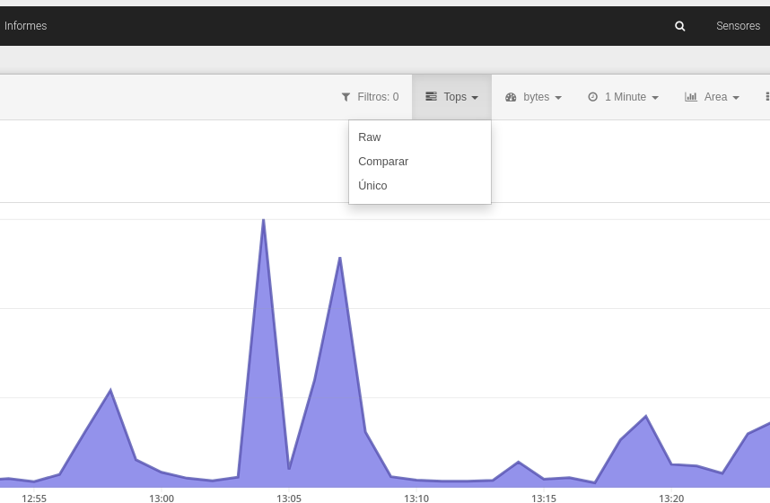
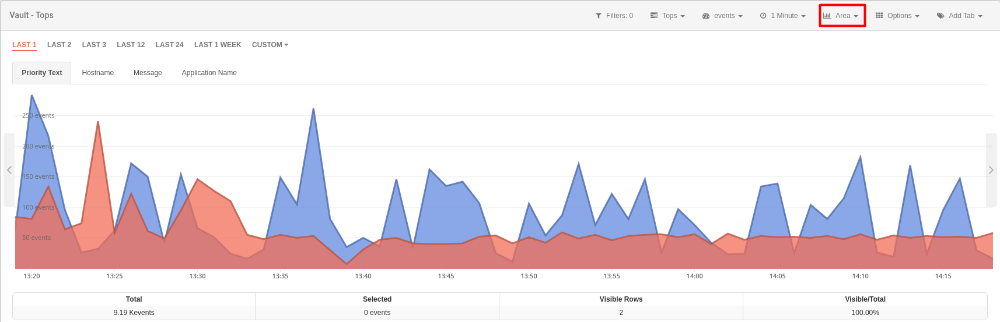
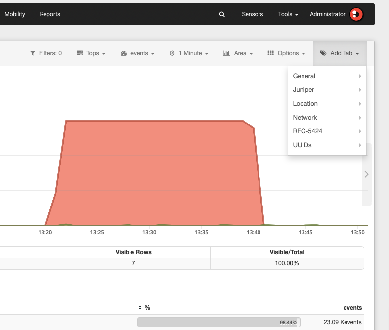

# Menú y opciones de los módulos

En el area de análisis de la barra de menú (barra superior, margen izquierdo), podemos encontrar diferentes secciones correspondientes a las Apps que hemos integrado en la plataforma de Redborder.

Posteriormente veremos las diferentes opciones para la visualización de datos, tipos de gráficos, granularidad (grado máximo de detalle temporal para una consulta de eventos) y atributos que pueden ser combinados para obtener un visualizador de tráfico de red totalmente personalizable.

Vista general de un módulo

## Opciones disponibles en el submenú

### Filtros

Permiten a los usuarios aislar una porción de la información para detallarla. En esta pestaña puede ver el número de filtros que han sido aplicados para aplicar acciones sobre ellos:

- *Busqueda avanzada.*
- *Crear una alarma.*
- *Crear un widget.*

Filtros

### Vistas

Ofrece diferentes opciones para mostrar la información.

- *Raw*: Eventos en bruto.
- *Tops*: Muestra la suma total de datos de diferentes eventos para mostrarlos como uno solo.
- *Comparar*: Comparación de eventos dentro de un periodo de tiempo.
- *Único*: Muestra el número de eventos únicos, agrupados según se indique.

Vistas

### Agregación

Hay diferentes valores o unidades de medida en los que los datos pueden ser mostrados. Por ejemplo, flows por segundo (flows/s) o bytes por segundo (bps). Tenga en cuenta que cada módulo tiene sus propias opciones de agregación.

Agregación

### Granularidad

Indica el grado de detalle temporal que puede mostrar la información. El mínimo valor para la granularidad es un minuto.

Granularidad

### Gráfico

Muestra los diferentes tipos de gráficos entre los que podemos mostrar los datos. Los tipos de gráficos disponibles varían dependiendo de la vista seleccionada. Son los siguientes:

Tipo de gráfico: Área

Tipo de gráfico: Líneas

Tipo de gráfico: Barras

Tipo de gráfico: Barras apiladas

Tipo de gráfico: Acumulado

### Opciones

En esta sección, el usuario puede realizar varias acciones para administrar los datos que se muestran. Las opciones varían según la vista seleccionada.

- *Mostrar total filtrado/Ocultar total filtrado*: muestra u oculta el gráfico considerando los filtros seleccionados.
- *Exportar a CSV*: Proporciona la opción de exportar a CSV un informe de cualquier campo seleccionando el límite del evento.
- *Máquina del tiempo*: Permite cambiar la fecha/hora de la máquina para poder ver toda la información y los eventos que han transcurrido en ese período de tiempo.
- *Ordenar agregaciones*: Permite cambiar el orden de las agregaciones que se muestran en el módulo.
- *Guardar pestañas como predeterminadas*: Al seleccionar esta opción, se puede modificar el diseño de pestañas predeterminado.

Opciones

### Atributos

Los eventos recibidos por el Manager consisten en un par "columna: valor". Los valores dados en cada columna pueden entenderse como datos específicos del evento que son los que realmente proporcionan información. Estos son los llamados "atributos".

Los atributos pueden ser mostrados de diferentes maneras: como pestañas o como columnas (Añadir Pestañas/Columnas) dependiendo de la vista en la que se encuentre.

Atributos

Todos los atributos tienen un significado y funcionalidad específica. Por ejemplo, en el módulo de Tráfico podemos observar atributos muy relevantes como *Public IP*, el cual muestra la dirección IP real de los dispositivos que se encuentran en la red, *Public IP MAP*, que indica su posición en el mapa, o *Country Code*, el cual indica el país al que pertenece.

Atributos: Vista general
