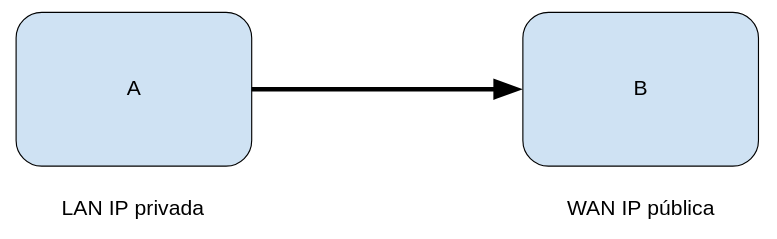
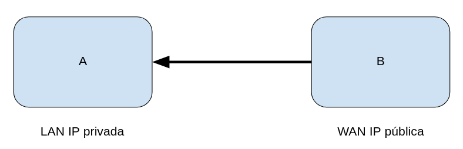
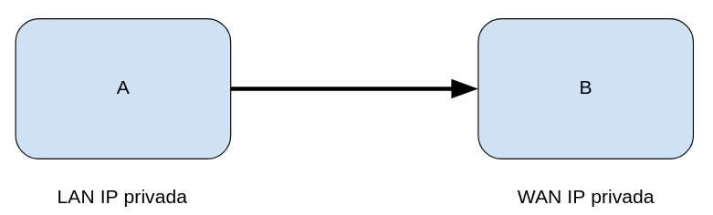

# Explicación de la dirección del tráfico

Al analizar los datos de flujo de red dentro de la plataforma podemos diferenciar tres tipos de tráfico: **upstream, downstream e internal**. Este valor se puede ver en el campo "dirección"

La diferencia entre estos tres tipos de tráfico reside en la **dirección** del flujo de red.

## Upstream 

Se considera tráfico **upstream** a todo aquel cuyo recorrido sea desde una red interna hacia una red externa, por lo que se dice que es tráfico **saliente**. La IP LAN es una dirección privada y la IP WAN es una dirección pública. 

## Downstream

Se considera tráfico **downstream** a todo aquel cuyo recorrido sea desde una red externa hacia una red interna, por lo que se dice que es tráfico **entrante**. La IP LAN es una dirección privada y la IP WAN es una dirección pública. 

## Internal

Se considera tráfico **internal** a todo aquel cuyo recorrido sea de una red interna a otra o a la misma red. Ambas IPs, tanto LAN como WAN son internas

