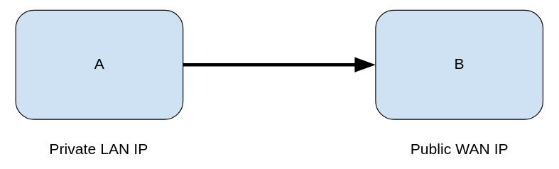
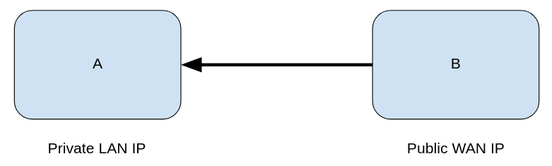

# Flow direction explanation

When analyzing the network flow data within the platform we can differentiate three types of traffic: **upstream, downstream and internal**. This value is present in the "direction" field.

The difference between these three types of traffic lies in the **direction** of the network flow.

## Upstream 

**Upstream** traffic refers to any traffic whose direction is from an internal network to an external network, which is why it is considered outgoing traffic. The LAN IP is a private address, and the WAN IP is a public address.

## Downstream

Downstream traffic refers to any traffic whose direction is from an external network to an internal network, which is why it is considered incoming traffic. The LAN IP is a private address, and the WAN IP is a public address.

## Internal

Internal traffic refers to any traffic whose direction is from one internal network to another, or within the same internal network. Both the LAN and WAN IPs are private addresses.

