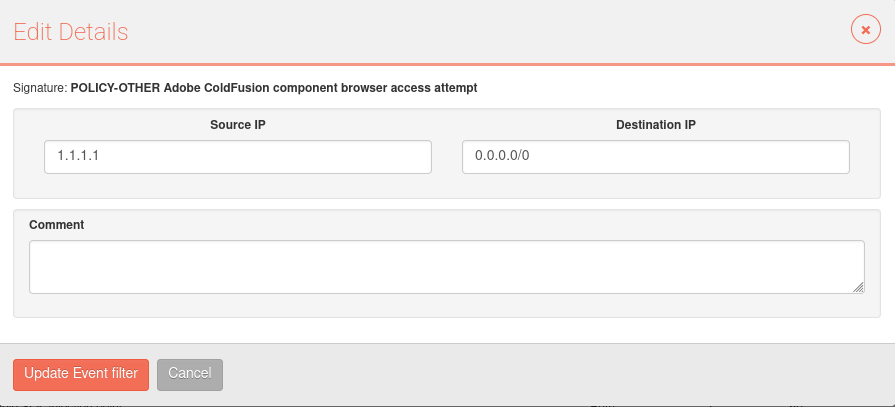

# Cómo crear una regla de supresión para cualquier IP

Utilice 0.0.0.0/0 si desea suprimir una regla para cualquier IP, en origen o en destino.

Por ejemplo:

Regla de supresión para bloquear toda intrusión que tenga 1.1.1.1 en su IP de destino: 

Source IP = 0.0.0.0/0  
Destination IP = 1.1.1.1

Regla de supresión para bloquear toda intrusión que tenga 1.1.1.1 en su IP de origen: 

Source IP  = 1.1.1.1  
Destination IP = 0.0.0.0/0

