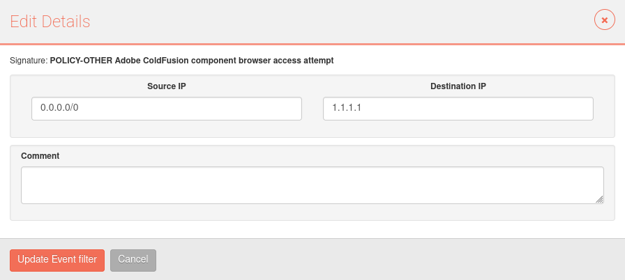
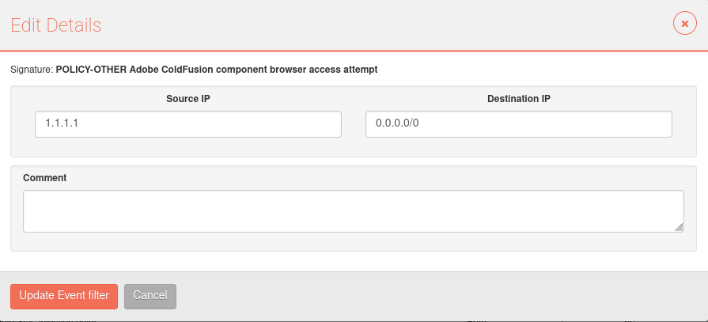

# How to create a suppress rule for any IP

Use 0.0.0.0/0 if you want to suppress a rule for whatevet IP, in source or in destination.

For example:

Suppress rule to block every intrusion that has 1.1.1.1 in its target IP: 

Source IP = 0.0.0.0/0
Destination IP = 1.1.1.1

Suppress rule to block every intrusion that has 1.1.1.1 in its source IP: 

Source IP  = 1.1.1.1
Destination IP = 0.0.0.0/0

