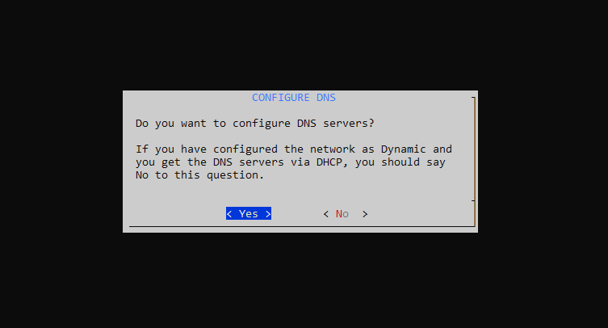
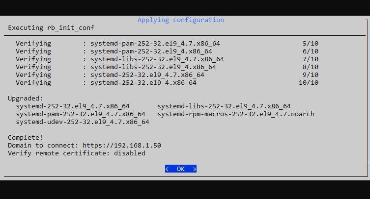

# Installation on Linux

How to install Redborder Flowgate on Linux systems.

Important things to know before installing:

- This installation is non-reversible, cannot be directly uninstalled or rolled back.
- The linux distribution supported at the moment is [Rocky Linux 9 minimal](https://rockylinux.org/download).
- This sensor must be registered with a **Redborder Manager**, so ensure you have one available.

## Prerequisites

### Virtual machine or baremetal

The requirements may vary depending on the volume of traffic to analyze. The following are the minimum requirements:

| **Component**      | **Specification**                                     |
|--------------------|-------------------------------------------------------|
| **Operating System** | Rocky Linux 9 minimal                               |
| **Memory**         | 8 GB RAM                                              |
| **Storage**        | 40 GB HDD space                                       |
| **CPU**            | at least 4 CPU Cores or 4 vCPU                        |
| **Network Interfaces**  | at least 1 (management interface), add an extra one to export network traffic (span port)     |

## Packages Installation

Install the supported operative system and run the following command as root:

``` bash title="Repositories installation"
yum install epel-release
rpm -ivh https://repo.redborder.com/ng/24.11/rhel/9/x86_64/redborder-repo-24.11-0.0.1-1.el9.rb.noarch.rpm
```
``` bash title="Install redborder-proxy package"
yum clean all
yum install redborder-proxy -y
```

Respawn a new bash to reload the environment variables:

``` bash title="Bash reload"
/bin/bash --login
```

## Setup wizard

Start the **installation wizard**:

``` bash title="Installation wizard command"
rbcli setup wizard
```

The first screen shows an index of the upcoming steps.


Press **Yes** to continue.

### Configure Network

This step is optional. If you are sure that the network interfaces are already configured, you can skip this step. Otherwise, enter the configuration by pressing **Yes**.


Select the management interface.


Select the interface configuration mode (static or DHCP)


If you select the static IP option, you will need to specify the IP, subnet mask, and default gateway:


### DNS configuration

Press **Yes** to start the DNS configuration.



You can add up to three different DNS servers:


Press **OK** to continue.

### Cloud address configuration

Introduce the **Redborder Manager** IP address.


Press **OK** to continue.

### Confirm configuration

Press **Yes** to confirm the actual configuration.


### Applying configuration

Wait for the process to finish.



Press **OK** to return to exit the wizard.

## What's Next?

Sign in to **Redborder Manager** and claim the new sensor from the Unclaimed sensor list.
