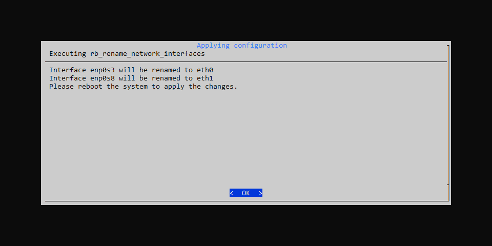
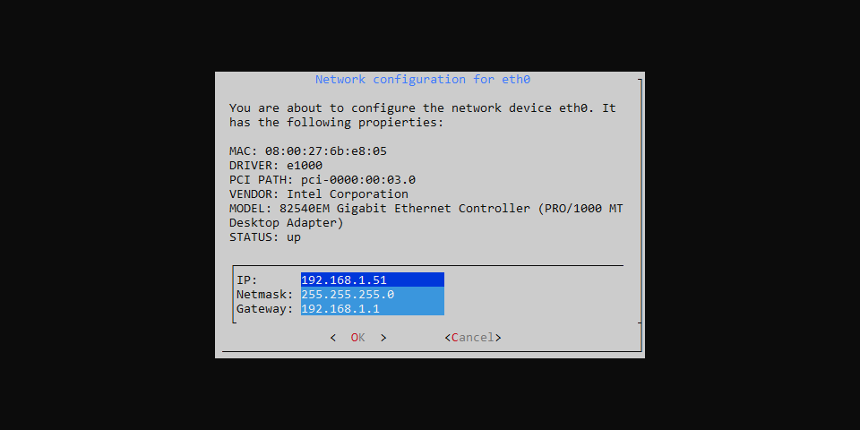
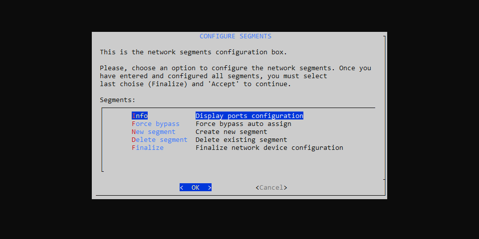
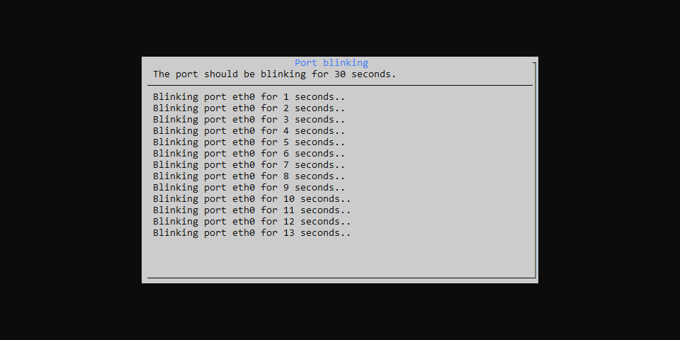
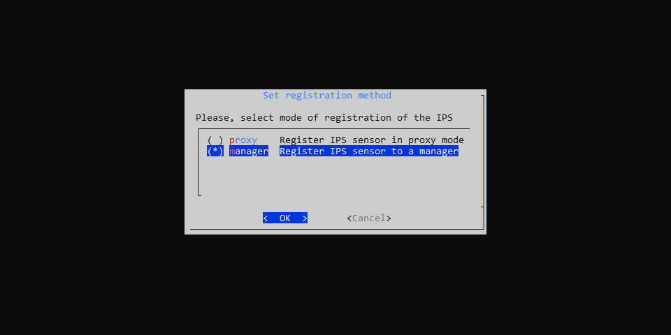
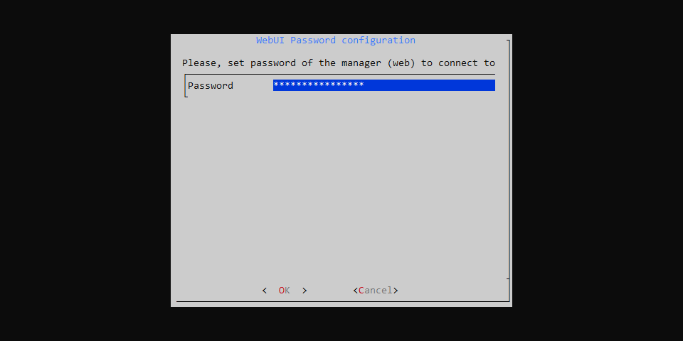

# Instalación en Linux

Cómo instalar Redborder Intrusion en sistemas Linux.

Aspectos importantes a considerar antes de la instalación:

- Esta instalación es irreversible; no se puede desinstalar ni revertir directamente.
- La distribución de Linux soportada actualmente es [Rocky Linux 9 minimal](https://rockylinux.org/download).
- Este sensor debe estar registrado con un **Redborder Manager**, así que asegúrate de tener uno disponible.

## Requisitos Previos

### Máquina virtual o hardware dedicado

Los requisitos pueden variar según el volumen de tráfico que se desee analizar. A continuación se detallan los requisitos mínimos:

| **Componente**      | **Especificación**                                     |
|--------------------|-------------------------------------------------------|
| **Sistema Operativo** | Rocky Linux 9 minimal                               |
| **Memoria**         | 8 GB RAM                                              |
| **Almacenamiento**        | 40 GB de espacio en disco duro                                     |
| **CPU**            | al menos 4 núcleos de CPU o 4 vCPU                    |
| **Interfaces de Red**  | al menos 2 (una para gestión y otra para el segmento de red de un solo puerto)     |

## Instalación de Paquetes

Instala el sistema operativo compatible y ejecuta el siguiente comando como root:

``` bash title="Instalación de repositorios"
yum install epel-release
rpm -ivh https://packages.redborder.com/releases/25.01/rhel/9/x86_64/redborder-repo-25.04-0.0.1-1.el9.rb.noarch.rpm
```
``` bash title="Actualiza el sistema y obtén la última versión del kernel"
yum update -y
reboot
```
``` bash title="Instala el paquete redborder-ips"
yum clean all
yum install redborder-ips -y
```

Reinicia una nueva instancia de bash para recargar las variables de entorno:

``` bash title="Recarga de Bash"
/bin/bash --login
```

## Asistente de Configuración

Inicia el **asistente de instalación**:

``` bash title="Comando para el asistente de instalación"
rbcli setup wizard
```

La primera pantalla muestra un índice de los próximos pasos.


### Configuración de Red

#### Renombrar Interfaces de Red

Redborder Intrusion requiere que las interfaces de red tengan longitudes máximas definidas. Si el asistente detecta que es necesario renombrar las interfaces de red, aparecerá esta pantalla, permitiéndote hacerlo.


Presiona **Yes** para confirmar.


Después de la confirmación, presiona **OK** para reiniciar.



Después del reinicio, inicia nuevamente el asistente para continuar con los siguientes pasos.

``` bash title="Comando para ejecutar el asistente de configuración"
rbcli setup wizard
```

#### Configurar Red

Selecciona la interfaz de gestión para la configuración.


Al seleccionar una interfaz e ingresar en su configuración, tienes la opción de asignarle una dirección IP estática o configurarla para que funcione de forma dinámica (con DHCP).


Si seleccionas la opción de IP estática, debes especificar la IP, la máscara de subred y la puerta de enlace predeterminada:



### Configuración de DNS

Presiona **Yes** para comenzar con la configuración de DNS:


Puedes ingresar hasta tres servidores DNS diferentes:


### Configurar Segmentos

Los segmentos identifican las redes a las que la Sonda de Intrusión tiene acceso y en las que actuará como un dispositivo de seguridad de red. Debe declararse al menos un segmento en las interfaces.



#### Info

En Info, podemos ver detalles relacionados con cada interfaz de red e incluso identificarla en la tarjeta de red física.


Al seleccionar una interfaz, debes elegir un tiempo de parpadeo para la interfaz de red física, lo que ayudará a identificarla en la máquina física en cuestión:


Presiona **OK** para hacer que las interfaces parpadeen.



#### Force bypass

Esta opción creará los segmentos automáticamente en máquinas con tarjetas de red Silicon Bypass.

#### New Segment

Selecciona **New Segment** para crear uno con las interfaces de red disponibles.


#### Delete Segment

Si deseas realizar la acción opuesta, puedes eliminar los segmentos que desees de la lista. Selecciona los que quieres eliminar:


#### Finalizar Configuración de Segmentos

Una vez que hayas configurado los segmentos deseados, presiona **finalize**.

## Configurar método de registro

Elige el modo en el que operará la Sonda de Intrusión:

- Proxy: Selecciona este modo si el Redborder Manager está en una red diferente a la Sonda de Intrusión.
- Manager: Selecciona este modo si el Redborder Manager y Redborder Intrusion son accesibles desde la misma red.



Presiona **OK** para confirmar.

## Modo Manager: Configuración de Registro del Sensor en la Interfaz Web

Introduce la dirección remota del Redborder Manager, el usuario de registro (por defecto admin) y el nombre que tendrá este sensor.


Presiona **OK** para confirmar.

Introduce la contraseña del Redborder Manager para realizar el registro.



Presiona **OK** para confirmar.

## Modo Proxy: Configuración de la dirección en la nube

Introduce la dirección IP del Redborder Manager (dirección en la nube).


Presiona **OK** para confirmar.

## Confirmar configuración

Antes de aplicar la configuración, el asistente resumirá toda la información completada, esperando que el usuario la acepte.


Presiona **Yes**  para confirmar la configuración.

## Aplicando configuración

Espera a que el proceso finalice.


Presiona **OK** para salir del asistente.

## Siguiente paso?

Inicia sesión en **Redborder Manager** y verifica que el nuevo sensor esté presente.

En caso de estar en Modo Proxy, deberás reclamar el sensor desde la lista de No Reclamados.
