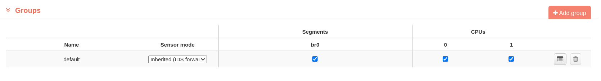

# Intrusion Policies

Every IPS sensor need a set of rules to identify as potential threat... In this chapter, you will set the rules the IPS needs to recognize traffic as intrusion. By default, there are no policies defined and it is considered that the administrator configure this based on determinant conditions like: traffic volume, resources and requeriments of the hardware, policies in the organazation, etc...

The rules that are going to be appliyed on IPS are know as policies. There are two main policies:  **Signature policies** and **Reputation policies**. Signature policies are those kind of rules that can be triggered by a match between the rule and one packet of the traffic. On the other hand, reputation policies identify IP address of the packet and trigger if is related with a specific network or country. 

Both kind of policies are complementary, so you can exploit a single one of the features or both at the same time. On next steps, you are going to see how to configure the policies.

!!! warning "About the configuration"
    This chapter is supposing that you already have an IPS claimed and running as a sensor.

    
    IPS sensor claimed and running

    Please locate your IPS in the **Sensors** tab.

## Sensor properties

Clicking on the *four-lines* icon you can expand the properties of the IPS

IPS properties menu

## IPS Edit

Each of the following fields can be expanded to configure.

!!! warning "If you change any property..."
    Remember to press **Update** button at the bottom 

### Exporter

The IPS allows traffic exportation that any interface of IPS can capture. In this menu you can set the ip address **Destiny address** of a flow sensor and the port based on the protocol:

Exporter

To do so, press the *four-lines* icon and edit the properties of the connection:

Exporter details

!!! info "Relation between ports and traffic exportation protocols..."
    Normally, you are going to use port 2055 for any netflow version and port 6343 for sflow.

!!! warning "If you are configuring an exporter..."
    It is mandatory to configure a flow sensor who's going to receive the traffic flow.

#### Destiny address

This is the address of the manager that is going to receive the traffic; and the port based on the exportation protocol. This field is mandatory if you really want to export the traffic.

#### Obervation id

Observation is just a new field included to have an extra way to filter the content on traffic view, splitting the information catched from different subnets. You can set a positive unique number or leave it empty if you don't want to filter by it.

## Groups

In case the IPS has any segment configured, here you can manage the processing resources asigned to every segment.

Groups

## Signature policies

By default, no signature policy is created for the ips. That's what you can watch in **Signatures policy menu**. In fact, no **Rule** is got in **Rule Versions** and is mandatory to have at least one to create a signature policy.

Signature Policies

To add the first policy press **New Policy**, it will appear a window to create one:

Signature Policy Detail

!!! warning "If you can't see any **Rule Source**..."
    No **Rule** is being downloaded by default. It is mandatory to have at least one to define a signature policy. To do so, go to **Tools > General Settings > Rule Versions**.

### Rule Versions

Access to rule version

### Back to signature policy
    
Here you have to select a name, and one of the rules sources. After that, confirm clicking **Create Signature Policy**. All rules in that policy will appear:

Rules selection

The rules details can be seen by expanding each category:

Rules expanded

By default, all rules are being ignored. You can change the action to do when a packet triggers an action to **pass, alert, drop or clear**. We can select a set of rules and/or categories to apply at the same time the same action by checking the boxes at the right and expanding **Change Action(s) menu**.

After the setup of the policy, go back to the **Signatures policy menu**. Here you will see the new policy created:

Signature Policies

To finally apply the configuration, click on **Assign** button.

## Reputation policies

By default, as it happened with signature policies, no policy is created for the ips. To add the first policy press **New Rep Policy**, it will appear a window to create one. Here you have to select a name, and one of the rules sources. After that, confirm clicking **Create Signature Policy**. A political map will appear:

Reputation map

You can configure the address by a set of networks or considering entire contries. Click on **+Add** on the corresponding category to add a network, or a location.

Country

Here you can select the action to take into account for each rule defined: **analyze, bypass or drop**

In case a region has a rule, it will color that part in the map, depending on the action selected:

Color map

After the setup of the policy, go back to the **Reputation policy menu**. Here you will see the new policy created:

Reputation Policies

To finally apply the configuration, click on **Assign** button.

## Apply Configuration

After any change in the previous policies, the configuration can be applied here by selecting the corresponding checkboxes and clicking **Update**.

Configuration update

## Monitors

In monitors you can check the resources consumed by every part of this sensor. Here you can check if any category is having a high impact over the others.

IPS monitor

