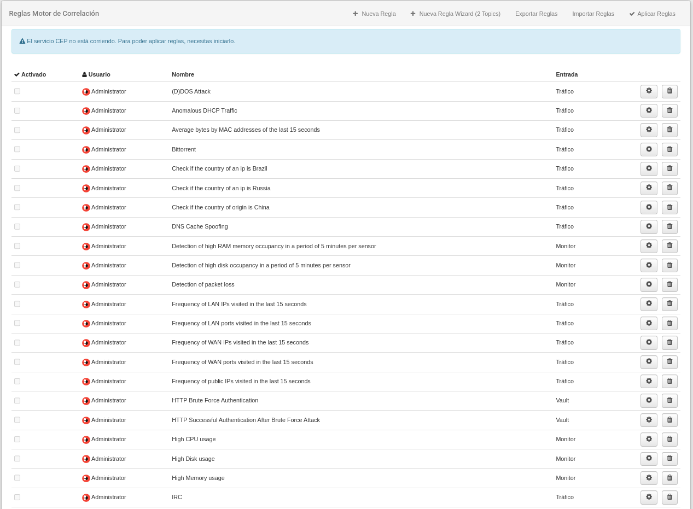

# Herramientas y administración

En el área de configuración de la barra de menú, cerca de *Sensores* podemos encontrar la sección *Herramientas* donde encontramos las opciones para configurar la plataforma.

Herramientas: opciones disponibles para configurar la plataforma

Es en este menú desplegable que puede encontrar los accesos a las configuraciones que definen, por ejemplo, las condiciones que deben cumplirse para que el usuario sea notificado por una alarma, hacer seguimiento de las actividades de los usuarios en la plataforma, registrar nuevos usuarios o gestionar la configuración del clúster, sensores y servidores, entre muchas otras acciones.

Despliegue las pestañas siguientes para leer una descripción de las opciones que se encuentran en el menú de herramientas.

??? note "Alarmas"

    ## Alarmas

    Una alarma es una notificación que se activa cuando se cumplen una o más condiciones.

    Al acceder a esta opción, se muestra la lista de alarmas que se han registrado.

    

    Lista de alarmas activas

    ### Crear una nueva alarma

    Haciendo click en el botón **Nueva Alarma** accedemos al formulario, en el que se establecerán las condiciones que debe cumplir la alarma para activar una notificación, y el grado de gravedad definido para esa alarma.

    

    Crear una alarma nueva

    1. **Configuración General**

        | Campo              | Descripción                            |
        | ------------------ | -------------------------------------- |
        | Nombre             | Nombre de la alarma |
        | Ventana de tiempo  | Intervalo de tiempo que debe superarse por exceso o valores predeterminados dados en límite superior / inferior para que la alarma esté activa |
        | Tipo de producto   | Seleccione el tipo de aplicación / elemento para el que se ha definido la alarma. El usuario verá en este campo las opciones que se incluyen en su licencia |
        | Notificar cada     | Establece la secuencia de tiempo para notificación |
        | Límite super/infer | Indica el número de eventos (máximo / mínimo) que deben cumplir las condiciones de la alarma para activar la notificación |
        | Unidad             | Agregación deseada para la alarma. Variará dependiendo de las agregaciones disponibles en el tipo de producto deseado |
        | Zona horaria       | Permite elegir qué definición de tiempo se quiere utilizar para la alarma |
        | Gravedad           | El usuario debe definir el nivel de gravedad que se le da a la alarma. Dependiendo de las condiciones que haya definido para la alarma, implicará un riesgo muy bajo, bajo, medio, alto, muy alto o crítico. Esta gradación de gravedad también se indica en una escala de colores |

    - **Anomalías**

        Redborder utiliza técnicas de análisis de datos para proveer notificaciones de peligros potenciales, esta opción permite al usuario configurar alarmas inteligentes que serán activadas dependiendo de si se detecta alguna anomalía de red dentro de los filtros especificados en el apartado *Condiciones*.

        Activar esta opción hará que se realice un análisis de anomalías una vez pasada la **Ventana de tiempo** configurada en la *Configuración General* de la alarma.

        La **granularidad** indica el grado de detalle temporal que utilizará la alarma para analizar los datos.

    - **Notificaciones**

        | Medio de notificación         | Descripción                            |
        | ------------------ | -------------------------------------- |
        | Syslog             | Permite exportar las notificaciones a un servidor syslog externo |
        | Email              | Habilita la selección de usuarios a los que enviar las notificaciones por  correo electrónico cuando se active una alarma |
        | Slack              | Habilita el campo *Slack Webhook* que permite a la plataforma enviar un mensaje a un canal de Slack cuando se active una alarma |

    - **Condiciones**

        Son los filtros en los que se va a basar el disparado de la alarma. Pueden ser configurados de manera similar a como se configurarían en el tipo de aplicación / elemento para el que se ha definido la alarma.

??? note "Auditorías"

    ## Auditorías

    Esta opción muestra una lista de la actividad del usuario (o usuarios) registrada en la plataforma Redborder, ordenada cronológicamente de manera predeterminada. El usuario puede ordenar la tabla de forma ascendente o descendente para cada una de las columnas. Puede usar el cuadro de búsqueda ubicado en la parte superior para filtrar la información que desea ver. Las columnas que se muestran en esta tabla son las siguientes:

    - **Usuario**: usuario que realizó la acción
    - **Recurso**: elemento que se ha creado, modificado o eliminado.
    - **Acción**: acción que se ha llevado a cabo (creación, edición, eliminación).
    - **Mensaje**: breve descripción de lo que ha sido auditado.
    - **Timestamp**: fecha y hora del registro de actividad.

    

    Auditorias: registro de actividad del usuario

??? note "Configuración del clúster"

    ## Configuración del clúster

    La opción Configuración del clúster nos permite verificar el estado y la configuración del clúster, establecer el proceso de creación del clúster durante el proceso de instalación del Manager.

    Puede modificar estos valores editando a través del botón de desbloqueo  Desbloquear. La información se puede cambiar con los siguientes parámetros:

    - Estado del clúster
    - Direcciones IP virtuales
    - Histórico de Nodos
    - Histórico de Reglas

    

    Configuración del clúster: Estado y configuración del clúster

??? note "Reglas del motor de correlación"

    ## Reglas del motor de correlación

    Aquí el uso puede ver todas las reglas para el motor de correlación. Es posible editar las reglas existentes y también crear otras nuevas.

    

??? note "Matriz ATT&CK"

    ## Matriz Mitre

    La matriz Mitre es un marco de inteligencia de amenazas que nos permite identificar los diferentes tipos de ataques que se pueden llevar a cabo contra un sistema. Esta información se puede importar a la plataforma para ser utilizada como complemento en otras secciones de la plataforma, como **Incidentes** o **Dashboards**.

    Por defecto, la matriz Mitre debe descargarse desde una fuente externa definida por la plataforma de Redborder. 

    
    
    *Vista sin descargar Mitre*

    ### Resumen de Tácticas Mitre

    Simplemente presione el botón de descarga y vuelva en un minuto. Después de eso, podrá ver la lista de **Tácticas Mitre**.

    

    *Tácticas Mitre*

    La lista predeterminada mostrará todas las tácticas que el marco MITRE ha definido con el número de reglas IPS asociadas a cada una.

    ### Vista de la Matriz Mitre

    La matriz Mitre es una tabla que muestra las diferentes técnicas que han sido activadas por cualquier evento de intrusión durante un cierto período de tiempo. Al igual que otros módulos, el marco de tiempo se puede editar para filtrar la información que está buscando, así como otros campos únicos como **tácticas** y **técnicas**.

    

    *Matriz Mitre*

    Las celdas de la matriz están coloreadas según la más alta de las severidades definidas en las reglas activadas, lo que indica el nivel de impacto que la **técnica** puede tener en el sistema. Por otro lado, el número indica la cantidad de reglas que han sido activadas y que tienen que están directamente relacionadas con esa **técnica** en concreto.

    Es útil tener una visión global de los ataques que se han llevado a cabo contra el sistema, especialmente cuando se utilizan diferentes técnicas para realizar el ataque, ya que puede significar que el ataque puede tener un alto impacto en el sistema. También es útil para priorizar las acciones a tomar para mitigar el ataque, o simplemente cubrir las vulnerabilidades que pueden ser explotadas.

??? note "Categorías de monitores"

    ## Categorías de monitores

    Aquí podemos agregar una nueva categoría para monitorizar el hardware. Las categorías utilizan tecnologías como *SNMP*, *Redfish*, *IPMI* o también un esquema *Bulkstats* para proporcionar información sobre el sistema y su funcionamiento.

    

    Categorías de Monitor

    Para agregar una nueva categoría de monitor debemos usar el botón superior derecho. Luego rellenaremos los campos seleccionando la tecnología correcta que permita a Redborder recibir los datos.

    

    Monitor de infraestructura

    ### Operaciones SNMP

    Para explicar la operación de la función *SNMP* usaremos un ejemplo, monitorear el uso de memoria. Cuando creamos una nueva categoría de monitor con el botón **Nueva categoría de monitor** de la página **Categorías de monitor**, veremos la siguiente ventana emergente.

    

    Creación inicial de una categoría de monitor

    Esta es la fórmula para calcular el uso de memoria de un dispositivo:

        100*(memory_total-memory_free-memory_total_buffer-memory_total_cache)/memory_total

    El resultado es una combinación de diferentes valores *SNMP*. Ahora, si queremos crear un monitor como el de este ejemplo, debemos elegir *Operación SNMP* en el menú desplegable de tecnología.

    Debajo del campo *OID*, ahora hay un botón llamado Añadir nueva variable, que agrega otro campo para que podamos ingresar más *OID* snmp. Las *OID*'s que se usaron son:

        UCD-SNMP-MIB::memTotalReal.0
        UCD-SNMP-MIB::memAvalReal.0
        UCD-SNMP-MIB::memBuffer.0
        UCD-SNMP-MIB::memCached.0

    En la parte inferior, hay un campo Operación de *OID*, en el que presentaremos la operación que queremos hacer con los *OIDs* ingresados previamente.

    

    Monitor de ejemplo

    Para cada *OID*, la salida se almacenará en una variable que luego usaremos en la operación de *OID*.

    Llegados a este punto, solo tenemos que crear el monitor presionando el botón *Crear*.

    Para agregar el nuevo monitor a un dispositivo sensor, crearemos un nuevo sensor en la pestaña Sensor, seleccionando *Monitor Device*.

    ### Bulkstats

    Las *Bulk Statistics* (o estadísticas recopiladas) son estadísticas que se recopilan en un grupo o esquema, por ejemplo, estadísticas del sistema, estadísticas de puertos o estadísticas *Radius*.

    Es posible visualizar información de *Bulkstats* en el manager de Redborder, para ello es necesario configurar la parte del cliente en el dispositivo de Cisco para activar el envío de información al manager via *FTP*.

    Una vez hecho esto, podremos visualizar toda la información referente a *Bulkstats* en el manager de Redborder accediendo a su pestaña correspondiente y seleccionando los campos deseados dentro del módulo de Monitor.

    

    Módulo de Monitor: Campos de Bulkstats

    Para definir un monitor *Bulkstats* personalizado, primero es necesario que el usuario tenga un esquema de *Bulkstat* en su dispositivo de red que pueda guardar en un archivo de texto plano y darle un nombre (por ejemplo: *Bulkstats-Schema.txt*).

    Normalmente, los esquemas de *bulkstats* se ven así:

    

    Esquemas Bulkstats: Archivo de texto plano

    Luego, se debe hacer clic en el botón **Nueva categoría de monitor** y dentro del nuevo formulario de categoría de monitores, seleccione *Bulkstats* en la lista de **Tecnología**. Esto mostrará la nueva opción para colocar su archivo de esquema de archivos masivos que define la configuración del usuario.

    

    Nueva categoría de monitor: Selección tecnológica

    Para asignar la nueva categoría de monitor a un *device sensor*, es necesario crear un *monitor device* (si el usuario aún no ha creado uno) desde la vista de *Árbol de sensores*.

    Hacer clic en el menú del sensor y luego haga clic en *Monitores*.

    

    Árbol de sensores

    Dentro del menú de monitores, presionamos el botón **Añadir Monitor** y dentro de la ventana, presionamos el botón **Añadir** correspondiente a la categoría de monitor creada.

    

    Monitores para dispositivo: Se muestra el modo Añadir monitores

    Una vez agregado el monitor al sensor, mostraría el destino donde necesita configurar el dispositivo para enviar la información.

    

    Monitores para dispositivo: Ruta de destino

    La *URL* corresponde a la ruta de destino. Es necesario configurar el protocolo *SFTP* en la red del dispositivo para enviar la información sobre los esquemas *bulkstats* al manager.

??? note "Licencias"

    ## Licencias

    A través de esta opción, el usuario puede verificar qué nodos tienen sus licencias vencidas. Del mismo modo, es posible cargar una nueva licencia o solicitar una nueva.

    En el borde superior de la pantalla se indica la cantidad de licencias disponibles, las aplicaciones que se pueden usar con estas licencias y la cantidad de nodos caducados. Hay una lista de nodos caducados que necesitan renovar sus licencias en el centro de la pantalla. También hay una lista de las acciones disponibles.

    Para cargar un archivo con una nueva licencia de Redborder, haga clic en **Subir Licencia**. Para solicitar una nueva licencia, haga clic en **Solicitar una licencia**.

    

    Licencias: consultas y actualización de licencias caducadas

??? note "Fuentes de búsqueda"

    ## Fuentes de búsqueda

    Lista de las *URL* de servicios web que realizan las consultas de datos de red. Desde esta pantalla es posible agregar más servicios web, así como editar los existentes.

    - **Eliminar un servicio**: haga clic en el botón "Eliminar".
    - **Editar un servicio existente**: haga clic en el botón "Editar":

        

        Fuentes de búsqueda: consultas de servicios web

    - **Añadir nuevo servicio web**: haga clic en el botón **Agregar fuente de búsqueda**.

        

        Añadir una nueva fuente de búsqueda

??? note "Objetos"

    ## Objetos

    Esta opción permite la creación y edición directa de objetos relacionados a aplicaciones internas, usuarios finales, protocolos, etc. El usuario puede navegar a través de diferentes pestañas que corresponden a las categorías de objetos que se pueden crear. Si desea ubicar los objetos de una manera más eficiente, puede usar el navegador.

    Se pueden crear tres categorías de objetos:

    - Red
    - MAC
    - VLAN
    - Servicios
    - APP

    

    Objetos: lista de objetos

    - **Cree un nuevo objeto**: haga clic en **Nuevo Objeto de Red** (Red, MAC, VLAN, Servicios, App)
    - **Editar un objeto existente**: haga clic en el botón **Editar**.
    - **Eliminar un objeto**: haga clic en el icono **Eliminar**.

    

    Objetos: crear un nuevo objeto

    En todos los casos, cuando crea o edita un objeto, el sistema le solicita un nombre, un valor y una descripción.
    Adicionalmente, en el caso de que el objeto sea de tipo red o MAC, nos pedirá el sistema operativo, dirección/es ip; así como de la posibilidad de crear el objeto para el usuario actual, o hacerlo público.

    En el margen superior derecho se muestra un submenú de opciones. Permite al usuario importar o exportar los datos relacionados con estos objetos en formato .csv.

    !!! info "Ten en cuenta..."
        Es posible crear un objeto directamente a partir de los atributos que se muestran en las tablas de datos de los módulos. Para esto, debe ir al módulo y hacer clic en el triángulo invertido que aparece cuando pasamos el ratón sobre un atributo como IP, MAC o VLAN.

??? note "Tipos de objetos (WIP)"

    ## Tipos de objetos

    Esta opción permite al usuario crear categorías para los objetos de red, con ello, se puede crear un inventario de los objetos encontrados en la red.

??? note "Mapas superpuestos"

    ## Mapas superpuestos

    Esta opción permite superponer una imagen sobre un mapa de Google para obtener más personalización.

    - **Editar mapa**: haga clic en el botón *Editar* situado junto a la lista de mapas existente.
    - **Agregar nuevo mapa**: haga clic en *Nuevo mapa de superposición*. 

    En ambos casos, se indicará el nombre del mapa, la latitud y la longitud en el lugar donde se debe ubicar la imagen.

    Por último, subir la imagen desde su equipo en formato .jpg o .png.

    

    Mapas superpuestos: superponer imágenes sobre un mapa mundial

??? note "Alertas de plataforma"

    ## Alertas de plataforma

    Las alertas son mensajes que se muestran a todos los usuarios cuando estos entran a la plataforma web. Es en este apartado donde se pueden administrar las alertas de la plataforma.

    Hay tres niveles para las alertas: información, advertencia y peligro. Cada nivel tiene su propio color para que las alertas se puedan diferenciar y todas se colocan por debajo de la barra de menú. En la siguiente imagen tenemos un ejemplo de una alerta de prueba.

    

    Alertas de plataforma

    Es posible crear alertas para la plataforma utilizando el botón Nueva alerta. Es necesario seleccionar el nivel de alerta y el mensaje de la alerta.

    

    Alerta de plataforma: Nueva alerta

    Si el usuario hace clic en el mensaje de alerta, no se volverá a mostrar hasta que el usuario inicie sesión nuevamente.

    Es posible eliminar la alerta haciendo clic en la cruz del mensaje. Después de eso, el mensaje de alerta ya no se mostrará.

??? note "Versionado de reglas"

    ## Versionado de reglas

    El usuario puede administrar las fuentes de las reglas de la plataforma. Es posible agregar o cargar nuevas fuentes y también habilitar las elegidas. Las reglas se usan para la sonda de **Snort**, que es utilizada por el módulo de intrusión.

    

    Versionado de reglas

    Es posible cargar reglas para un IPS en particular usando la opción **Cargar Fuente**, donde el usuario puede seleccionar el archivo para cargar.

    También es posible agregar fuentes para descargar nuevas reglas de Internet que se actualizan periódicamente; en caso de ser necesario, el usuario puede forzar la actualización de las reglas para asegurarse de que todas las reglas estén en su versión más reciente.

??? note "Centro de soporte"

    ## Centro de soporte

    El usuario puede usar el Centro de soporte para resolver cualquier pregunta o problema relacionado con la plataforma. Es necesario estar registrado en el Centro de Soporte.

    

    Centro de soporte

??? note "Usuarios"

    ## Usuarios

    La activación o modificación de los datos de los usuarios, la gestión de servicios o la creación de nuevos registros es posible desde la interfaz **Configuración de usuarios**.

    Para buscar un usuario específico, introduzca sus datos en el navegador. También puede navegar a través de la lista alfabética que se encuentra en la parte superior de la lista de usuarios.

    Los usuarios solo pueden visualizar las secciones de la plataforma (modo de lectura) pero no pueden modificar su contenido (excepto en el caso de su propio perfil de usuario). El único usuario que tiene permisos para hacerlo es el Superadministrador.

    

    Usuarios: interfaz de gestión de permisos de los usuarios

    En el cuerpo de la pantalla, encontramos una lista que contiene los usuarios activos en la plataforma Redborder, dirección de correo electrónico, *Dominio Top* (nivel máximo al que tiene acceso el usuario), número de veces que ha iniciado sesión, IP y hora desde la que realizó su último acceso.

    Al hacer clic en el botón **Editar**, el usuario puede modificar la información y visualizar un resumen de su estado y actividad dentro de la plataforma.

    

    Usuarios: edición del perfil del usuario

    !!! warning "Importante"
        Cada vez que se modifique cualquier dato en el perfil de un usuario, se debe introducir la contraseña actual para confirmar los cambios.

    para crear un nuevo usuario, haga clic en **Nuevo usuario** y complete la información requerida en el perfil del usuario. Puede marcar la casilla **Administrador** para darle al nuevo usuario permisos completos.

    

    Usuarios: Nuevo usuario

    ### Área de usuario

    En la parte superior derecha de la barra de menú, encontrará el área de usuario, desde la cual puede ver las notificaciones, verificar el perfil, acceder a la ayuda contextual y salir del sistema.

    

    Área de usuario

    #### Notificaciones

    Para ver una lista resumida de notificaciones, haga clic en el **área del usuario**. Para acceder a una lista completa de ellas, seleccione la opción **Ver todo** o haga clic en cualquiera de las notificaciones que aparecen en el resumen; de esta forma puede acceder a una nueva pantalla desde la cual puede ver los detalles de las notificaciones y eliminarlas todas a través de la opción **Borrar todos**.

    

    Área de usuario: notificaciones

    #### Mi perfil

    Esta opción permite el acceso directo al perfil del usuario y realiza las mismas acciones con la opción **Herramientas -> Usuarios**.

    #### Mostrar ayuda

    Esta opción permite una ayuda sensible al contexto que facilita la navegación y la usabilidad de la plataforma.

    

    Área de usuario: ayuda

    #### Cerrar sesión

    Para una desconexión segura de la plataforma, seleccione la opción **Cerrar sesión**. El sistema volverá a la pantalla de inicio de sesión.

??? note "Trabajador y cola de tareas"

    ## Trabajador y cola de tareas

    En esta opción, el usuario puede verificar el estado del trabajo (*Trabajador*) y las tareas (*Jobs*) que se ejecutan en segundo plano. También puede verificar cuáles de estas tareas se han completado.

    !!! info "Ten en cuenta..."
        Llamamos **Trabajador** a los programas que se ejecutan constantemente en segundo plano.

        Una **Tarea** es un programa que se ejecuta periódicamente o solo una vez, pero no permanece ejecutándose en segundo plano, sino que se ejecuta y se cierra.

    

    **Tareas almacenadas** muestra la lista de servicios terminados. Puede conocer el estado de cada uno a través del icono "Información", o eliminar de la lista utilizando el icono "Eliminar". Esta pantalla se recarga automáticamente cada 5 segundos.
