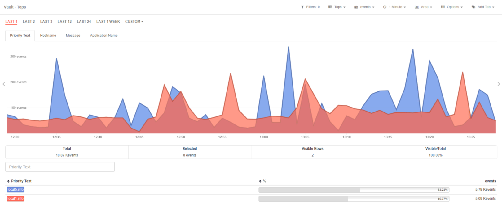

# Apps Overview

Redborder maximizes network visibility through a suite of powerful Apps designed for comprehensive data representation and visualization. 

Each app leverages specialized technology and operates through an independent interface to enhance network insights.

## Traffic

Analyzes network flow data (e.g., SFlow, NetFlow) and utilizes AI to detect anomalies, ensuring proactive network security.

## Intrusion

Provides real-time detection of malicious activities with a robust New Generation Network Intrusion Detection and Prevention System (NGIDS/NGIPS).

## Monitor

Tracks hardware health and network performance using SNMP, supporting continuous operational awareness.

## Scanner

Scans for vulnerabilities, identifying risks and providing reports for mitigation.

## Vault

Collects and centralizes logs for streamlined data management and improved oversight.

## Mobility

Monitors mobile devices to enforce security compliance, safeguarding mobile assets.

