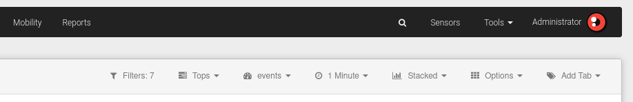

# Apps Menu

In this section, the common options that we can find in various apps will be explained.

## Top Menu

### Filters

Allow users to isolate a portion of the information for detailed inspection. In this tab, you can see the number of filters that have been applied to take actions on them:

- Advanced search.
- Create an alarm.
- Create a widget.

### Aggregations

The different metrics in which the data can be displayed. Each app has its own aggregations.

### Granularity

Indicates the degree of temporal detail that can be shown in the information. The minimum value for granularity is one minute.

### Chart Type

Displays the different types of graphs among which the data can be shown. The available graph types vary depending on the selected view:

**Area**: graph that overlays the data on a group of elements belonging to the selected attribute, making the total traffic the sum of the traffic per attribute.

**Lines**: graph that overlays the data on a group of elements belonging to the selected attribute; in this case, the area is not shown but the graph is represented by a line.

**Bars**: overlays data on a group of elements belonging to the selected attribute, with the total being the sum of values for each of those elements. In this case, the data is represented by bars.

**Stacked Bars**: provides in the same graph the data obtained for each of the elements included in the selected attribute, so you can see the results of independent IP, sensor, etc., represented in bars.

**Accumulated**: comparatively shows the data for each of the selected attributes in the same graph.

**Streams**: graph only available in Raw view.

### Options

The options vary depending on the selected view.

- **Show total/Hide total**: When selecting this option, the value of all differentiated traffic received or transmitted by each of the attributes that can be queried is displayed on the graph. When this option is active, the list of "Hide total" options appears. Available in the upper and unique view.
- **Export to CSV**: Provides the option to export to CSV including the data corresponding to the selected attribute, you can set a row limit to include in the file. Only available for **Tops and Unique views**.
- **Time machine**: By selecting this option, the user can see the data as if they were viewing it on the last specified day and time. Available for all views except Raw.
- **Sort aggregations**: Allows changing the order of the aggregations.
- **Sort columns**: **available for Raw view**. Allows changing the order of the columns.
- **Save tabs/columns as default**: The open tabs will be saved as the default tabs.
- **Start Reloading**: **available for Raw view**. Activates the countdown for data reload; on the left of the section bar, a countdown appears indicating the time to reload. At any time, this can be stopped by selecting *Stop Reloading*.
- **Export to PNG**: Export the graph in PNG format.

### Add Tab

Events received by the Manager consist of dimensions. The values given in each column can be understood as specific event data that actually provide information. These are called "tabs" or "dimensions".

## Time Selector

Filter events based on time periods. The periods defined in the platform are Last Hour, 2 hours, 3 hours, 12 hours, 24 hours, and Last Week.

There is the possibility to select a different time period than the default one offered. Depending on the user's needs, a custom selection of the period can be made using the Custom option. The procedure to perform a custom time filter is specified later.

## Tabs

By browsing through each of the tabs, detailed values associated with the selected dimension can be explored.

The user can change the order in which the tabs are displayed at any time. To do this, simply drag and drop the tab to the desired position.

## Chart

In this area, the data is displayed according to the selected view and chart type. Placing the mouse over any of the points that make up the chart, a dialog box displays detailed information for that moment in time, aggregation, and attribute.

## Table

### Summary

Below the *Chart* area, there is a summary of all the data displayed, both in the view and in the table. In the following order, this summary indicates the total aggregation value of all loaded data, the total aggregation value of all loaded and selected data, the number of rows of loaded data, and the percentage of aggregated value of the loaded data from the total data.

### Search

Allows searching by tab. Searches are automatically converted into filters.

### Data Table

Displays values classified by the selected attribute type. For example, each row could show each of the source IPs (Column/Attribute: SRC Address) with the percentage of detailed bytes (aggregation) that element consumes within the network.

For the isolated analysis of one or more elements from this bar (selecting as a filter), click on the element you want to filter and then press the corresponding button that will appear next to the search.
