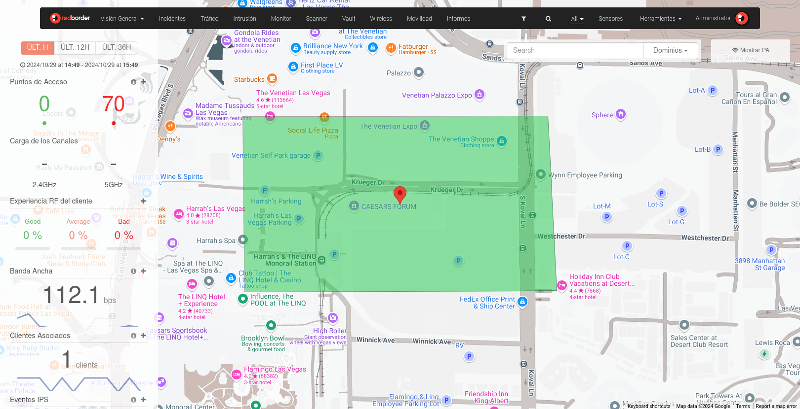
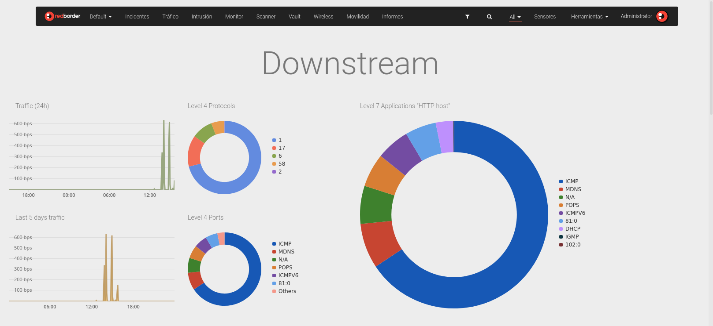

# Visión General y Dashboard predeterminado

Los Dashboards permiten tener un resumen visual de los datos. El usuario puede combinar widgets para obtener información valiosa sobre tendencias, cambios y excepciones asociadas con los datos recopilados en las diferentes aplicaciones.

## Dashboard de Visión General

Redborder Manager incluye un Dashboard de plataforma llamado **Visión General** que muestra la ubicación de los sensores en un mapa. Este Dashboard no puede ser editado ni eliminado por los usuarios.

## Dashboard predeterminado

Los Dashboards se pueden acceder directamente desde el primer elemento en el menú superior. El Dashboard predeterminado se muestra primero.

!!! note "Sobre la visibilidad de los Dashboards"
    Puedes ver tus propios Dashboards, así como aquellos que se han compartido contigo directamente por otros usuarios o a través de un dominio compartido.
