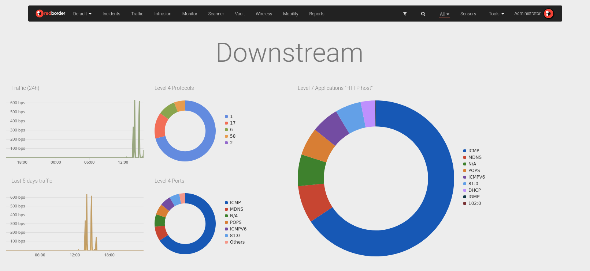

# Overview and Default Dashboard

Dashboards allow you to have a visual summary of the data. The user can combine widgets to obtain valuable information about trends, changes, and exceptions associated with the data collected in the differents Apps.

## Overview Dashboard

Redborder Manager includes a platform dashboard called **Overview** that shows the sensors' location on a map. This dashboard cannot be edited or deleted by the users.

## Default Dashboard

Dashboards can be accessed directly from the first item in the top menu. The default dashboard is displayed first.

!!! note "About dashboards visibility"
    You can view your own dashboards as well as those shared with you directly by other users or through a domain share.
