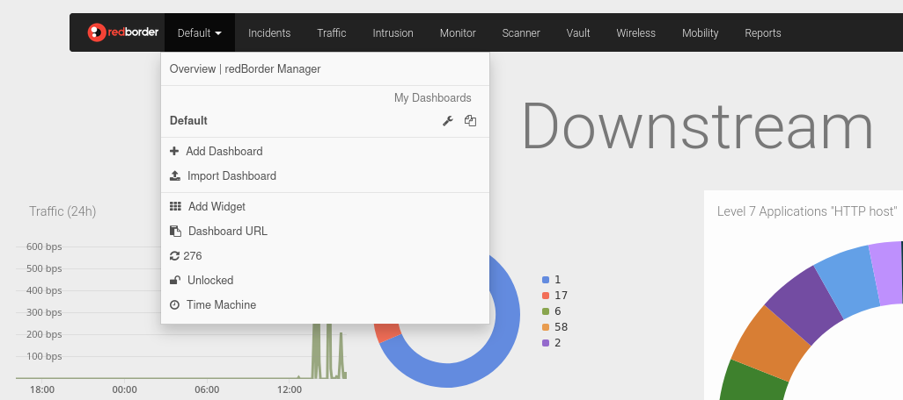

# Dashboards Menu

Click on **Dashboards** to expand the menu.

The Dashboards menu includes the following options:

- **My Dashboards**: At the top, you’ll see dashboards created and accessible to your profile. Each dashboard has two icons: the wrench icon to view and edit the dashboard’s general settings, and the **Clone** icon to duplicate the selected dashboard.
- **Add Dashboard**: Creates a new dashboard.
- **Import Dashboard**: Imports a previously exported dashboard.
- **Add Widget**: Opens the widget creation form.
- **Dashboard URL**: Copies a direct link to the current dashboard.
- **Refresh Time**: Updates the dashboard data.
- **Unlocked**: Prevents other users from editing the current dashboard when locked.
- **Time Machine**: Allows viewing metrics as they appeared on a specific date and time, simulating real-time data.
