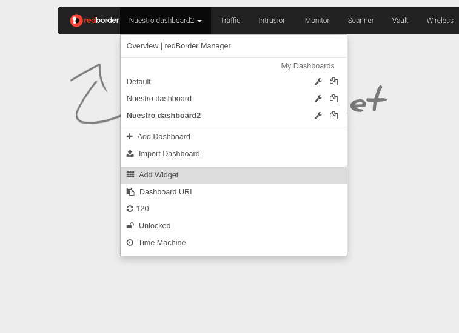

# Dashboard and Widget Administration

In the **Dashboards** section, users can create a wide variety of **widgets** that display specific information captured by the platform, either for efficient monitoring or for simply organization of these components. The idea is that both users and organizations can have better control of data analysis from a single screen.

## Requirements

Most widgets will require some type of operational **sensor** or **tool** to be functional. We will know which one based on the fact that widgets are categorized by modules. Implicitly, for a sensor to be operational, it is necessary for the corresponding module to be enabled.

!!! warning "In case a machine administrator disables a module via console..."
    Disabling a module will cause an **error** if the user tries to access a dashboard where a widget of that category exists. Therefore, before disabling said module, it is recommended to export the dashboard and/or delete it.

Additionally, to access the widgets, it is necessary to have editing permissions on the dashboard you intend to edit, as it is the container that will host the widgets.

## Dashboard and Widget Menu

Apart from the list of available dashboards, an administrator can access the following actions:

- **Add dashboard/Import dashboard**: allow adding a new custom dashboard and importing others already created. The process of creating and importing the dashboard will be seen later.
- **Add Widget**: add the widgets you want to customize in the dashboard.
- **Update time**: data in the dashboards is updated every 300 seconds (5 minutes), this time is customizable from *General Settings*. You will see a countdown of the remaining time until the next update. You can reset the count by clicking on the figure shown. At that moment, the word "Stopped" will appear. Click again to start the countdown.
- **Unlock**: The user has the option to lock/unlock the dashboard they are viewing so that no other user with permissions can edit the dashboard.

*Dashboard action menu*

## Create and configure a dashboard

Whether because the organization has restricted user permissions, because the organization doesn't have any dashboard, or because the user simply wants to manage their own dashboard, the user will come to the conclusion of creating a new one. In the dashboard menu, there is the **Add dashboard** button.

The first step will be to create a blank panel. Then add the widgets that meet the visualization needs.

*Locate add a dashboard*

When clicked, the form to edit the dashboard properties will open:

*Edit a new dashboard*

The dashboard can be reconfigured by clicking the edit button (wrench icon) next to the dashboard you intend to edit.

*Locate dashboard actions*

The appearance is similar to editing an already created dashboard, except for the **delete**, **convert to report**, and **export dashboard** actions.

*Edit a dashboard*

### Edit dashboard properties

There are multiple properties that can be filled:

- **Name**: Dashboard name. This name will be shown in the dashboard list and is the only value that is **mandatory** to fill.
- **Set this Dashboard as default**: There is always a default assigned dashboard. It is the dashboard that is displayed after completing the **login** process. If you want to change it to this dashboard, just check the box.
- **Description**: Additional description for the dashboard, which can be used to list the widgets intended to be included or justifications about restrictions on its users.
- **Layout**: The **column-based** option is the default option and will restrict the position and dimensions of widgets to fit a grid. In the case of selecting the **fixed position** option, there will be no natural restriction on where to place widgets on the dashboard.
- **Background Color**: The dashboard can be customized with a background color within a color palette. Just click the box you like.
- **Dashboard Users**: By default, only the user who created the dashboard can view and edit it. However, the **Dashboard Users** list can be expanded to add additional users who have editing permissions on the dashboard.
- **Dashboard Domains**: If you want to give access to a group of users who share a common domain, it's better to add it to the **Dashboard Domains** list. Thus, all users who have access to the domain will also have access to the dashboard.

!!! note "In case of entering a name that already exists..."
    The system allows duplicate dashboard names, but it is not recommended to do so, as it can lead to confusion.

!!! warning "If you update any parameter"
    Remember to press **Update Dashboard** to register the changes or they will be lost.

### Clone a dashboard

The other button (icon of two sheets) is used to clone the dashboard. When pressed, it will only ask you to change the name of the new dashboard:

*Name a dashboard clone*

### Add a user to the dashboard

To add a user with permissions, we press the **Add** button and select the users we want from the displayed list:

*User list*

These users will have permissions to view and interact with the widgets of the dashboard itself. If you want to add editing permissions, you must check the **Edit permissions** box.

### Add a domain to the dashboard

Alternatively, permissions can be based on the level of access in terms of domains. In such a way that all users who have access to that domain will also have access to that dashboard.
To add a domain with permissions, we press the **Add** button and select the domains we want from the expanded tree:

*Domain to add to the list*

Once the domains you want to add have been selected, you must press **Add Domains** button to cofirm the operation. So now the new domains will be added to the list:

*Domains added to the list*

Regarding permissions, there are 3 options:

- **None (default option)**: Only users included in the domain will be able to view and interact with the widgets on this dashboard.
- **Only by Admins**: Only those users who are included in the domain and have administrator level will be able to configure the dashboard.
- **All**: Only users included in the domain will be able to configure the dashboard.

### Delete dashboard

During editing, the delete button allows you to delete the dashboard. When pressed, it will ask for confirmation.

*Confirm removal*

### Export and import a dashboard

Pressing the **Export Dashboard** button will open the file browser for the user to download the current dashboard in *.csv* format. When you want to import, you can do so by pressing **Import Dashboard** in the **dashboard menu**. It is a very useful tool for sharing dashboards or for saving them in a safe place.

### Generate report

Dashboards can also be used as templates. Then these templates can be used to generate **reports** automatically. To generate the template, you must press **Convert to Report** and it will be saved in the **Reports** section.

*Confirm add report*

## Creating a widget

To create a widget, you will need to be on a dashboard and expand its editing options.

*Widget creation: location*

This will show us the present categories. By clicking on one of them, we can access the list of widgets for that category.

*Widget creation: categories*

Clicking on one of the options will open the widget creation form.

*Widget creation: configuration*

### Widget properties

During the creation or editing of a widget, there will be several properties to define for that widget. Depending on the widget, you will need to adjust some properties or others. The set of properties is:

- **Name**: Widget title
- **Chart type**: Type of visualization with which you want to display the data.

*Chart type selection*

- **Destination dashboard**: Dashboard that will host the widget. By default, it will be the dashboard we are currently on.
- **Click action**: Widgets are elements that respond when clicked. Here you define what action they perform: such as going to the particular **view** or going to another dashboard.
- **Range**: Time window from which to show data.
- **Aggregation**: Metric that will be used to calculate the values represented in the graph.
- **Series Type**: Property to decide how multiple lines of the same graph are displayed.
- **Granularity**: The time distance between two samples of the graph. Low granularity means higher definition in the graph.
- **Analysis**: Statistical details that can be added to the graph about the values to be measured.
- **Time zone**: To define the context of the widget based on its geolocation (if that widget represents any).
- **Color**: The first line color that will be used for the graph.
<!-- Reference -->
- **Filters**: Like in **views**, widgets can also be filtered to show exactly the data of interest.
- **Number of elements**: Maximum number of elements to show in the graph.
- **Columns**: List of fields you want to add to the graph. Clicking on the box will display the list.

*Columns*

- **Always show text**: If you want the widget text to be displayed, regardless of whether the mouse is over the widget or not.
- **Invert colors**: If the value to be represented is coded as a color, the color map can be inverted based on that value.

*Balls graph with threshold of 1*

- **Font size**: Alters the size of the text in the widget.
- **Alignment**: Positions the text within the widget.
- **Image**: Reference of the image you want to show in the widget. Use it to load an image from your local disk.
- **Maintain aspect ratio**: If you want the image not to be distorted as a result of widget sizing.
- **URL**: Link to the page you want to load within the widget.
<!-- - **Widget height (pixels)** -->
- **Unique**: with this option, occurrences or events of a column are isolated at a specific time.
- **Grouped**: with this option, occurrences or events of a column are isolated at a specific time grouped according to determined criteria.

The user can modify the information associated with each of the available dashboards by selecting "General Settings", clicking on the tool icon.

## Actions on the widget

The user can access the actions of each widget on the dashboard by expanding the menu in the right corner of the widget, indicated by the **three vertical dots** icon. The following actions are available:

- **Clone**: Allows duplicating the widget and incorporating it directly into the dashboard that the user selects.
- **Edit**: Allows modifying the properties and configuration of the widget.
- **Export to PNG**: Allows downloading the information currently shown in the widget in PNG format.
- **Reload**: Reloads the widget data to show the most recent information.
- **Delete**: Deletes the widget from the current dashboard.
- **Expand**: Shows the widget in full screen for better visualization.
- **Export data**: Allows downloading the widget data in CSV or JSON format.

*Actions on the widget*

Apart from that, the widget is a draggable element, so it can be moved anywhere within the dashboard. To do this, you must click on the widget title and drag it. A shadow will show where the widget will be positioned when the button is released.

*Reposition the widget*

Finally, the user can also scale the widget within the dashboard by dragging the bottom right corner of the widget.

*Widget resizing*

!!!warning "If there is a configured click action..."
    Remember that if the widget has a configured click action, clicking on the widget will execute and redirect to the view or dashboard that has been configured.

## What's next?

Whether as an administrator or as a user, configure the dashboards you consider necessary for your organization and for your users.
