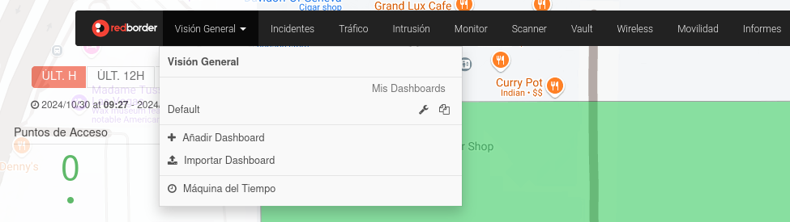
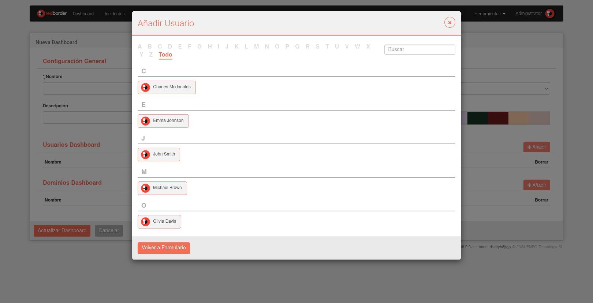

# Acciones del Dashboard

## Creación y Configuración de un Dashboard

Para configurar un nuevo Dashboard, comienza creando un panel en blanco y luego añade los widgets que se adapten a tus necesidades de visualización.

Haz clic en **Añadir Dashboard** para abrir el formulario de creación de Dashboard.

### Formulario de Dashboard

Completa el formulario con las siguientes propiedades:

- **Nombre**: Nombre del Dashboard.
- **Establecer como Predeterminado**: Cada usuario tiene un Dashboard predeterminado que se muestra al iniciar sesión.
- **Descripción**: Añade detalles sobre el Dashboard, como los widgets planeados o las guías de uso
- **Diseño**: La disposición **basada en columnas** es la predeterminada, alineando los widgets en una cuadrícula. La disposición de **posición fija** permite colocar los widgets libremente, sin restricciones de cuadrícula.
- **Color de Fondo**: Personaliza el Dashboard con un color de fondo seleccionado de una paleta de colores.
- **Usuarios Dashboard**: De forma predeterminada, solo el creador del Dashboard puede verlo y editarlo. Usa la lista de Usuarios del Dashboard para agregar otros usuarios con permisos de edición.
- **Dominios Dashboard**: Para conceder acceso a un grupo de usuarios dentro de un dominio compartido, agrega el dominio a la lista de Dominios del Dashboard. Esto permite que todos los usuarios en ese dominio accedan al Dashboard.

### Añadir un Usuario al Dashboard

Para agregar un usuario con permisos de visualización, haz clic en el botón **Añadir**, luego selecciona usuarios de la lista que aparece:

Los usuarios seleccionados podrán ver e interactuar con los widgets del Dashboard. Para otorgar permisos de edición, marca la casilla **Permisos de edición**.

### Añadir un Dominio al Dashboard

Los permisos también se pueden otorgar por dominio, permitiendo que todos los usuarios dentro de ese dominio accedan al Dashboard. Para agregar un dominio, haz clic en el botón **Añadir** y elige los dominios de la lista desplegada:

Después de seleccionar los dominios deseados, haz clic en **Añadir Dominios** para confirmar.

Los permisos para dominios incluyen tres niveles:

- **Ninguno (opción predeterminada)**: Solo los usuarios dentro del dominio pueden ver e interactuar con los widgets del Dashboard.
- **Solo por Administradores**: Solo los usuarios del dominio con privilegios de administrador pueden configurar el Dashboard.
- **Todos**: Todos los usuarios dentro del dominio tienen permisos de configuración para el Dashboard.

### Eliminar un Dashboard

Para eliminar un Dashboard, haz clic en el botón de eliminar. Aparecerá un mensaje de confirmación antes de que el Dashboard sea eliminado.

### Convertir en Reporte

Usa esta opción para convertir un Dashboard en un formato de reporte.

### Exportar Dashboards

Haz clic en **Exportar Dashboard** para descargar el Dashboard actual como un archivo .tar.gz.

Para importar un Dashboard, haz clic en **Importar Dashboard** en el Menú de Dashboards.