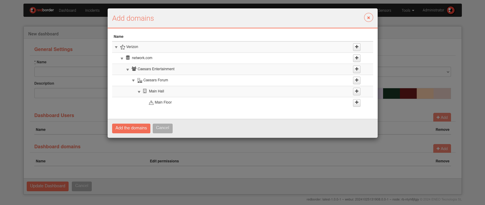

# Dashboard Actions

## Creating and Configuring a Dashboard

To set up a new dashboard, begin by creating a blank panel, then add widgets that suit your visualization needs.

Click **Add Dashboard** to open the dashboard creation form.

### Dashboard form

Complete the form with the following properties:

- **Name**: Name of the dashboard.
- **Set as Default**: Each user has a default dashboard, displayed immediately after login.
- **Description**: Add details about the dashboard, such as planned widgets or usage guidelines.
- **Layout**: The **column-based** layout is the default, aligning widgets to a grid. The **fixed position** layout allows free widget placement without grid constraints.
- **Background Color**: Customize the dashboard with a background color from a color palette.
- **Dashboard Users**: By default, only the dashboard creator can view and edit it. Use the Dashboard Users list to add other users with editing permissions.
- **Dashboard Domains**: To grant access to a group of users within a shared domain, add the domain to the Dashboard Domains list. This provides all users in that domain access to the dashboard.

### Adding a User to the Dashboard

To add a user with viewing permissions, click the Add button, then select users from the list that appears:

Selected users will be able to view and interact with the dashboard widgets. To grant editing permissions, check the **Edit permissions** box.

### Adding a Domain to the Dashboard

Permissions can also be granted by domain, allowing all users within that domain to access the dashboard. To add a domain, click the **Add** button and choose domains from the expanded list:

After selecting the desired domains, click **Add Domains** to confirm.

Permissions for domains include three levels:

- **None (default option)**: Only users within the domain can view and interact with dashboard widgets.
- **Only by Admins**: Only domain users with administrator privileges can configure the dashboard.
- **All**: All users within the domain have configuration permissions for the dashboard.

### Deleting a Dashboard

To delete a dashboard, click the delete button. A confirmation prompt will appear before the dashboard is removed.

### Convert to Report

Use this option to convert a dashboard into a report format.

### Export Dashboards

Click **Export Dashboard** to download the current dashboard as a .tar.gz file.

To import a dashboard, click **Import Dashboard** in the **Dashboard Menu**.
