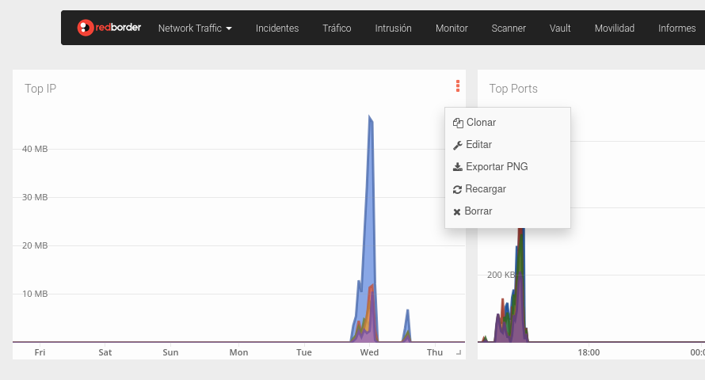

# Menú de Widgets

Para acceder a este menú los usuarios pueden hacer clic en el ícono de tres puntos verticales ubicado en la esquina superior derecha del widget.

Las siguientes acciones están disponibles:

- **Clonar**: Duplica el widget y permite al usuario agregar la copia directamente a un Dashboard seleccionado.
- **Editar**: Abre opciones para modificar las propiedades y configuración del widget.
- **Exportar PNG**: Descarga la vista actual del widget como una imagen PNG.
- **Recargar**: Actualiza el widget para mostrar los datos más recientes.
- **Borrar**: Elimina el widget del Dashboard actual.
