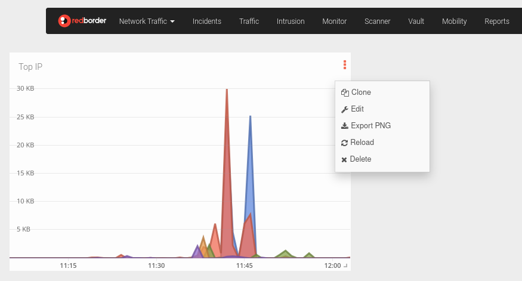

# Widgets Menu

To access this menu users can click the **three vertical dots** icon located in the widget's upper-right corner.

The following actions are available:

- **Clone**: Duplicates the widget and allows the user to add the copy directly to a chosen dashboard.
- **Edit**: Opens options to modify the widget's properties and configuration.
- **Export to PNG**: Downloads the current widget view as a PNG image.
- **Reload**: Refreshes the widget to display the most up-to-date data.
- **Delete**: Removes the widget from the current dashboard.
