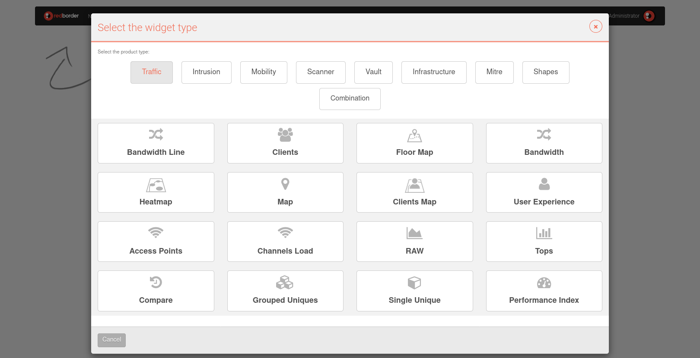
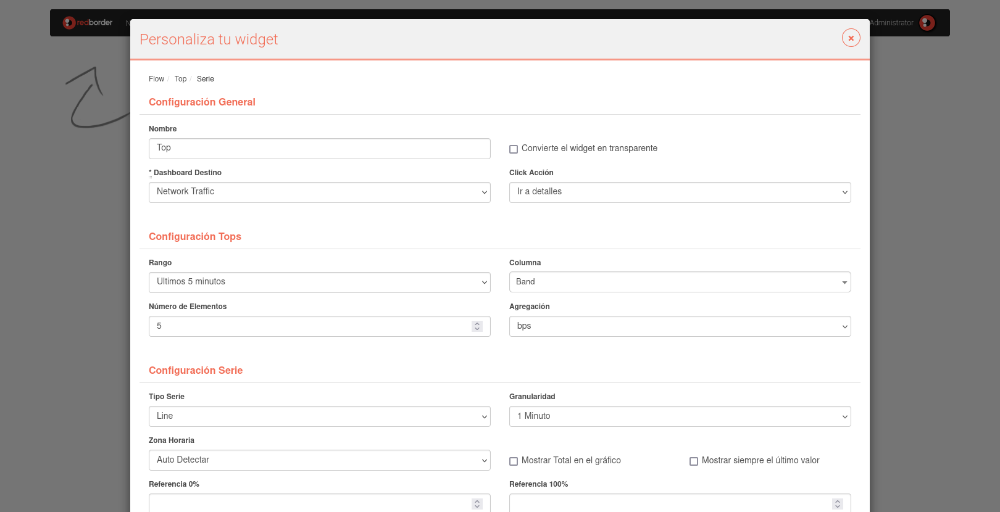

# Acciones de Widgets

## Creación de un Widget

Para crear un nuevo widget, haz clic en **Añadir Widget** en el menú del Dashboard.

Esto abre el asistente de widgets. El primer paso es seleccionar el tipo de producto (App) y el tipo de widget.

Ciertos tipos de widgets, como los Tops, incluyen un paso adicional para elegir el formato de visualización de los datos.

### Personaliza tu Widget

Dependiendo del tipo de widget, deberás completar varias propiedades específicas del widget.

#### Configuración General

- **Nombre**: Título del widget.
- **Dashboard Destino**: El Dashboard en el que aparecerá el widget. Por defecto, será el Dashboard actual.
- **Convierte el widget en transparente**: Activa la transparencia para el fondo del widget.
- **Clic Acción**: Define la respuesta del widget al hacer clic, como navegar a una vista específica o a otro Dashboard.

#### Configuración Tops

- **Rango**: Especifica el período de tiempo para los datos mostrados.
- **Número de Elementos**: Define el número máximo de elementos que se mostrarán en el gráfico.
- **Columnas**: Campos que deseas mostrar en el gráfico; al hacer clic en el cuadro se revelan las opciones disponibles.
- **Agregación**: Métrica utilizada para calcular los valores mostrados en el gráfico.

#### Configuración Serie
- **Tipo Serie**: Determina cómo se presentan múltiples líneas en el mismo gráfico.
- **Zona horaria**: Establece la zona horaria del widget para datos específicos de ubicación.
- **Granularidad**: Intervalo de tiempo entre muestras en el gráfico; una granularidad menor proporciona un detalle más fino.
- **Análisis**: Agrega información estadística al gráfico para los valores medidos.
- **Color**: Define el color de la línea principal del gráfico.
- **Mostrar siempre el texto**: Muestra el texto del widget de manera persistente, incluso sin interacción del mouse.
- **Invertir colores**: Invierte el esquema de colores si los valores están codificados por color.

#### Otras Configuraciones (disponibles según el tipo del widget)

- **Tamaño de fuente**: Ajusta el tamaño del texto dentro del widget.
- **Alineación**: Posiciona el texto dentro del widget.
- **Imagen**: Agrega una imagen al widget subiéndola desde tu unidad local.
Mantener relación de aspecto: Conserva la proporción de la imagen al cambiar el tamaño.
- **URL**: Carga una página web específica dentro del widget.
- **Único**: Aísla ocurrencias o eventos de una columna en un momento específico.
- **Agrupado**: Agrupa ocurrencias o eventos de una columna en un momento específico, según los criterios seleccionados.

#### Filtros

- **Filtros**: Aplica filtros para mostrar solo los datos relevantes para tu widget.
