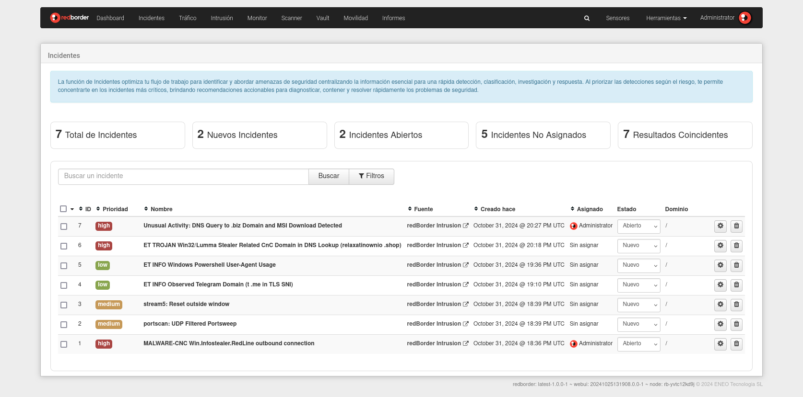
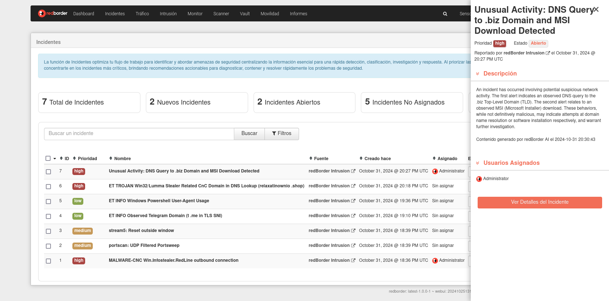

# Lista de Incidentes

La función de Incidentes de Redborder NDR simplifica la detección y respuesta a amenazas de seguridad al priorizar eventos de alto riesgo y centralizar toda la información clave en un solo lugar. Los eventos de fuentes integradas se agrupan en incidentes, lo que reduce el tiempo dedicado a alertas individuales y permite una respuesta más rápida.

Los incidentes se clasifican según su nivel de riesgo, enfocando la atención en los problemas más críticos. Indicadores comunes como dispositivos, direcciones IP y nombres de usuario se utilizan para vincular eventos relacionados.

Accede a las incidencias a través del menú superior.

## Búsqueda y filtrado de incidentes

Busca, filtra y ordena incidentes fácilmente para enfocarte en los casos más relevantes.

Por defecto, los incidentes se muestran en orden de fecha, del más reciente al más antiguo, sin aplicar ningún filtro.

## Campos del Incidente

Los campos de un incidente son los siguientes:

- **ID**: Identificador único para el seguimiento del incidente.
- **Prioridad**: Nivel de prioridad asignado al incidente para fines de gestión.
- **Nombre**: Título descriptivo para referencia rápida.
- **Fuente**: Fuente de datos de origen del incidente.
- **Fecha de Creación**: Fecha y hora de la detección inicial.
- **Asignado**: El usuario actualmente responsable de gestionar el incidente.
- **Estado**: El estado actual del incidente, que puede incluir:

## Estados del Incidente

- **Nuevo**: Recientemente creado y en espera de revisión.
- **Abierto**: Actualmente en investigación.
- **Cerrado**: La investigación ha concluido y no se requiere más acción.
- **Contención existosa**: Se han implementado con éxito medidas de contención.
- **Incidente Reportado**: Informado oficialmente a los interesados o autoridades relevantes.
- **Rechazado**: Determinado como falso positivo o desestimado por otra razón.
- **Restauración existosa**: Los sistemas y datos afectados han sido completamente restaurados.
- **Detenido**: La investigación o resolución está temporalmente pausada.
  
## Acciones de Incidente

Las acciones que puedes realizar en un incidente incluyen:

- **Gestionar Múltiples Incidentes**: Haz clic en la casilla de verificación dentro de la cabecera de la lista de incidentes para seleccionar todos los disponibles en la página actual, o selecciona uno a uno utilizando la casilla ubicada a la izquierda de cada incidente. Al presionar el ícono de los tres puntos, podrás cambiar el estado, vincular o borrar los incidentes seleccionados.
- **Ver Detalles del Incidente**: Haz clic en el nombre del incidente para acceder a información detallada.
- **Ver Eventos del Incidente**: Haz clic en la fuente para revisar los eventos relacionados con el incidente.
- **Cambiar Estado del Incidente**: Actualiza el estado haciendo clic en el campo de estado.
- **Gestionar Incidente**: Haz clic en el ícono de configuración para entrar en modo de gestión del incidente.
- **Eliminar Incidente**: Haz clic en el ícono de basura para eliminar el incidente de la lista.

## Contadores de Incidentes

En la parte superior de la vista de incidentes se encuentra la siguiente información:

- **Total de Incidentes**: Total de incidentes visibles.
- **Incidentes Creados**: Total de incidentes creados en la última hora.
- **Incidentes Abiertos**: Total de incidentes con estado **Abierto**.
- **Incidentes No Asignados**: Total de incidentes que no han sido asignados a ningún usuario.
- **Resultados Coincidentes**: Total de incidentes que coinciden con los filtros y busqueda de la lista de incidentes.

## Barra Lateral de Incidente

Al hacer clic en el nombre del incidente, se abre un resumen en la barra lateral. Seleccionar **Ver Detalles del Incidente** o el ícono de configuración proporciona acceso completo a los detalles del incidente. Si el estado es **Nuevo**, se actualizará automáticamente a Abierto y asignará el incidente a ti para su gestión.

