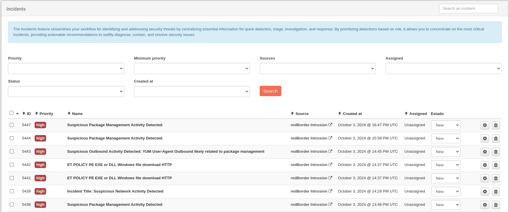

# Incidents List

The Redborder NDR Incidents feature simplifies detecting and responding to security threats by prioritizing high-risk events and providing all key information in one place. Events from integrated sources are grouped into incidents, reducing time spent on individual alerts and enabling faster response.

Incidents are ranked by risk, focusing attention on the most critical issues. Common indicators like devices, IP addresses, and usernames are used to link related events. 

Access incidents through the top menu.

## Searching and Filtering Incidents

You can search, filter, and sort to focus on specific incidents you want to view.

By default, no filter is applied and the list is ordered by date from most recent to oldest.

## Incident Fields

The fields of an incident are the following:

* **ID**: Unique identifier of the incident.
* **Priority**: The priority of the incident to be managed.
* **Name**: An explanatory name of the incident.
* **Source**: The datasource from which the incident was generated.
* **Created at**: The date and time when the incident was detected.
* **Assigned**: The user of the web that currently has the incident assigned.
* **Status**: The current state of the incident. Possible values include:

## Incident Status

* **New**: The incident has been created but not yet reviewed.
* **Open**: The incident is currently being investigated.
* **Closed**: The incident investigation is complete and no further action is required.
* **Containment Achieved**: The incident has been contained and prevented from spreading further.
* **Incident Reported**: The incident has been officially reported to relevant stakeholders or authorities.
* **Rejected**: The incident has been determined to be a false positive or not requiring further action.
* **Restoration Achieved**: Systems and data affected by the incident have been successfully restored.
* **Stalled**: The investigation or resolution of the incident has been temporarily halted due to various factors.
  
## Incident Actions

The actions that can be performed on an incident are the following:

* **View Incident Details**: Click on the name of the incident to see the details of the incident.
* **View Incident Events**: Click on the source of the incident to go to the view of the source of the incident.
* **Change Incident Status**: Click on status to change the status of the incident.
* **Access Incident**: Click on the settings icon to start managing the incident.
* **Delete Incident**: Click on trash icon to delete the incident.

## Incident Sidebar

Clicking on the name of the incident will open a quick incident description. Clicking on **View Incident Detail** will have the same effect as clicking on the settings icon. In both cases, if the incident's status was **New**, it will change to **Open**; and the user will be auto-assigned to yourself.

