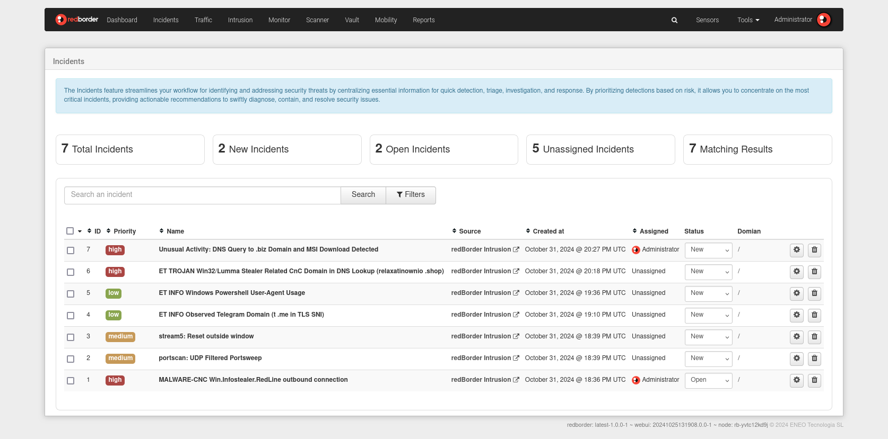
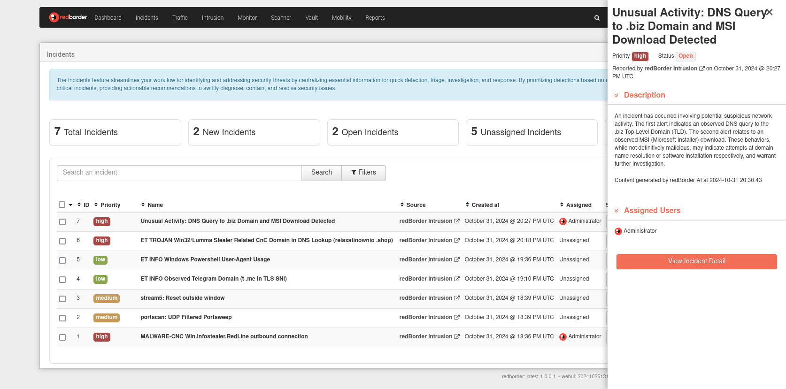

# Incidents List

The Redborder NDR Incidents feature simplifies detecting and responding to security threats by prioritizing high-risk events and providing all key information in one place. Events from integrated sources are grouped into incidents, reducing time spent on individual alerts and enabling faster response.

Incidents are ranked by risk, focusing attention on the most critical issues. Common indicators like devices, IP addresses, and usernames are used to link related events. 

Access incidents through the top menu.

## Searching and Filtering Incidents

Easily search, filter, and sort incidents to focus on the most relevant cases.

By default, incidents are displayed in order of date, from most recent to oldest, with no filters applied.

## Incident Fields

The fields of an incident are the following:

- **ID**: Unique identifier for tracking the incident.
- **Priority**: The priority level assigned to the incident for management purposes.
- **Name**: A descriptive title for quick reference.
- **Source**: The originating data source of the incident.
- **Created At**: Date and time of initial detection.
- **Assigned**: The user currently responsible for managing the incident.
- **Status**: The current state of the incident, which may include:

## Incident Status

- **New**: Recently created and awaiting review.
- **Open**: Currently under investigation.
- **Closed**: Investigation is complete, and no further action is needed.
- **Containment Achieved**: Containment measures have been successfully implemented.
- **Incident Reported**: Officially reported to relevant stakeholders or authorities.
- **Rejected**: Determined to be a false positive or otherwise dismissed.
- **Restoration Achieved**: Affected systems and data have been fully restored.
- **Stalled**: Investigation or resolution is temporarily paused.
  
## Incident Actions

Actions you can perform on an incident include:

- **Manage Multiple Incidents**: Click the checkbox within the header of the incident list to select all available incidents on the current page, or select one by one using the checkbox located to the left of each incident. By pressing the three-dot icon, you will be able to change the status, link or delete the selected incidents.
- **View Incident Details**: Click the incident name to access detailed information.
- **View Incident Events**: Click the source to review related incident events.
- **Change Incident Status**: Update the status by clicking on the status field.
- **Manage Incident**: Click the settings icon to enter incident management mode.
- **Delete Incident**: Click the trash icon to remove the incident from the list.

## Incident Counters

At the top of the incident view you will find the following information:

- **Total Incidents**: Total number of visible incidents.
- **Created Incidents**: Total number of incidents created in the last hour.
- **Open Incidents**: Total number of incidents with status **Open**.
- **Unassigned Incidents**: Total number of incidents that have not been assigned to any user.
- **Matching Results**: Total number of incidents that match the filters and search in the incident list.

## Incident Sidebar

Clicking the incident name opens a summary in the sidebar. Selecting **View Incident Details** or the settings icon provides full access to the incident details. If the status is **New**, it will automatically update to Open and assign the incident to you for management.

