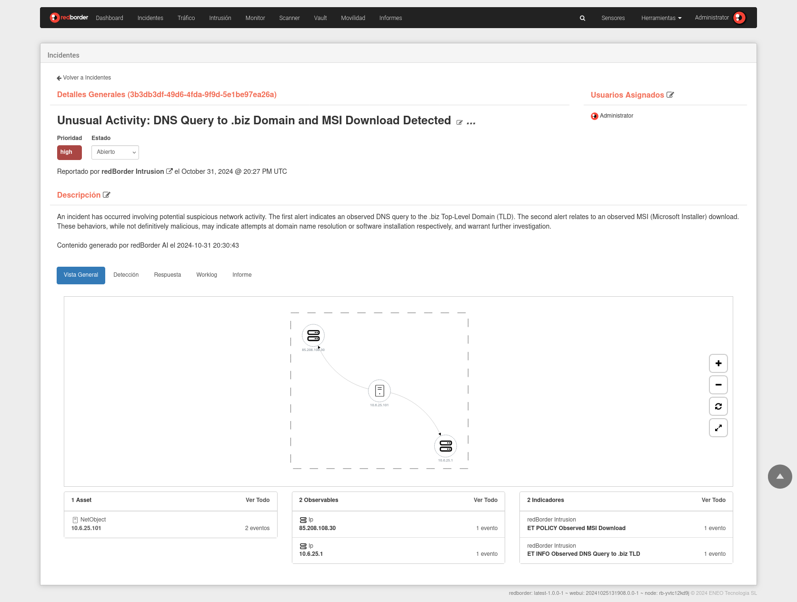
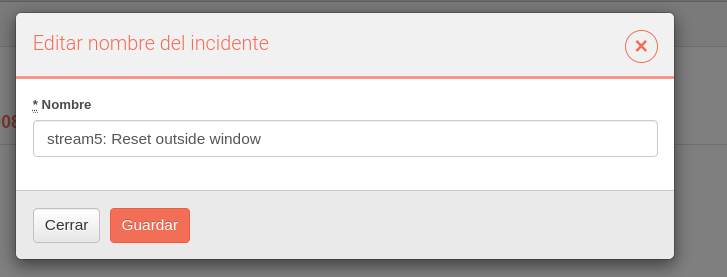
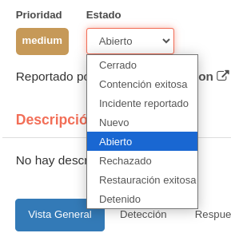
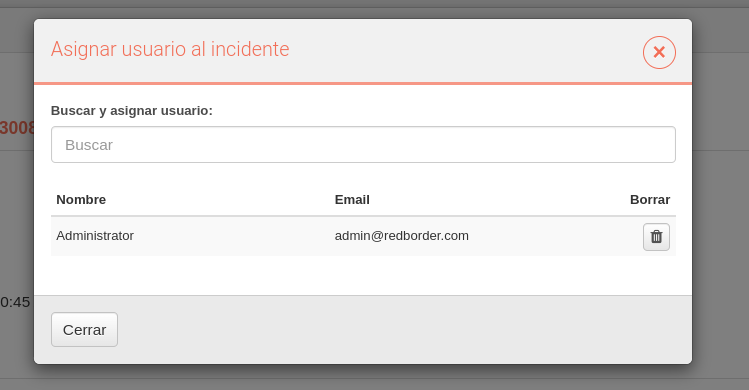
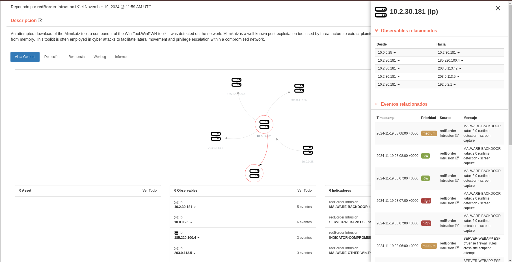
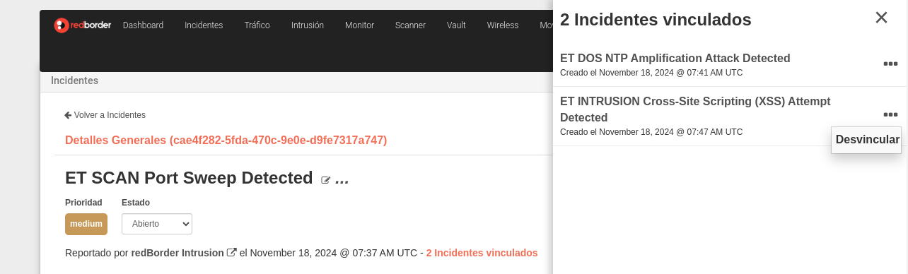
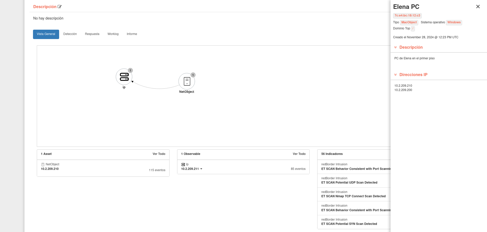
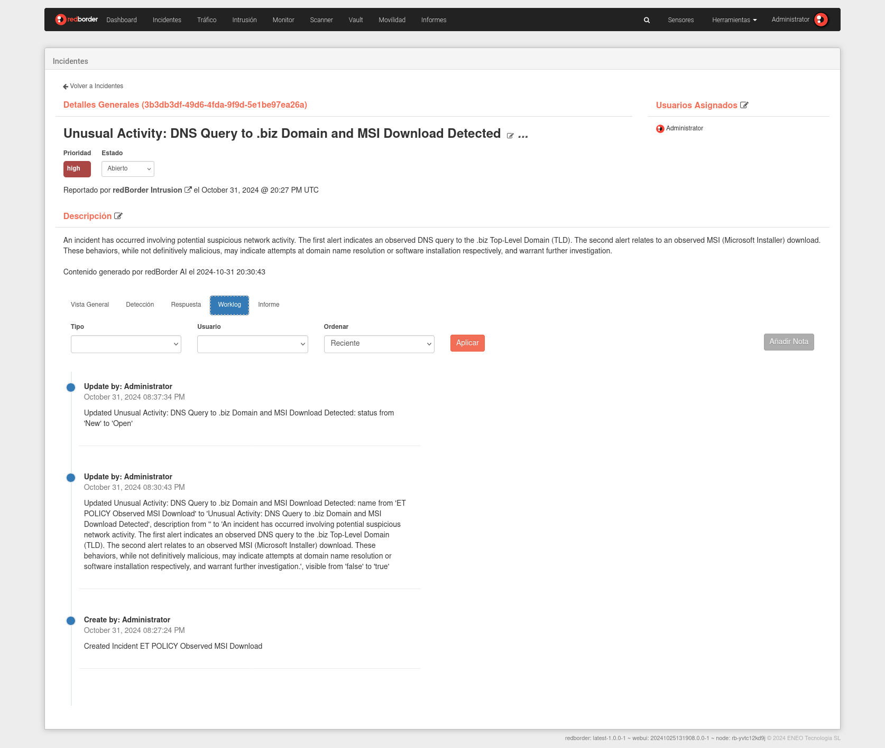
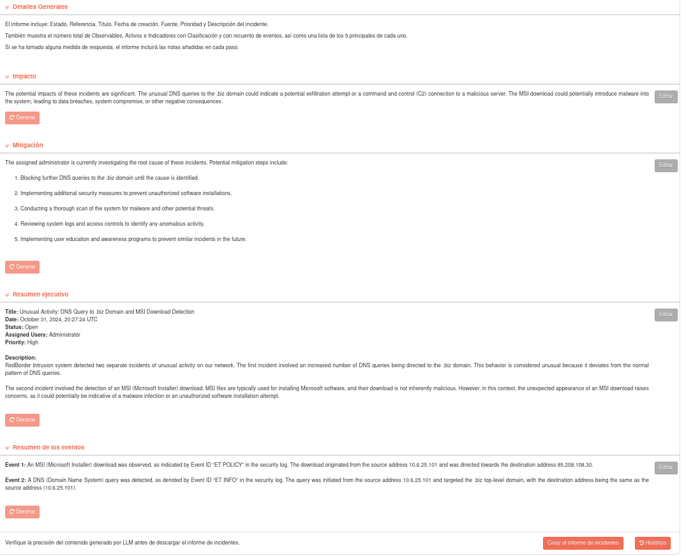

# Detalles del Incidente

La página de detalles del incidente ofrece información completa sobre un incidente, lo que ayuda a diagnosticarlo, contenerlo y solucionarlo. Incluye un encabezado, un gráfico de ataque y varias pestañas para acceder a las secciones **Vista general**, **Detección**, **Respuesta**, **Worklog** e **Informe**.

## Overview del Incidente

En el encabezado de la página **Detalles del incidente**, puede ver el estado y la prioridad, el nombre del incidente y qué fuente lo informó junto con la marca de tiempo, una descripción, quién ha sido asignado al incidente y las tácticas MITRE ATT&CK®.

### Overview

La sección de Resumen resume la información clave del incidente, mostrando:

- **Activos** involucrados
- **Observables** identificados
- **Indicadores** vinculados al incidente

Un gráfico interactivo visualiza las relaciones entre los observables, permitiendo a los usuarios comprender rápidamente sus conexiones.

Puedes realizar las siguientes acciones dentro de la sección de Detalles del incidente:

=== "Editar el título"

    Puedes modificar el título del incidente presionando el ícono de editar ubicado al lado del **título** del incidente.

    

=== "Editar descripción"

    Puedes modificar la descripción del incidente presionando el ícono de editar ubicado al lado de la **Descripción** del incidente.

    

=== "Editar estado"

    Puedes modificar el estado del incidente presionando el dropdown de **Estado**.

    

=== "Asignar usuarios"

    Puedes asignar diferentes usuarios presionando el ícono de editar ubicado al lado de **Usuarios Asignados**. El usuario asignado recibirá una notificación de que ha sido asignado al incidente en cuestión.

    

#### Gráfica de Detalles del incidente

El gráfico de **Detalles del incidente** que se encuentra en la parte superior de la página presenta una visualización de las relaciones entre eventos que llevaron al incidente.

La relación entre los nodos se muestra en la etiqueta de la flecha direccional que conecta a otros nodos. Cuando hay varios nodos que se han unificado en un objeto y comparten una flecha direccional, puede pasar el cursor sobre un nodo para resaltar los demás nodos que tienen una relación con él.

Puede realizar las siguientes acciones:

| Icono                   | Descripción                                                                                                             |
| ----------------------- | ----------------------------------------------------------------------------------------------------------------------- |
| :material-plus:         | Haga clic en este icono para reducir la vista de la información dentro del panel.                                       |
| :material-minus:        | Haga clic en este icono para ampliar la información dentro del panel.                                                   |
| :material-refresh:      | Haga clic en este icono para realinear los nodos y centrar nuevamente el gráfico.                                       |
| :material-arrow-expand: | Haga clic en este icono para centrar nuevamente el gráfico dentro del panel cuando este se expande a pantalla completa. |

Al hacer clic en un nodo, se abre una barra lateral que proporciona información detallada y útil sobre el elemento seleccionado.

#### Ver Tácticas de MITRE ATT&CK 

El modal de MITRE muestra las tácticas, técnicas y subtécnicas de MITRE ATT&CK® que impactan el incidente.

#### Incidentes vinculados

La vinculación de incidentes mejora la gestión de incidentes al agrupar incidentes relacionados y establecer una relación bidireccional entre ellos, lo que agiliza el flujo de trabajo de respuesta a incidentes.

Puede vincular dos o más incidentes y, una vez vinculados, su relación se muestra en el sidebar Incidentes vinculados dentro de los detalles del incidente. Además, los incidentes se pueden desvincular directamente desde este sidebar según sea necesario.

#### Barra Lateral de Observables

Para obtener más información sobre los observales implicados, haga clic en el nodo correspondiente dentro del gráfico. Se abrirá una barra lateral con los detalles del observale con su correspondientes nodos y eventos relacionados.

#### Barra Lateral de Activos

Para obtener más información sobre los activos implicados, haga clic en el nombre del activo deseado en la sección "Activos" o en el nodo correspondiente dentro del gráfico. Se abrirá una barra lateral con los detalles del activo.

### Detección

La sección de **Detección** enumera los eventos relevantes y sus observables y activos que contribuyeron al incidente, proporcionando una visión de cómo fue identificado.

### Respuesta

La sección de **Respuesta** presenta un **playbook**, una guía paso a paso adaptada al tipo de incidente. Los playbooks aseguran un enfoque sistemático de respuesta, con tareas organizadas por fase. Cada tarea incluye una descripción, espacio para comentarios de los usuarios y un marcador de finalización.

!!!info "Note"
    Puede administrar los **playbooks** asignados a los incidentes a través de la función Playbooks en la sección Herramientas (Herramientas > Playbooks).

Cada fase enumera las tareas que deben completarse secuencialmente. Los usuarios pueden documentar sus acciones y marcar las tareas como realizadas.

En este ejemplo, el playbook contiene cuatro fases:

=== "Identificación"

    La fase de **Identificación** del proceso de respuesta a incidentes se centra en validar la amenaza y decidir si se justifica una investigación más exhaustiva. Esta fase implica revisar el incidente para confirmar que es un verdadero positivo e indicativo de un comportamiento anómalo, analizar los indicadores relevantes, confirmar la validez del incidente, asignar un estado adecuado, documentar todas las pruebas y notificar a las partes involucradas.

=== "Contención"

    La fase de **Contención** del proceso de respuesta a incidentes implica la identificación de los hosts afectados y la contención de los indicadores de vulnerabilidad para evitar la propagación de actividades maliciosas. Esta fase también incluye la implementación de un monitoreo adicional para detectar cualquier actividad maliciosa en curso relacionada con el incidente e identificar vulnerabilidades que puedan haberse explotado.

=== "Erradicación"

    La fase de **erradicación** del proceso de respuesta a incidentes se centra en mitigar o remediar vulnerabilidades, eliminar contenido malicioso y validar la erradicación de la amenaza. También implica restaurar los hosts afectados e implementar la supervisión para garantizar que el sistema se recupere por completo del incidente.

=== "Recuperación"

    La fase de **Recuperación** del proceso de respuesta a incidentes implica restaurar los sistemas y servicios a sus operaciones normales, garantizando que el entorno sea seguro y completamente funcional para reanudar las actividades comerciales.

### Worklog

El **Worlog** documenta todas las acciones realizadas por los usuarios en el incidente. Los usuarios pueden ver, filtrar y añadir / editar / eleminar comentarios manualmente según sea necesario.

### Búsqueda y Filtro del Worklog

Las entradas del Worklog se pueden filtrar por Tipo y Usuario y ordenar por fecha. Los tipos de registros incluyen:

- **Cambios en el Incidente**: Registros generados por el sistema para actualizaciones de estado y acciones de los usuarios.
- **Acciones de Respuesta**: Registros añadidos por el usuario durante las actividades de investigación y respuesta.
- **Notas**: Notas creadas por el usuario para información adicional.

Los usuarios pueden añadir notas al worklog haciendo clic en **Añadir Nota**, lo que abre un editor de texto. El editor permite:

- Inserción de enlaces
- Bloques de código y formato de texto
- Otras opciones de formato

### Informe

La página **Informe** dentro de Detalles del incidente proporciona información resumida del incidente generada por IA, que se puede editar, formatear con Markdown y descargar como un solo archivo de informe. Si los detalles del incidente cambian, se pueden volver a generar secciones individuales para obtener contenido actualizado generado por IA. Estas actualizaciones se pueden editar y descargar nuevamente para crear un informe actualizado.

Genera el informe del incidente usando Redborder AI.

Haz click en **Crear el informe de incidentes** para generar una versión en PDF del informe.

Puedes ver el historial de reportes generados haciendo click en **Historial**