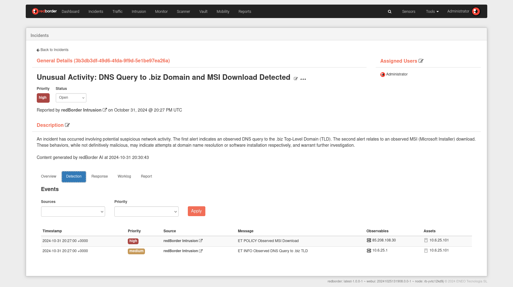
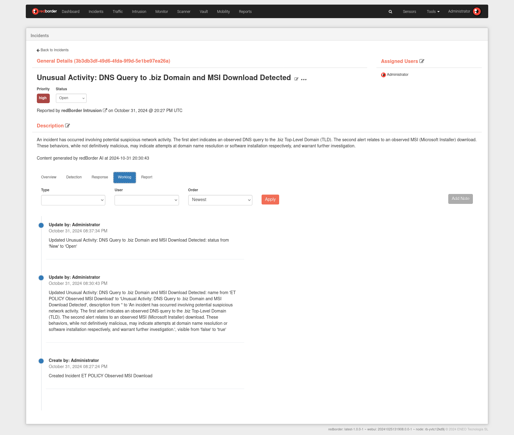
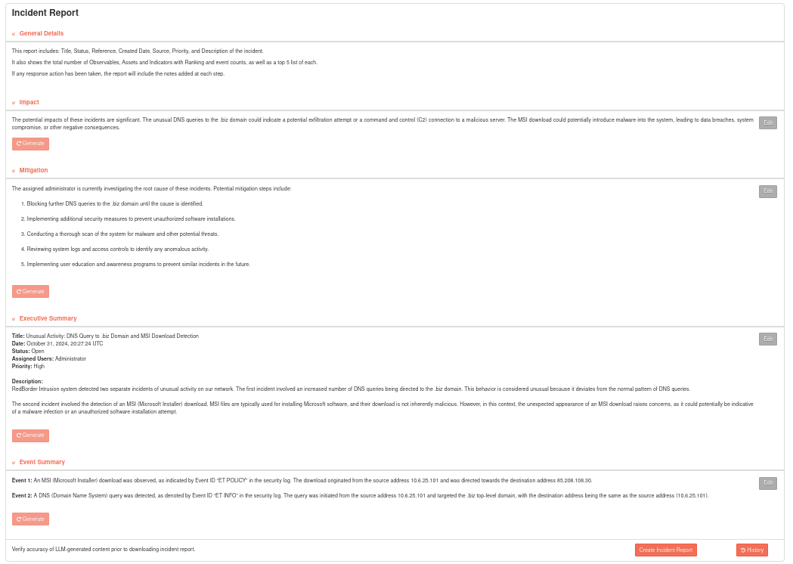

# Incident Details

## Incident Overview

This view provides comprehensive information about the incident, allowing users to document each step of the response process.

### Overview

The Overview section summarizes key information about the incident, displaying:

- **Assets** involved
- **Observables** identified
- **Indicators** linked to the incident

An interactive graph visualizes the relationships between observables, enabling users to quickly understand their connections.

### Detection

The **Detection** section lists relevant events and its observables and assets contributing to the incident, providing insight into how it was identified.

### Response

The **Response** section presents a **playbook**, a step-by-step guide tailored to the incident type. Playbooks ensure a systematic response approach, with tasks organized by phase. Each task includes a description, space for user comments, and a completion marker.

The default playbook contains four phases:

- **Identification**
- **Containment**
- **Eradication**
- **Recovery**

Each phase lists tasks to be completed sequentially. Users can document their actions and mark tasks as done.

### Worklog

The **Worklog** records all actions taken by users on the incident. Users can view, filter, and manually add comments as needed.

#### Worklog Search & Filter

Worklog entries can be filtered by **Type** and **User** and sorted by date. The types of logs include:

- **Incident Changes**: System-generated logs for status updates and user actions.
- **Response Logs**: User-added logs during investigation and response activities.
- **Notes**: User-created notes for additional information.

Users can add notes to the worklog by clicking **Add Note**, which opens a text editor. The editor supports:

- Link insertion
- Code blocks and text formatting
- Other formatting options

### Report

Generate the incident report using Redborder AI.

Click in **View Incident Report** to generate a PDF version of the report.

