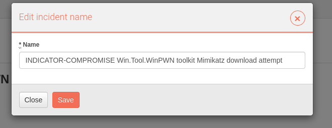
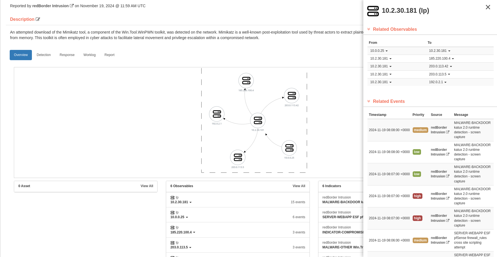
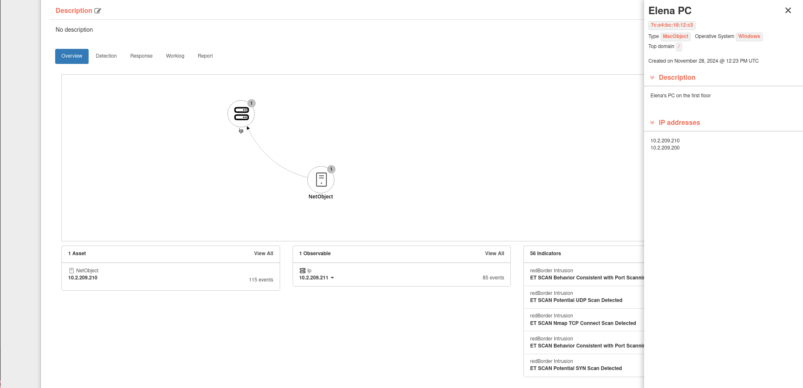

# Incident Details

The Incident Detail page offers comprehensive information about an incident, aiding in its diagnosis, containment, and remediation. It features a header, an attack graph, and several tabs for accessing the **Overview**, **Detection**, **Response**, **Worklog** and **Report** section.

## Incident Overview

In the header of the **Incident Detail** page, you can view the status and priority, the incident name and which source reported it along with timestamp, a description, who has been assigned to the incident, and the MITRE ATT&CK® Tactics.

### Overview

The Overview section summarizes key information about the incident, displaying:

- **Assets** involved
- **Observables** identified
- **Indicators** linked to the incident

An interactive graph visualizes the relationships between observables, enabling users to quickly understand their connections.

You can take the following actions inside the Overview tab of the incident:

=== "Edit tile"

    You can modify the tile of an incident by pressing the pen icon located next to the incident **title**.

    

=== "Edit description"

    You can modify the description of an incident by pressing the pen icon located next to the **description** label.

    

=== "Edit status"

    You can modify the status of the incident by pressing the **status** dropdown.

    

=== "Assing user"

    You can assing users by pressing the pen icon located next to the **Assigned Users** label. The assigned user will recieve a notification indicating that has been assigned to the incident.

    

#### Overview Graph

The **overview** graph at the top of the page presents a condensed visualization of the event relationships leading to the incident's escalation.

The relationship between nodes is shown on the label of the directional arrow that connects to other nodes. When there are multiple nodes that have been unified into one object and share a directional arrow, you can hover over one node to highlight the other nodes that have a relationship to it.

You can take the following actions:

| Icon                    | Description                                                                                       |
| ----------------------- | ------------------------------------------------------------------------------------------------- |
| :material-plus:         | Click this icon to decrease the view of information within the panel.                             |
| :material-minus:        | Click this icon to enlarge the information within the panel.                                      |
| :material-refresh:      | Click this icon to reflow the nodes and recenter the graph.                                       |
| :material-arrow-expand: | Click this icon to recenter the graph within the panel when the panel is expanded to full screen. |

Clicking on a node opens a sidebar that provides detailed and useful information about the selected element.

#### View MITRE ATT&CK Tactics

The MITRE modal shows the MITRE ATT&CK® tactics, techniques and sub-techniques impacting the incident.

#### Linked Incidents

Linking incidents enhances incident management by aggregating related incidents and establishing a bi-directional relationship between them, streamlining the incident response workflow.

You can link two or more incidents, and once linked, their relationship is displayed in the Linked Incidents sidebar within the incident details. Additionally, incidents can be unlinked directly from this sidebar as needed.

#### Observables Sidebar

For more information on the observables, click on the corresponding node within the graph. This will open a sidebar displaying the observable's details, including related nodes and events.

#### Assets Sidebar

For more information on the assets involved, click on the name of the desired asset in the “Assets” section or on the corresponding node within the graph. This will open a sidebar with the asset's details.

### Detection

The **Detection** section lists relevant events and its observables and assets contributing to the incident, providing insight into how it was identified.

| Column Name   | Description                                                                                                                                            |
| ------------- | ------------------------------------------------------------------------------------------------------------------------------------------------------ |
| `Timestamp`   | Date and time the sighting was first observed.                                                                                                         |
| `Priority`    | The threat level given to the event.                                                                                                                   |
| `Source`      | Source that produced the sighting. Click the Source link to open the event.                                                                            |
| `Message`     | Event message.                                                                                                                                         |
| `Observables` | Any observables that were contained in the event. Click the dropdown to copy in the clipboard, create object or see lookup sources of the observables. |
| `Assets`      | The assets that were targeted in the sighting.                                                                                                         |

### Response

The **Response** section presents a **playbook**, a step-by-step guide tailored to the incident type. Playbooks ensure a systematic response approach, with tasks organized by phase. Each task includes a description, space for user comments, and a completion marker.

!!!info "Note"
    You can manage the **playbooks** assigned to incidents through the Playbooks feature in the Tools section (Tools > Playbooks).

Each phase lists tasks to be completed sequentially. Users can document their actions and mark tasks as done.

The default playbook contains four phases:

=== "Identification"

    The **Identification** phase of the incident response process focuses on validating the threat and deciding whether further investigation is warranted. This phase involves reviewing the incident to confirm it is a true positive and indicative of anomalous behavior, analyzing relevant indicators, confirming the incident's validity, assigning an appropriate status, documenting all evidence, and notifying the involved parties.

=== "Containment"

    The **Containment** phase of the incident response process involves identifying the affected hosts and containing indicators of compromise to prevent the spread of malicious activity. This phase also includes implementing additional monitoring to detect any ongoing malicious activity related to the incident and identifying vulnerabilities that may have been exploited.

=== "Eradication"

    The **Eradication** phase of the incident response process focuses on mitigating or remediating vulnerabilities, removing malicious content, and validating the eradication of the threat. It also involves restoring affected hosts and implementing monitoring to ensure the system recovers fully from the incident.

=== "Recovery"

    The **Recovery** phase of the incident response process involves restoring systems and services to normal operations, ensuring the environment is secure and fully functional to resume business activities.

### Worklog

The **Worklog** records all actions taken by users on the incident. Users can view, filter, and manually add / edit / delete comments as needed.

#### Worklog Search & Filter

Worklog entries can be filtered by **Type** and **User** and sorted by date. The types of logs include:

- **Incident Changes**: System-generated logs for status updates and user actions.
- **Response Logs**: User-added logs during investigation and response activities.
- **Notes**: User-created notes for additional information.

Users can add notes to the worklog by clicking **Add Note**, which opens a text editor. The editor supports:

- Link insertion
- Code blocks and text formatting
- Other formatting options

### Report

The **Report** page within the Incident Detail provides AI-generated incident summary information, which can be edited, formatted using Markdown, and downloaded as a single report file. If the incident details change, individual sections can be regenerated to obtain updated AI-generated content. These updates can then be edited and downloaded again to create an up-to-date report.

Generate the incident report using Redborder AI.

Click in **Create Incident Report** to generate a PDF version of the report.

You can see the history of the generated incident reports by clicking **History**
