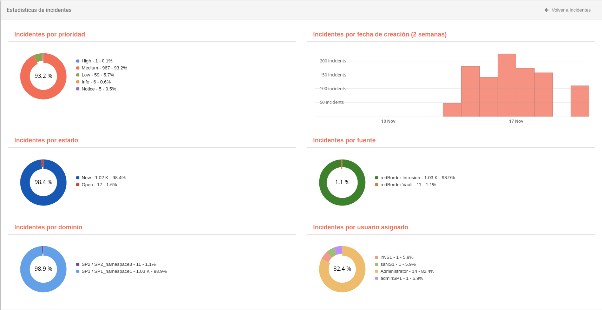

# Estadísticas de Incidentes

La pestaña de **Estadísticas de Incidentes** proporciona una visión general de los datos relacionados con los incidentes mediante gráficos y widgets interactivos.

## Acceso a las Estadísticas de Incidentes

Para acceder a esta pestaña:

1. Navega a la sección **Incidentes** en el menú principal.
2. Haz clic en la opción **Estadísticas**, ubicada en la parte superior de la pantalla.

## Widgets Disponibles

En la pestaña **Estadísticas de Incidentes**, puedes explorar los datos mediante diferentes widgets, que incluyen:

- **Incidentes por prioridad**: Visualiza la distribución de incidentes según su nivel de prioridad.
- **Incidentes por fecha de creación**: Analiza los incidentes organizados por fechas.
- **Incidentes por estado**: Observa el estado actual de los incidentes (abierto, cerrado, etc.).
- **Incidentes por fuente**: Consulta el origen de los incidentes registrados.
- **Incidentes por dominio**: Examina los incidentes clasificados por dominio.
- **Incidentes por usuario asignado**: Revisa cuántos incidentes están asignados a cada usuario.

