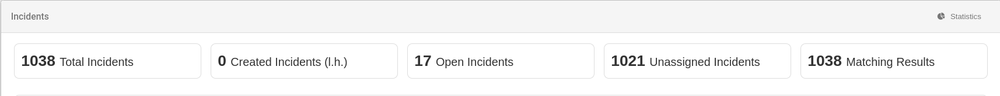

# Incident Statistics

The **Incident Statistics** tab provides an overview of incident-related data using interactive charts and widgets.

## Accessing Incident Statistics

To access this tab:

1. Navigate to the **Incidents** section in the main menu.
2. Click on the **Statistics** option, located at the top of the screen.

## Available Widgets

On the **Incident Statistics** tab, you can explore data using different widgets, including:

- **Incidents by Priority**: Visualizes the distribution of incidents based on their priority level.
- **Incidents by Creation Date**: Analyzes incidents organized by date.
- **Incidents by status**: View the current status of incidents (open, closed, etc.).
- **Incidents by source**: View the source of incidents.
- **Incidents by domain**: View incidents classified by domain.
- **Incidents by assigned user**: View how many incidents are assigned to each user.

