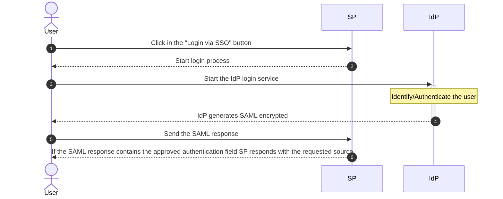
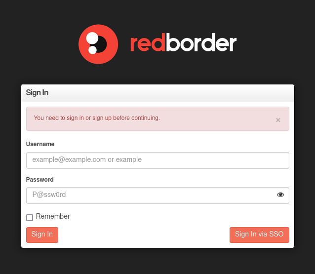

# Integrate Single Sign On with Redborder manager Web Platform  

This documentation provides a step-by-step guide to integrating [Single Sign On](https://en.wikipedia.org/wiki/Single_sign-on) (SSO) using the [SAML protocol](https://en.wikipedia.org/wiki/SAML_2.0) with the Redborder Web Platform. By following these instructions, you will be able to enable SSO and configure it, allowing you to login and register into the Redborder Web Platform.  

SAML Protocol diagram:  

## Enable SSO

First of all, you need to enable the SSO login system. For that go to `General Settings -> Single Sign On` and enable the related checkbox.  

After, the SSO login system is enabled. You can check it by going to the login page and seeing there is a button *"Login via SSO"* like the below image.  

  

## Configure Redborder Web UI to use SSO  

1. Go to `General Settings`.  
2. Click on the  **"Single Sign On"** card.  
3. Fill the fields with the related values.  
4. Press the **"Update"** button to apply the changes.  

### Configurable parameters

  

- **Lock New Users When Created**: This setting enable the option to lock the account when it is created.

=== "IdP Parameters"  
    - **IdP Single Sign On Target URL**: This is the URL that redirects to the IdP when you want to login.  
    - **IdP Single Logout On Target URL**: This is the URL that redirects to the IdP when you want to log out. There are some IdPs that have not this configuration, then write the Redborder logout path: `<host>/users/logout`.  
    - **IdP Entity ID**: This is the URL used by the SP to verify the SAML responses coming from the IdP.  
    - **IdP Certificate**: The unique certificate provided by the IdP that allows decrypting the encrypted response of the authentication and get the user attributes.  

=== "SP Parameters"  
    - **SP Entity ID**: This is the URL of the SP that will receive the metadata from the IdP.  
    - **SP Target URL**: This is the URL of the SP that check the SAML response and log in.  
    - **SP Certifcate**: This is the file which contains the public certificate that encrypts the communication with the IdP. It must be a `.crt` or `.pub` file.  
    - **SP Private Key**: This is the private key of the certificate that encrypts the communication with the IdP. It must be a `.key` file.  

## Login and register  

After setting all the settings, SSO can be used. To use it, go to the login path and you will see a button referring to SSO. Click on it and will redirect you to the SSO configured service of the IdP.  
