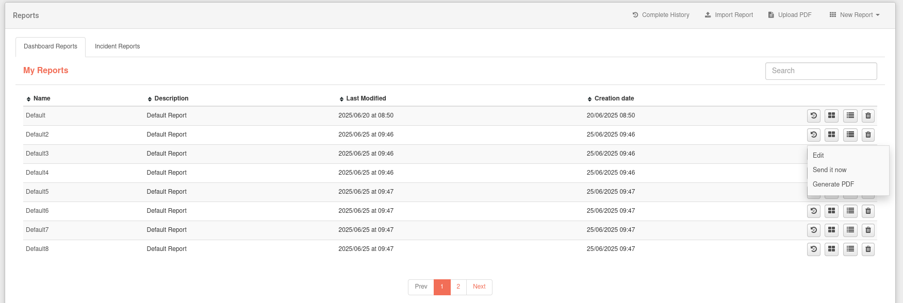

# Creating Reports

The **Reports** allows the user to create periodic reports with the information provided by the Redborder platform.

To create a new report,click on the drop-down with the text **New Report** and then click on the “New Group” button. Complete the fields in order to create the report.

You also have the option to import a report from a file using the **Import Report** button. At the same time, next to it you have a button to view the complete history of all reports you have access to.

During the creation of a new report, you can select parameters such as schedule type, share with specific users or share with domains. Once the report is created, it will appear in the list of reports mentioned above.

In the composition view, the user can edit the report and add new widgets by pressing the *Add Block* button. If we grab the widget from the title bar at the top, we will be able to move it. In the lower right corner of each widget, the cursor will change shape, allowing you to change the size of the widget.

When generating a report, a new window will open in which, after a few seconds of loading, the report will be rendered in PDF format. The user will be able to download the report by pressing the *Print* icon  located at the top right of the screen.
