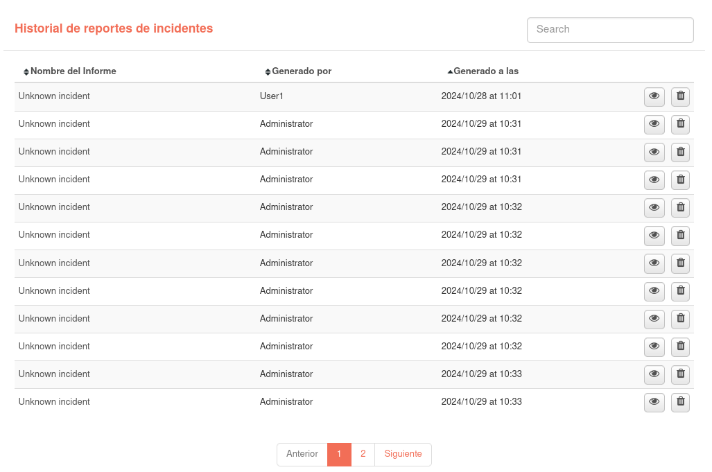

# Informes

El módulo de **Informes** permite al usuario realizar informes periódicos con la información que ofrece la plataforma Redborder.

Para crear un nuevo informe, haga clic en el botón *Nuevo informe* y complete todos los campos requeridos. También tiene la opción de importar un informe desde un archivo utilizando el botón *Importar informe*. A la vez, a su lado tiene un botón para ver el historial completo de todos los informes a los que tiene acceso.

Para buscar informes, introduzca parte del nombre o de la descripción del informe en la barra de búsqueda y presione la tecla "Entrar" o "Enter". Además, puede ordenar los informes haciendo clic en el encabezado de la columna por la cual desea ordenar; los informes se ordenarán de forma descendente o ascendente alternativamente.

En la lista de informes, puede ver el historial del informe, editar un informe existente, generar un PDF o enviarlo por correo electrónico. Todas estas opciones están disponibles en el botón de edición situado a la derecha de la lista.

Durante la creación de un nuevo informe, puede seleccionar parámetros como el tipo de programación, compartir con usuarios específicos o compartir con dominios. Una vez creado el informe, este aparecerá en la lista de informes mencionada anteriormente.

En la vista de composición, el usuario puede editar el informe y añadir nuevos widgets presionando el botón *Añadir Bloque*. Si agarramos el widget desde la barra de título en la parte superior, podremos desplazarlo. En la esquina inferior derecha de cada widget, el cursor cambiará de forma, permitiendo cambiar el tamaño del widget.

Al generar un informe, se abrirá una nueva ventana en la que, después de unos segundos de carga, el informe se renderizará en formato PDF. El usuario podrá descargar el informe presionando el ícono de *Imprimir*  ubicado en la parte superior derecha de la pantalla.

## Historial de informes

Cada vez que se genera un informe en PDF, esta acción se registrará en el historial de informes, incluyendo la hora y fecha de generación, el informe generado y el usuario que lo ha generado.
El usuario también tiene la posibilidad de visualizar los informes que han sido exportados previamente, ya sea por él mismo o por otros usuarios.

En esta sección dispone de todos los registros PDF generados a partir de los informes a los que tiene acceso. Esta información está separada en dos tablas, una con los informes que se generan en el módulo de informes y otra para los informes de incidencias. Ambas tablas tienen los mismos campos y funciones. 

Puede ordenar el historial haciendo clic en los nombres de las columnas y buscar los registros de informes generados. También se puede visualizar el PDF generado pulsando sobre el botón correspondiente.

Los usuarios con rol de administrador tienen la posibilidad de borrar registros de informes generados. Un usuario que no tiene ese rol solo puede borrar estos registros si se trata del usuario que ha generado el reporte.

Si hace clic en el nombre de uno de los informes, accederá a la composición del informe o al incidente a partir del cual se generó el informe.

Table de informes

Tabla de reportes de incidentes

