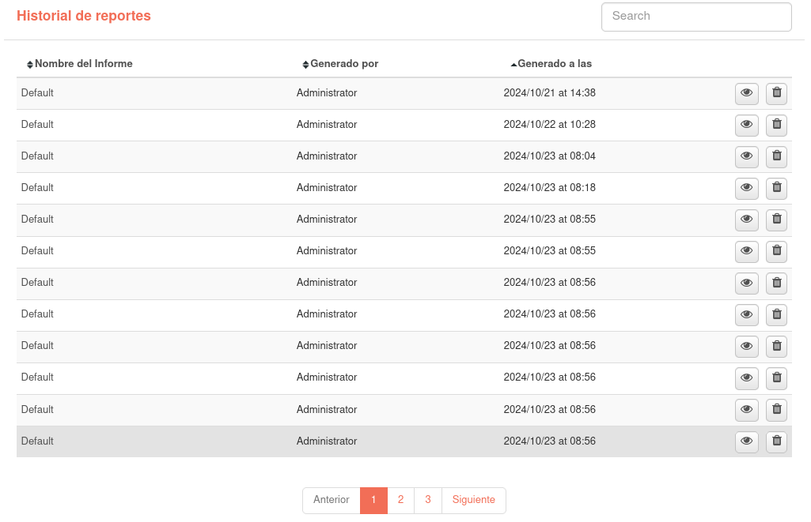
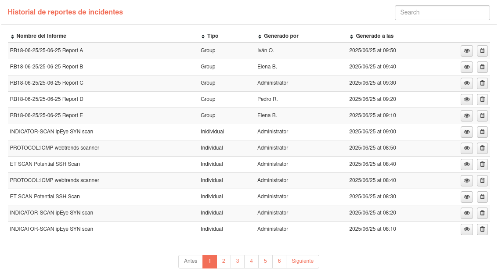

# Historial de Informes

Cada vez que se genera un informe en PDF, esta acción se registra en el historial de informes, incluyendo la fecha y hora de generación, el informe generado y el usuario que lo generó. El usuario también tiene la posibilidad de ver los informes que han sido exportados previamente, ya sea por él mismo o por otros usuarios.

En esta sección dispone de todos los registros PDF generados a partir de los informes a los que tiene acceso. Esta información está separada en dos tablas, una con los informes que se generan en el módulo de informes y otra para los informes de incidencias.

Puede ordenar el historial haciendo clic en los nombres de las columnas y buscar los registros de informes generados. También se puede visualizar el PDF generado pulsando sobre el botón correspondiente.

Los usuarios con rol de administrador tienen la posibilidad de borrar registros de informes generados. Un usuario que no tiene ese rol solo puede borrar estos registros si se trata del usuario que ha generado el reporte.

Si hace clic en el nombre de uno de los informes, accederá a la composición del informe o al incidente a partir del cual se generó el informe.

## Tabla de informes

## Tabla de reportes de incidentes

En esta tabla se diferencian dos tipos de reportes: 

- Individuales (Individual): Generados desde el incidente.
- Grupales (Group): Generados a partir de un informe de incidentes grupal.

