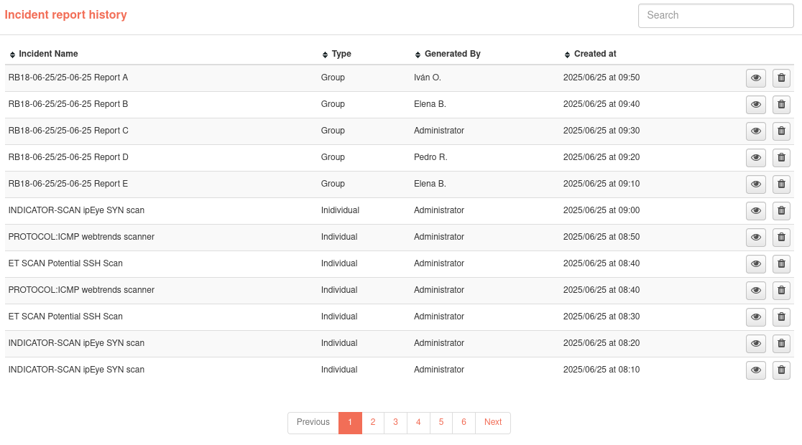

# Report History

Each time a PDF report is generated, this action will be recorded in the report history, including the time and date of generation, the report generated and the user who generated it.
The user also has the possibility to view the reports that have been previously exported, either by himself or by other users.

In this section you have at your disposal all the PDF records generated from the reports to which you have access. This information is separated into two tables, one with the reports that are generated in the reports module and another one for the incident reports. Both tables have the same fields and functions. 

You can sort the history by clicking on the column names and search for generated report records. You can also view the generated PDF by clicking on the corresponding button. 

Users with the administrator role have the possibility to delete generated report records. An user who does not have this role can only delete these records if he or she is the user who generated the report.

If you click on the name of one of the reports, you will access the composition of the report or the incident from which the report was generated.

Reports table:

Incident reports table: 

