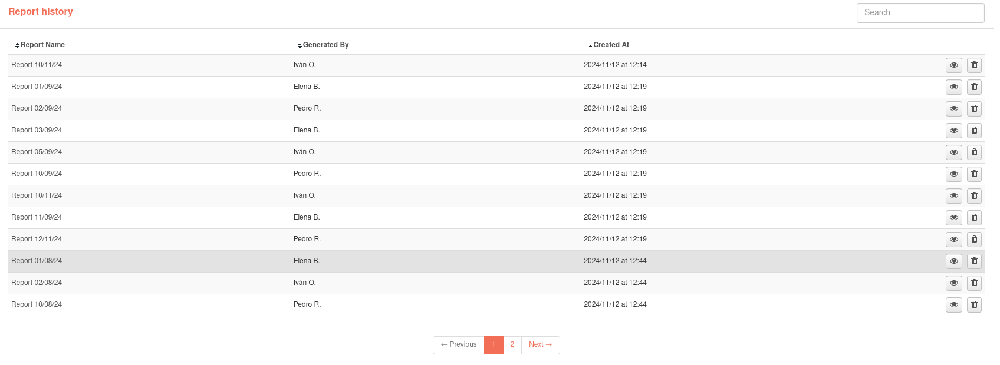

# Report History

Each time a PDF report is generated, this action will be recorded in the report history, including the time and date of generation, the report generated and the user who generated it.
The user also has the possibility to view the reports that have been previously exported, either by himself or by other users.

In this section you have at your disposal all the PDF records generated from the reports to which you have access. You can sort the history by clicking on the column names and search for generated report records. You can also view the generated PDF by clicking on the corresponding button. Users with the administrator role have the possibility to delete generated report records.

