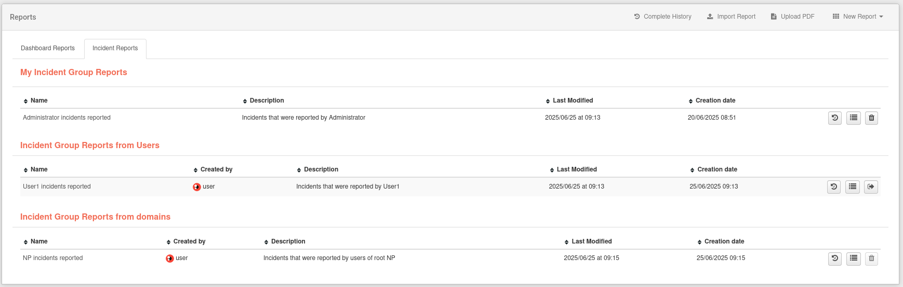
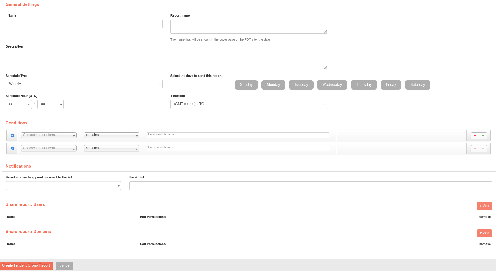

# Create incident group reports

Similar to [reports](ch09_creation_reports.en.md), group incident reports allow users to create periodic reports with information from several different [incidents](../incidents/ch05_incident_details.en.md). To enter this section, go to Reports and then enter the Incident Reports section.

To create a new report, click on the drop-down with the text **New Report** and then click on the “New Group Incident Report” button. Complete the fields in order to create the report.

Unlike the reports, there're some new fields:

- Report Name: name that will be next to the date on the cover page and the file name.
- Time zone: time zone to which the incident dates will be adapted.
- Conditions: this field allows to select using filters which **incidents** will be added in the report. It is important to note that the incident date filter will be specified by the **Schedule Type** field.

As with the reports, it is also possible to share the report with other users and domains.

Depending on the time settings specified in the report, the report's PDF will be automatically generated and sent to the specified addresses.

Once the report is created, it will appear in the list in the section mentioned at the beginning. We will have several options, depending on whether the report is ours or shared and the permissions it has:

- History: history of the PDF files generated on this report.
- Edit: Edit the details of the report.
- Send it now: Generate a PDF and send it to the configured sender.
- Generate PDF.
- Delete.
- Leave the collaborative report.