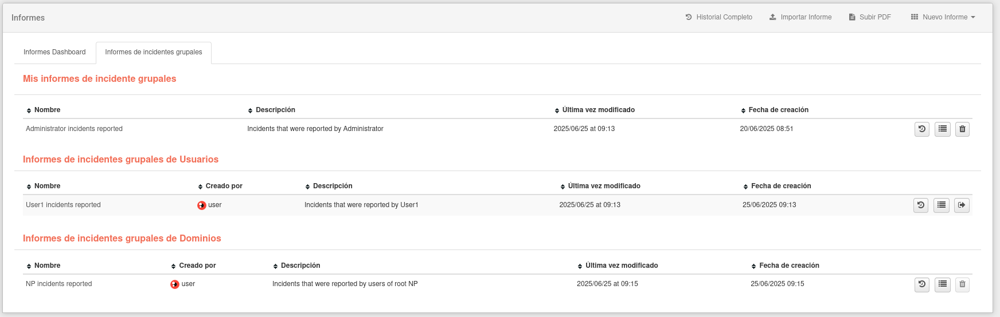
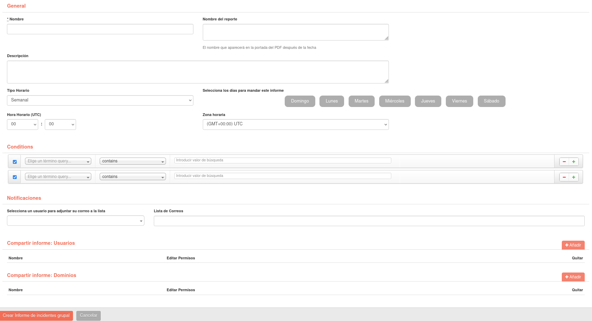

# Crear informes de incidentes grupales

Similar a los [informes](ch09_creation_reports.es.md), los informes de incidentes grupales permiten a los usuarios crear reportes periódicos con la información de varios [incidentes](../incidents/ch05_incident_details.es.md) diferentes. Para entrar a esta sección habrá que ir a Reportes y luego entrar en la sección de Informes de incidentes.

Para crear un nuevo informe, haga clic en el desplegable con el texto **Nuevo Informe** y a continuación en el botón "Nuevo Informe de incidentes grupal". Complete los campos para poder crear el informe.

A diferencia de los informes, encontraremos algunos campos nuevos:

- Nombre del Informe: nombre que saldrá a continuación de la fecha en la portada y el nombre del archivo.
- Zona horaria: zona horaria a la que se adaptarán las fechas de los incidentes
- Condiciones: este campo permite seleccionar mediante filtros que **incidentes** serán añadidos en el reporte. Es importante tener en cuenta que el filtro de fecha de los incidentes será especificado por el campo **Tipo Horario**.

Al igual que que los reportes, también es posible compartir el informe con otros usuarios y dominios. 

Dependiendo de la configuración horaria especificada en el informe, este generará un PDF y lo enviará automáticamente a las direcciones especificadas.

Una vez creado el informe, aparecerá en la lista dentro de la sección mencionada al principio. Tendremos varias opciones, dependiendo si el informe es nuestro o es compartido y los permisos que este tenga:

- Historial: historial de los archivos PDFs generados sobre este informe.
- Editar: Editar los detalles sobre el informe.
- Enviar ahora: Generar un PDF y enviarlo al remitente configurado.
- Generar PDF.
- Eliminar.
- Abandonar el informe colaborativo.