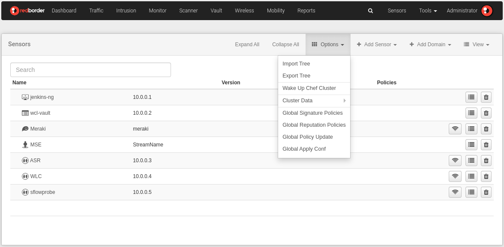
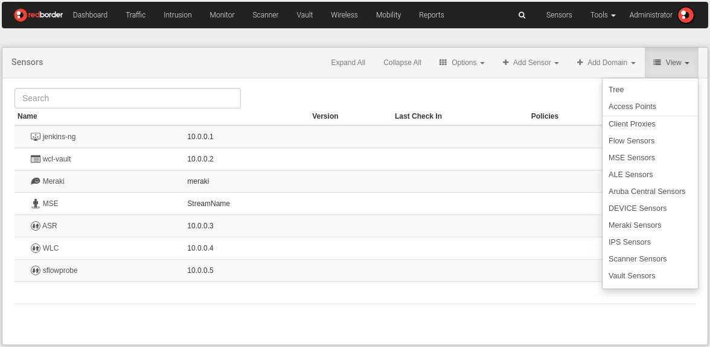
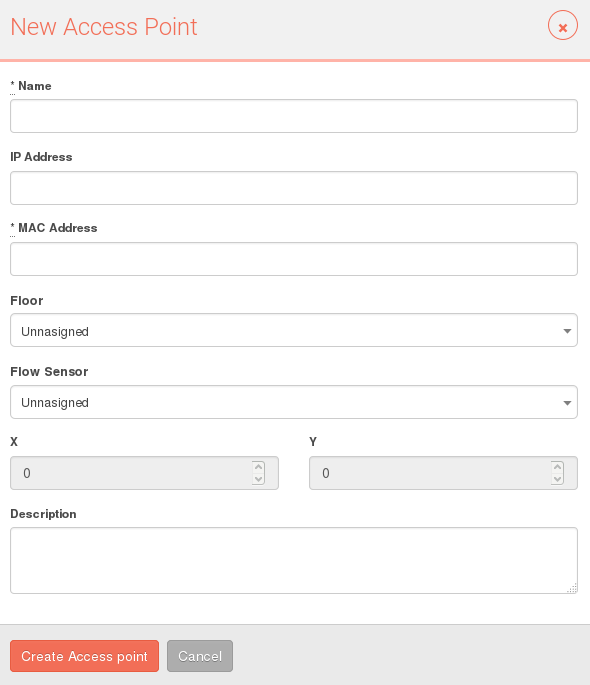

# Sensors View

In the **Sensors** section, users can query, manage, and configure the sensors registered in the Manager by creating and editing domains and sensors. For this purpose, there are several views that offer the possibility to perform various actions on the sensors registered in the Manager.

**Sensors** is available in the top right corner of the header menu, next to the **Tools** section and the user area. This menu area is called the **Configuration Zone**, because unlike the options available in the top left corner (Analysis), these allow for complete management and configuration of the Manager and the sensors: rule policies, alarms, cluster configuration, or user management, among other actions.

## Menu and Sensor Options

The organization of this section is very similar, in terms of structure, to that of other parts of the website. In this case, we find:

1. **Submenu section**: configuration and management options for sensors.
    - *Expand all*: Fully expands the sensor tree.
    - *Collapse all*: Fully collapses the sensor tree.
    - *Options*
    - *Add sensor*
    - *Add domain*
    - *View*

- **Main area**: the information displayed in this area depends on the selected view. There are four views available to visualize the organization of sensors registered in the Manager:
    - *Tree*: a list that shows the network infrastructure according to levels of hierarchy and dependency between the elements that compose it. Two icons next to each element allow for editing and deleting actions.
    - *Map*: places the location of domains and sensors on a map.
    - *Access Points*: offers direct access to the visualization of defined Access Points.

    In the **Sensors** view, users can find a list of sensors available according to the applications included in their license. Click on the sensor you want to check to see an alphabetical list of all sensors associated with this application.

!!!info "Please note..."
    Each view presents its own menu of options and different possibilities for creating and editing sensors or domains.

    The Map view does not present available options.

## Options

Here are the available options in the **Sensors** section. They can be selected from the Options button and from the options shown by clicking on the "Edit" button both at the domain level and at the sensor level.

- *Import Tree*: This option allows you to import your network infrastructure by uploading a file to the Redborder platform. This will be displayed in the tree view.

    

    There are two ways to import a tree:

    1. **Options** -> **Import Tree**
    - Edit icon (domain level)

    

- *Export Tree*: This option allows you to export a tree and is available to other applications. The user will download a zip file to store it on their computer.

    There are two ways to export a tree:

    1. **Options** -> **Export Tree**
    - Edit icon (domain level)

    

- *Chef Cluster Lift*
- *Cluster Data*
    1. Indexed Data: Displays statistics of indexed data from the cluster
    - Historical: Displays information about the historical data of the cluster
    - Realtime: Displays information about the Realtime process

## Add Sensor

Throughout the submenu options, we find **Add a Sensor**. In the dropdown menu, the different sensors available to add to the network infrastructure are displayed.

Select the type of sensor from the dropdown menu and then fill in the requested information.

It is also possible to claim a sensor from a remote flowgate using the option in the dropdown menu and entering the UUID of the sensor.

!!!info "Please note..."
    At the moment a sensor is created, it is set by default as root, above the domain level.

    Users can organize their sensor infrastructure at any time by dragging and dropping the sensor to the level where they want it to be.
    
    The sensor automatically inherits the properties of the root domain (policies, operating mode, Snort variables, etc.).

## Views

When the user accesses the Sensors section, they can find a list (tree view) displaying the domains and sensors that are part of their network infrastructure. At this point, let's review each view and the available actions.

### Tree

The **tree** view (This is the view that we have seen in all the previous images) is the default view when accessing **Sensors**. It displays a list showing the organization of domains and sensors according to levels of hierarchy and dependency.

From this view, the user can add a new domain or sensor, delete existing ones, access other views, import and export the tree, as well as directly edit all domains and sensors that are part of the list.

Each item displayed in the tree has two icons: Edit and Delete. (The same icons function in both the tree view and the sensor view):

!!!info "Please note..."
    The options in the menu displayed by the Edit icon will vary depending on whether we are at the domain level or sensor level.

!!!warning "Important"

    **Some sensors cannot be deleted.**

    In such cases, the "Delete" icon will appear in gray. Before the domain or sensor is deleted, the system will display a popup screen with a warning message.

    All users and descendants assigned to this domain or sensor will be disabled and assigned to its parent or root domain. The user with admin role needs to enable user permissions from the **Tools -> Users** section.

If **IPS/IDS sensors** have been registered, the type of policy/policies applied to them will be displayed.

By clicking on it, we access the panel of rules included in that policy.

**Options available in the Tree view:**

- Add a new domain or sensor
- Delete a domain or sensor
- Access other views
- Import and Export the tree
- Edit a domain or sensor

#### Organization Levels

- **Domain**: These are containers that can include sensors, sensor groups, etc. The domain level shows the domain name and allows adding a description. They can be classified according to their nature (organizational, spatial, etc.).

- **Sensors**: These are end nodes corresponding to physical elements placed in the network (switches, routers, IPS, etc.).

At the sensor level, the following information is displayed: sensor name, IP, applied policy (IPS sensors), last check and version. A description can be added to the sensor.

!!!info "Please note..."
    Remember that IPS or Gateway sensors must be created through sensor registration in the Manager installation process. **Sensors** allows you to edit and overwrite the parameters inherited from General Configuration: **Tools -> General Configuration**.

    Sensors from other Apps can be created from the **Sensors** section.

**Configuration Inheritance**:

In the **Tools** section, there are options for General Configuration through which the user can define general parameters of the Manager and the Apps.

This is the highest level of configuration (acts as the root domain), so the properties defined here will be inherited by domains and sensors that fall below this level.

When a domain or sensor is created or edited for the first time, we can observe that some parameters have the label "Inherited", which means they have inherited values from the General Configuration. Override this information if you want to change it.

Domains and sensors falling below the level of the overridden element will again inherit the properties applied to this element.

### Monitors

!!!info "Please note..."
    This option is only available in the menu displayed by the "Edit" icon at the sensor level.

When clicking on the "Edit" icon of the sensor, the Monitor option appears. Then, we can see a list of monitoring metrics used to monitor the status of the sensor at different levels. 

These are the actions available for controlling the sensor status:

- **Restore Default**: applies the default metrics included at the time of sensor creation.
- **Add Monitor**: shows available metrics.
- **Delete Monitor**: removes the applied metric.

The technology column indicates the source from which the data is collected.

### Access Points

Access Points (APs) are the access points of the network infrastructure associated with a location. The Access Points depend on the Flow App and apply at both the domain and sensor levels.

This is another way to visualize your sensor organization, through the distribution of APs by domain. You can access the visualization or creation of Access Points in two different ways:

- View -> Access Points.
- Edit icon at the sensor/domain level -> Edit: Access Points View (located in the top-right submenu).

!!!info "Please note..."
    To know at which level we are, you can check the navigation path located in the top-left margin. You can navigate through the different screens by clicking on any of the elements in the path.

The submenu of this interface displays a series of buttons similar to those on the main **Sensors** screen. The actions you can perform from this screen are as follows (these may vary depending on whether you are viewing at the domain or sensor level):

- **Show on Map/Show Plants**: displays the geographical distribution of the Access Points or their location in plants if you are viewing a Plant domain with more than one plant level.
- **Edit (domain or sensor name)**: takes you back to the domain or sensor editing screen.
- **Options -> Export Access Points/Delete Access Points**: allows exporting all Access Points to a .csv file or deleting all defined Access Points for that location.
- **Add sensors**: adds a new sensor defined as an Access Point.
- **Add domain**
- **Views**: menu that allows navigation through the different existing views.
- **Add Access Points**
- **Add zones**

## Adding a Domain

As we've seen earlier, there are various types of domains identified through an icon in the tree view. The process of adding a domain is straightforward; the configuration should be done later through the Edit icon found next to each domain in the tree view or from the Access Points view.

Select the *Add Domain* option located in the top-right submenu, choose the type of domain you want to add, and then fill in the required fields (these will vary depending on the type of domain being created).

From this point on, the rest of the information associated with the domain should be modified by clicking on the edit button located to the right of each domain in the Tree or Access Points view and selecting the *Edit* option.

## Editing a Domain

From this interface, you can modify the configuration of an existing domain and enter information for a newly created domain.

To access this screen, the user must click on the edit button to the right of the domain they wish to edit from the Tree or Access Points view and select the **Edit** option.

These are the general data that can be modified for domains. However, depending on the selected domain type, one of these fields will appear:

- **General**: Displays general information about the domain. Name, domain type: (select the domain type in the box), and description.
- **Servers**: In this section, the user can define the configuration of Flowgate and Syslog servers. All displayed values are inherited by default. Overwrite if necessary.
- **Location**: Locates the sensor/domain on a world map.
