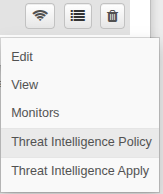
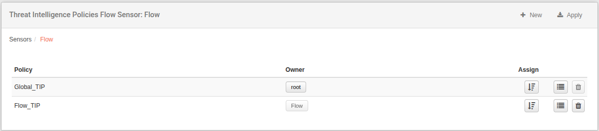
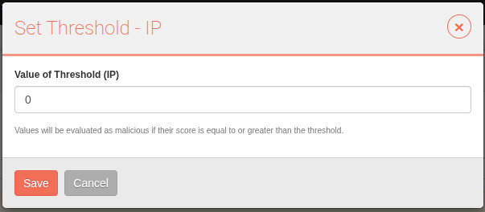
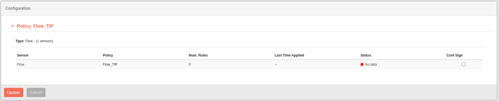

# Políticas de Inteligencia de Amenazas

Cada sensor Flow, Vault, Proxy e IPS necesita un conjunto de reglas para identificar amenazas potenciales... En este capítulo, establecerás las reglas que se necesitan para reconocer el tráfico como malicioso; ya sean direcciones ip, dominios, url, sha1 o sha2 .Por defecto, no hay políticas de inteligencia de amenazas definidas y se considera que el administrador las configure. Previamente, antes de establecer estas políticas, se debe tener en cuenta que se tienen que establecer fuentes de inteligencia de amenazas. [Ver herramientas de inteligencia de amenazas](../tools/ch21_threat_intelligence_sources.es.md)

!!! warning "Sobre la configuración"
    Este capítulo supone que ya tienes sensores de Flow, Vault, Proxy o IPS funcionando.

    Por favor, localiza tus sensores en la pestaña **Sensores**.

Las reglas que se van a aplicar al sensor se conocen como Políticas de Inteligencia de Amenazas.

## Propiedades del sensor

Al hacer clic en el ícono de *cuatro líneas*, puedes expandir las propiedades del sensor.

## Crear Políticas de Inteligencia de Amenazas

Por defecto, no se crea ninguna política. Para agregar la primera política, presione **Nueva**, aparecerá una ventana para crear una. Aquí debe seleccionar un nombre y opcionalmente una descripción. Después de eso, confirme haciendo clic en **Crear Política de Inteligencia de Amenazas**. 

Aparecerá para poder configurar listas de **Inteligencia de Amenazas** de tipo IP, DOMAIN, URL, SHA1 y SHA2.

Puede configurar cada una de ellas, haga clic en **+Agregar** en la categoría correspondiente para agregar una lista. Estas listas son las que debemos tener establecidas [🔧](../tools/ch21_threat_intelligence_sources.es.md). La categoria puede ser **clean** o **malicious**. La categoria malicious debe tener un peso de entre 0.01 y 1.0 obligatoriamente; y las clean tendran un peso por defecto de 0.0.

Puede configurar el **Threshold** de cada una de la misma forma, haga clic en **Set Threshold** en la categoría correspondiente para agregarlo. El Threshold será el límite por el cual se mostrará luego en el módulo correspondiente el score. Es decir, si establecemos el Threshold de 50, el score debera ser mayor para que se muestre en el módulo. Si lo establecemos en 0, se mostrarán todos los score. 

Después de la configuración de la política, regrese al **menú de políticas de inteligencia de amenazas**. Aquí verá la nueva política creada.

Para finalmente aplicar la configuración, haga clic en el botón **Asignar**. Si tenemos una política asignada, podremos **Desasignar** la política para que el sensor no tenga ninguna.

## Aplicar Configuración

Después de cualquier cambio en las políticas anteriores, le damos a **Applicar**.

Aqui veremos las diferentes **Políticas de Inteligencia de Amenazas** y sobre los sensores que queramos aplicar la configuración, dependiendo desde donde hemos accecido, veremos mas políticas y sensores.La configuración se puede aplicar aquí seleccionando las casillas de verificación correspondientes y pulsando **Update**.

## Políticas de Inteligencia de Amenazas Globales

De la misma forma que hemos podido crear **Políticas de Inteligencia de Amenazas** en los sensores, también lo podemos hacer de forma **Global**, es decir, desde las **Opciones** en la pestaña de **Sensores**.

Desde aqui podremos crear políticas globales, para luego asignarlas en los sensores a cualquier  nivel. De la misma manera podremos **Aplicar la configuración** desde este nivel, y desde aquí veremos mas políticas y sensores para poder aplicar la configuración.
