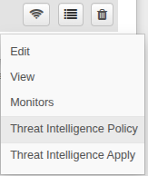
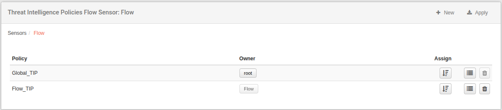
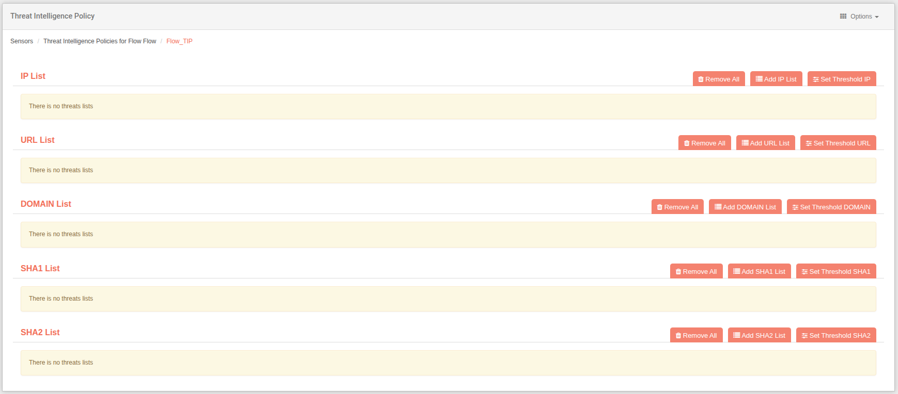
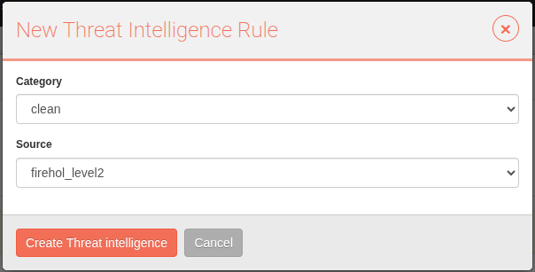
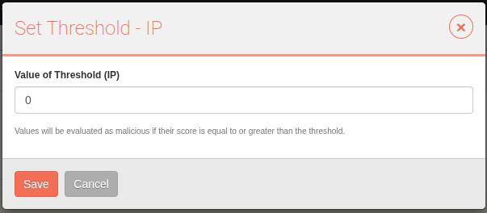
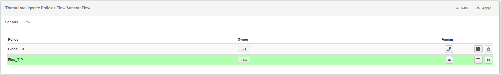
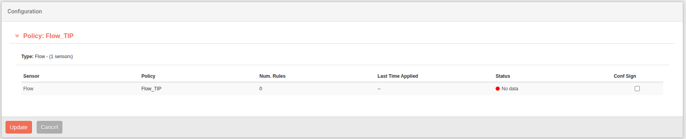
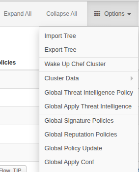

# Threat Intelligence Policies

Each Flow, Vault, Proxy and IPS sensor needs a set of rules to identify potential threats... In this chapter, you will set up the rules that are needed to recognize traffic as malicious; be it ip addresses, domains, urls, sha1 or sha2 .By default, there are no threat intelligence policies defined and the administrator is considered to configure them. Previously, before setting these policies, it should be noted that threat intelligence sources have to be established. [See Threat Intelligence Tools](../tools/ch21_threat_intelligence_sources.md)

!!! warning "About the configuration"
    This chapter assumes that you already have Flow, Vault, Proxy or IPS sensors running.

    Please locate your sensors in the **Sensors** tab.

The rules to be applied to the sensor are known as Threat Intelligence Policies.

## Sensor properties

By clicking on the *four lines* icon, you can expand the sensor properties.

## Create Threat Intelligence Policies

By default, no policy is created. To add the first policy, press **New**, a window will appear to create one. Here you must select a name and optionally a description. After that, confirm by clicking **Create Threat Intelligence Policy**.

You will be prompted to configure **Threat Intelligence** lists of IP, DOMAIN, URL, SHA1 and SHA2 type.

You can configure each of these, click **+Add** in the corresponding category to add a list. These lists are the ones we should have set up [🔧](../tools/ch21_threat_intelligence_sources.md). The category can be **clean** or **malicious**. The malicious category must have a weight between 0.01 and 1.0 mandatory; and the clean ones will have a default weight of 0.0.

You can set the **Threshold** of each one in the same way, click on **Set Threshold** in the corresponding category to add it. The Threshold will be the limit at which the score will be displayed in the corresponding module. That is, if we set the Threshold to 50, the score must be higher to be displayed in the module. If we set it to 0, all the scores will be displayed.

After the policy configuration, return to the **threat intelligence policy menu**. Here you will see the newly created policy.

To finally apply the settings, click the **Assign** button. If we have a policy assigned, we will be able to **Unassign** the policy so that the sensor does not have one.

## Apply Settings

After any changes to the above policies, click **Apply**.

Here we will see the different **Threat Intelligence Policies** and on the sensors we want to apply the configuration, depending on where we have accessed from, we will see more policies and sensors.The configuration can be applied here by selecting the corresponding checkboxes and pressing **Update**.

## Global Threat Intelligence Policies

In the same way that we have been able to create **Threat Intelligence Policies** on sensors, we can also do it in a **Global** way, that is, from the **Options** in the **Sensors** tab.

From here we will be able to create global policies, and then assign them to sensors at any level. In the same way we will be able to **Apply the configuration** from this level, and from here we will see more policies and sensors to be able to apply the configuration.
