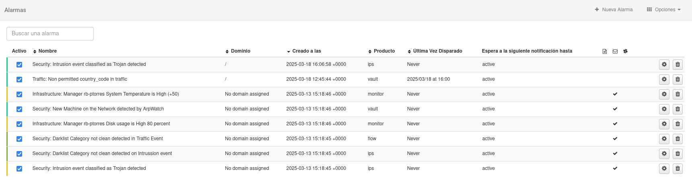
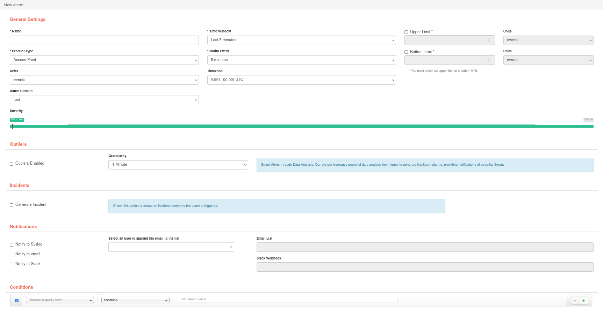

# Alarmas

Una alarma es una notificación que se activa cuando se cumplen una o más condiciones.

Al acceder a esta opción, se muestra la lista de alarmas que se han registrado. Los usuarios solo podrán ver las alarmas que se han creado en los dominios a los que tengan acceso. Además, si el usario es administrador, podrá crear, editar y eliminar dichas alarmas.

## Crear una nueva alarma

Haciendo click en el botón **Nueva Alarma** accedemos al formulario, en el que se establecerán las condiciones que debe cumplir la alarma para activar una notificación, y el grado de gravedad definido para esa alarma.

1. **Configuración General**

    | Campo              | Descripción                            |
    | ------------------ | -------------------------------------- |
    | Nombre             | Nombre de la alarma |
    | Ventana de tiempo  | Intervalo de tiempo que debe superarse por exceso o valores predeterminados dados en límite superior / inferior para que la alarma esté activa |
    | Tipo de producto   | Seleccione el tipo de aplicación / elemento para el que se ha definido la alarma. El usuario verá en este campo las opciones que se incluyen en su licencia |
    | Notificar cada     | Establece la secuencia de tiempo para notificación |
    | Límite super/infer | Indica el número de eventos (máximo / mínimo) que deben cumplir las condiciones de la alarma para activar la notificación |
    | Unidad             | Agregación deseada para la alarma. Variará dependiendo de las agregaciones disponibles en el tipo de producto deseado |
    | Zona horaria       | Permite elegir qué definición de tiempo se quiere utilizar para la alarma |
    | Dominio de la alarma               | Permite elegir en que dominio se creará la alarma
    | Gravedad           | El usuario debe definir el nivel de gravedad que se le da a la alarma. Dependiendo de las condiciones que haya definido para la alarma, implicará un riesgo muy bajo, bajo, medio, alto, muy alto o crítico. Esta gradación de gravedad también se indica en una escala de colores |

- **Anomalías**

    Redborder utiliza técnicas de análisis de datos para proveer notificaciones de peligros potenciales, esta opción permite al usuario configurar alarmas inteligentes que serán activadas dependiendo de si se detecta alguna anomalía de red dentro de los filtros especificados en el apartado *Condiciones*.

    Activar esta opción hará que se realice un análisis de anomalías una vez pasada la **Ventana de tiempo** configurada en la *Configuración General* de la alarma.

    La **granularidad** indica el grado de detalle temporal que utilizará la alarma para analizar los datos.

- **Notificaciones**

    | Medio de notificación         | Descripción                            |
    | ------------------ | -------------------------------------- |
    | Syslog             | Permite exportar las notificaciones a un servidor syslog externo |
    | Email              | Habilita la selección de usuarios a los que enviar las notificaciones por  correo electrónico cuando se active una alarma |
    | Slack              | Habilita el campo *Slack Webhook* que permite a la plataforma enviar un mensaje a un canal de Slack cuando se active una alarma |

- **Condiciones**

    Son los filtros en los que se va a basar el disparado de la alarma. Pueden ser configurados de manera similar a como se configurarían en el tipo de aplicación / elemento para el que se ha definido la alarma.

- **Tipo de producto**

    Tipo de aplicación / elemento para el que se ha definido la alarma. El usuario solo podrá seleccionar las aplicaciones a las que tenga acceso. Si un administrador crea una alarma en un dominio en el que no se tenga acceso al tipo de producto que se especifique, esta alarma no se lanzará.