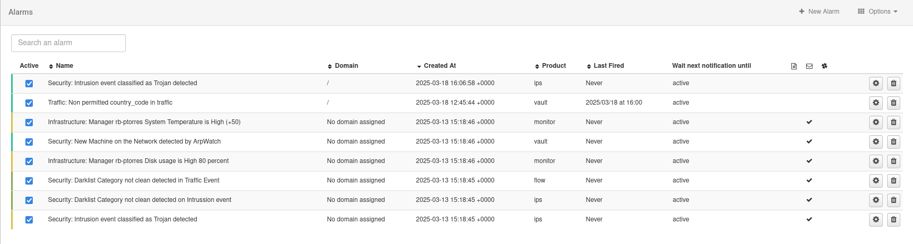

# Alarms

An alarm is a notification that is triggered when one or more conditions are met.

When accessing this option, the list of registered alarms is displayed.

## Create a new alarm

By clicking on the **New Alarm** button, we access the form, where the conditions that the alarm must meet to trigger a notification, and the severity level defined for that alarm, are established. Users will only be able to see the alarms that have been created in the domains to which they have access. In addition, if the user is an administrator, the user will be able to create, edit and delete these alarms.

1. **General Settings**

    | Field              | Description                            |
    | ------------------ | -------------------------------------- |
    | Name               | Name of the alarm |
    | Time window        | Time interval that must be exceeded by excess or predetermined values given in the upper/lower limit for the alarm to be active |
    | Product type       | Select the type of application/element for which the alarm has been defined. The user will see the options included in their license in this field |
    | Notify every       | Sets the time sequence for notification |
    | Upper/lower limit  | Indicates the number of events (maximum/minimum) that must meet the alarm conditions to trigger the notification |
    | Unit               | Desired aggregation for the alarm. It will vary depending on the aggregations available in the desired product type |
    | Time zone          | Allows choosing the time definition to be used for the alarm |
    | Alarm Domain       | Sets the domain in which the alarm will be created |
    | Severity           | The user must define the severity level given to the alarm. Depending on the conditions defined for the alarm, it will imply a very low, low, medium, high, very high, or critical risk. This severity grading is also indicated on a color scale |

- **Outliers**

    Redborder uses data analysis techniques to provide notifications of potential dangers, this option allows the user to configure smart alarms that will be triggered if any network anomalies are detected within the filters specified in the *Conditions* section.

    Activating this option will perform an anomaly analysis once the configured **Time window** in the alarm's *General Settings* has passed.

    The **granularity** indicates the level of temporal detail that the alarm will use to analyze the data.

- **Notifications**

    | Notification method       | Description                            |
    | ------------------------- | -------------------------------------- |
    | Syslog                    | Allows exporting notifications to an external syslog server |
    | Email                     | Enables the selection of users to send notifications via email when an alarm is triggered |
    | Slack                     | Enables the *Slack Webhook* field that allows the platform to send a message to a Slack channel when an alarm is triggered |

- **Conditions**

    These are the filters that will trigger the alarm. They can be configured similarly to how they would be configured in the type of application/element for which the alarm has been defined.

- **Product Type**

    Type of application/element for which the alarm has been defined. The user can only select the applications to which he has access. If an administrator creates an alarm in a domain where the specified product type is not accessible, this alarm will not be triggered.