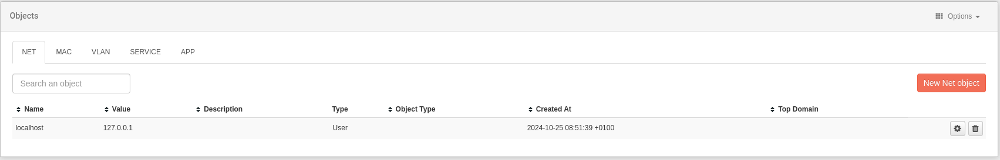

# Objects

This option allows the direct creation and editing of objects related to internal applications, end users, protocols, etc. The user can navigate through different tabs corresponding to the categories of objects that can be created. If you want to locate objects more efficiently, you can use the browser.

Three object categories can be created:

- Network
- MAC
- VLAN
- Service
- APP

Objects: object list

- **Create a new object**: click on **New Net Object** (Network, MAC, VLAN, Services, App)
- **Edit an existing object**: click the **Edit** button.
- **Delete an object**: click the **Delete** icon.

Objects: create a new object

In all cases, when creating or editing an object, the system asks for a name, a value, and a description.

Additionally, if the object is of the network or MAC type, it will ask us for the operating system, IP address(es), as well as the possibility of creating the object for the current user, or making it public.

In the upper right margin, there is a submenu of options. It allows the user to import or export data related to these objects in .csv format.
