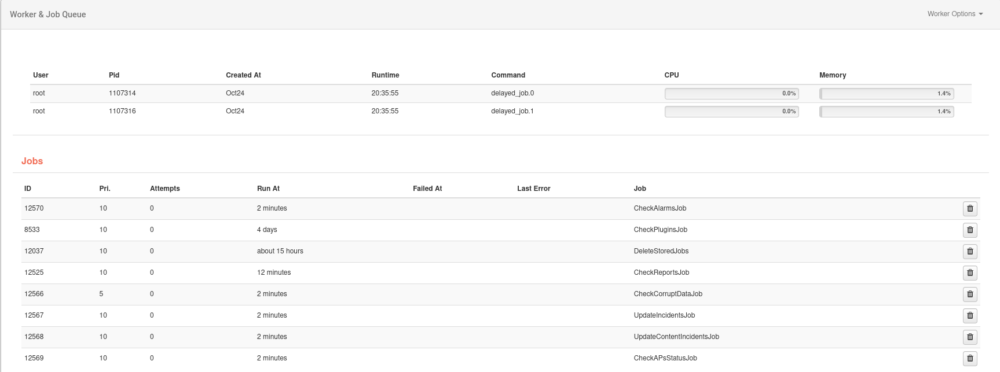
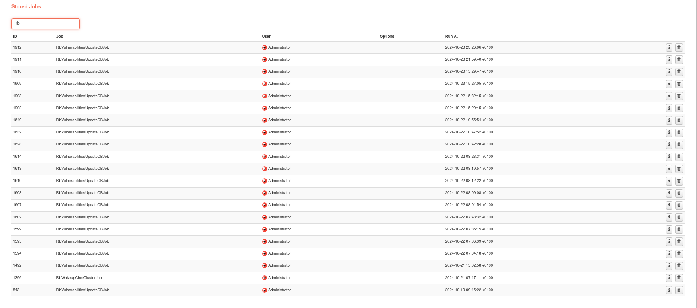

# Worker and Job Queue

In this option, users can check the status of the workers and the jobs running in the background. They can also verify which jobs have been completed.

**Workers** are programs that constantly run in the background while **Jobs** are programs that runs periodically or only once but does not remain running in the background. It runs and then closes.

Jobs can be launched manually by the menu **Worker Options**, but there are cases when a job needs to be deleted before launch them manually.

**Delete Stored Job** deletes all stored jobs since a date each day at 00:00h. That date depends on the number of "days to keep the stored jobs" information (default: 90 days), which can be changed in a field of **General Settings**.
    

**Stored Jobs** shows the list of completed services. You can check the status of each one via the "Information" icon or remove it from the list using the "Delete" icon. Also, you can search by the **name of the job**.

**Information** icon allows to check status and other information of the job.

**Delete** icon delete from Stored Jobs the selected job.

**Search** field allows you to search by the name of the job and it refreshes automatically each time a letter changes.

