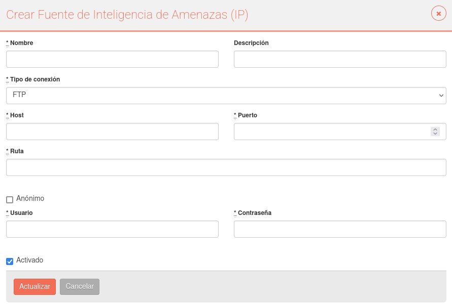
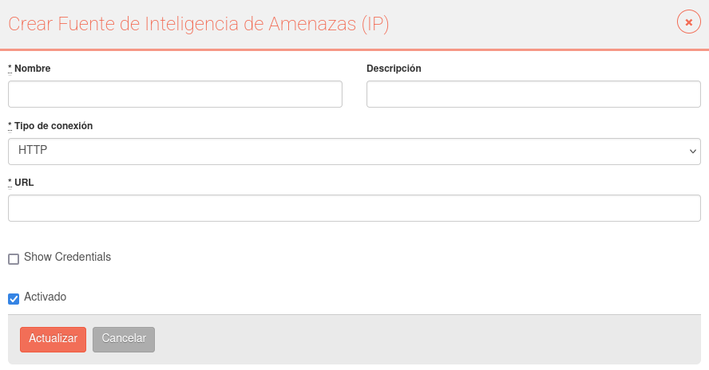
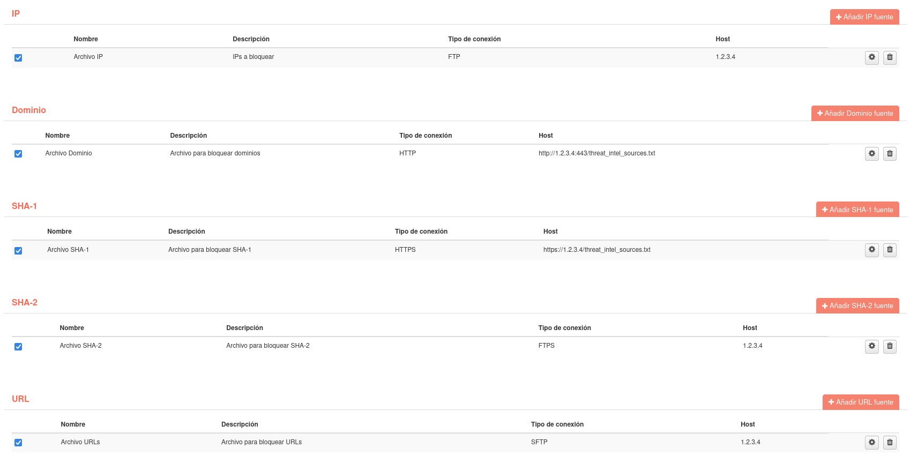

# Fuentes de inteligencia de amenazas

In this option, users can add files from different sources, which indicate a list of identifiers that, if found in traffic or intrusions, will be marked as “malicious”. Estos archivos serán descargados mediante la ejecución del Job **UpdateThreatIntelJob**

Identificadores que pueden ser incluidos en estas listas son:

- IPs
- Dominios
- SHA-1
- SHA-2
- URLs

Cada archivo solo puede tener un tipo de estos identificadores, no se pueden mezclar varios en una sola. 

Para añadir un archivo a descargar, basta con utilizar el botón "Añadir" en la sección del identificador que contenga el archivo. Una vez en el formulario, se tiene que rellenar la información del archivo y especificar que tipo de conexión se utilizará para descargarlo. Estos son los tipos de conexión disponibles:

- FTP
- FTPS
- SFTP
- HTTP
- HTTPS

Para las conexiones FTP, FPTS y SFTP, tendremos que especificar el host, puerto y la ruta donde se encuentra el archivo. Además, tendremos que especificar que usuario y contraseña se utilizará para conectarse a la fuente y descargar el archivo. Si no se necesitan credenciales para descargarlo, se tendrá que marcar la opción "Anónimo".

Para las conexiones HTTP y HTTPS, tendremos que especificar la url que se utilizará para descargar el archivo. Si fuese necesario incluir credenciales para descargar el archivo, tendremos que marcar la opción "Show Credentials".

Una vez creadas las fuentes, podemos activarlas o desactivarlas dependiendo de si queremos que se descarguen o no.

