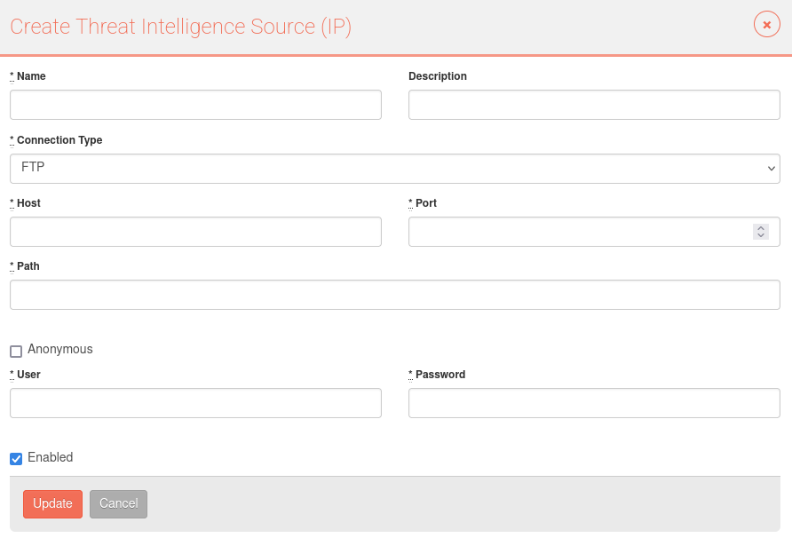
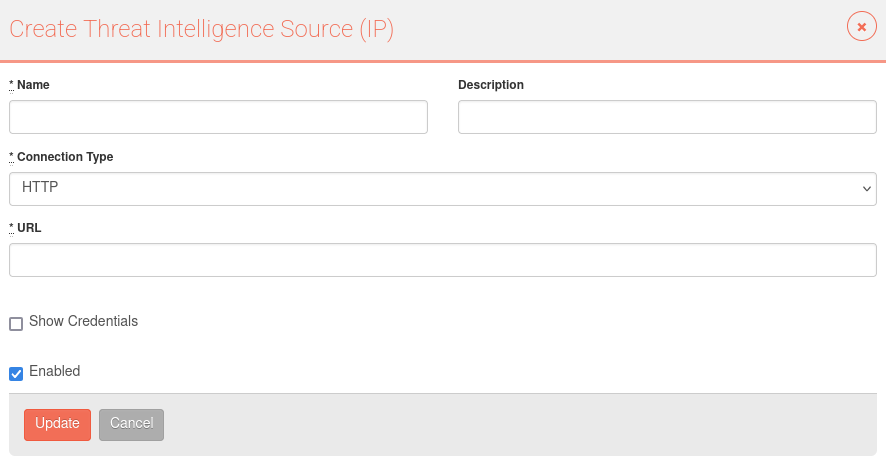
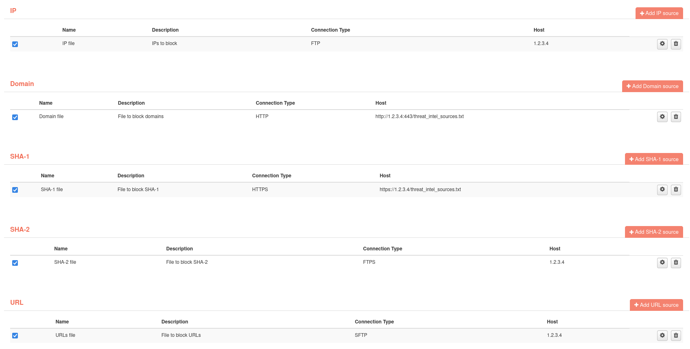

# Threat intelligence sources

In this option, users can add files from different sources, which indicate a list of identifiers that, if found in traffic or intrusions, will be marked as “malicious”. These files will be downloaded by the Job **UpdateThreatIntelJob**

Identifiers that can be included in these lists are:

- IPs
- Domains
- SHA-1
- SHA-2
- URLs

Each file can have only one of these identifiers, you cannot mix several of them in one file.

To add a file to download, simply use the “Add” button in the section of the identifier containing the file. Once in the form, you have to fill in the file information and specify which type of connection will be used to download it. These are the available connection types:

- FTP
- FTPS
- SFTP
- HTTP
- HTTPS

For FTP, FPTS and SFTP connections, we will have to specify the host, port and the path where the file is located. In addition, we will have to specify which user and password will be used to connect to the source and download the file. If no credentials are required for downloading, the "Anonymous" option must be checked.

For HTTP and HTTPS connections, we will have to specify the url that will be used to download the file. If it is necessary to include credentials to download the file, we will have to check the “Show Credentials” option.

Once the sources have been created, we can activate or deactivate them depending on whether we want them to be downloaded or not.

