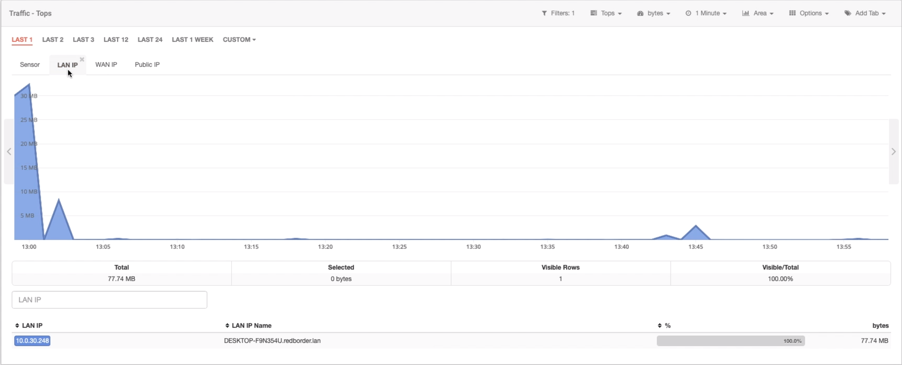
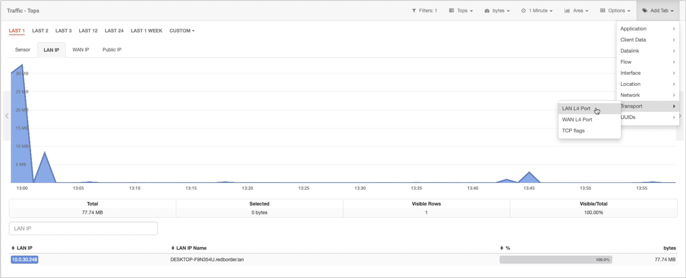

# Seguimiento de una IP con Redborder

Podemos usar Redborder para rastrear una IP sospechosa. Es posible aprender sobre su comportamiento utilizando el módulo de **Tráfico**.

Antes que nada, debemos saber la IP que queremos rastrear. Una vez que tengamos la IP, iremos al módulo de **Tráfico**.

Seguimiento de una IP: módulo de tráfico

Una vez en el módulo **Tráfico**, podemos usar el botón **Búsqueda avanzada** desde el filtro para ver solo el tráfico generado por esa IP.

Seguimiento de una IP: búsqueda avanzada en el módulo de Tráfico

Aquí podemos configurar la IP sospechosa para filtrar todo el tráfico. Utilizaremos la métrica *LAN IP* para ese propósito.

Seguimiento de una IP: filtrado de IP

Cuando apliquemos el filtro, solo veremos el tráfico de esa IP.

Seguimiento de una IP: tráfico filtrado

Es posible agregar nuevas métricas para ver el comportamiento de la IP y lo que está haciendo en nuestra red.

Seguimiento de una IP: añadir nuevas métricas

Ahora podemos ver qué puertos está utilizando esta IP.

Seguimiento de una IP: puertos utilizados por IP sospechosa

Con este caso de uso, podemos ver cómo Redborder puede filtrar el tráfico de una o más IP para que el usuario pueda detectar comportamientos incorrectos para IP particulares, pudiendo rastrear las IP con solo unos pocos clics.
